# DDAC - Document-Driven AI Collaboration

Languages: English | [中文](README.md)

[](https://creativecommons.org/licenses/by-sa/4.0/)

DDAC is a documentation-first collaboration pattern that lets AI work with you reliably by reading and following living specifications.

- Self-understanding via specs
- Autonomous execution from declarative rules
- Persistent context across sessions
- Continuous improvement via feedback

---

## 🧩 Architecture at a glance

To better understand DDAC, we present two diagrams: the theoretical core and the project practice.

### 1) DDAC paradigm: theoretical core

This diagram presents the tool-agnostic philosophy at the heart of DDAC—a four-layer loop that continually evolves.


### 2) GitHub project: practical implementation

This diagram shows how the DDAC paradigm is realized in this open-source repository.

```mermaid
graph TD
    subgraph "DDAC GitHub Project"
        A -- "Guides" --> B
        B -- "Runs and updates" --> C
        C -- "Provides feedback" --> D
        D -- "Improves via PR/Issues" --> A

        subgraph "External inputs"
            T --> C
            I --> D
        end
    end

    A["Specification<br>📜 docs/*"]
    B["Execution<br>🤖 AI assistant"]
    C["Feedback<br>📝 Routebooks & reports"]
    D["Evolution<br>👨‍💻 Designers & community"]
    T["📂 templates/*<br>Task templates"]
    I["💬 GitHub Issues<br>Community feedback"]
```



- Notes:
  - **Spec Docs (docs/)**: Specifications and implementation guides for AI and users; provide long-term memory and collaboration standards.
  - **Templates (templates/)**: Reusable execution templates that drive routebooks and reports.
  - **Repo Base**: Foundation files ensuring version traceability and open-source compliance.
  - **Issues & Discussions**: Community collaboration and feedback channels that continuously improve specs and templates.

---

## Quick Start

1) Clone
```bash
git clone https://github.com/ArnoFrost/DDAC.git
cd DDAC
```
2) Open with Obsidian (recommended)
3) Read the docs (English versions WIP):
- Core Concepts: `docs/01-Core-Concepts.en.md`
- Architecture: `docs/02-Architecture.en.md`
- Getting Started: `docs/03-Getting-Started.en.md`
- Advanced: `docs/04-Advanced.en.md`
- FAQ: `docs/05-FAQ.en.md`

---

## Contributing

Languages: [English](CONTRIBUTING.en.md) | [中文](CONTRIBUTING.md)

See the contribution guide and code of conduct before opening PRs or issues.

---

## License

This project is licensed under CC BY-SA 4.0. See `LICENSE` for details.

---

Last updated: 2025-10-18