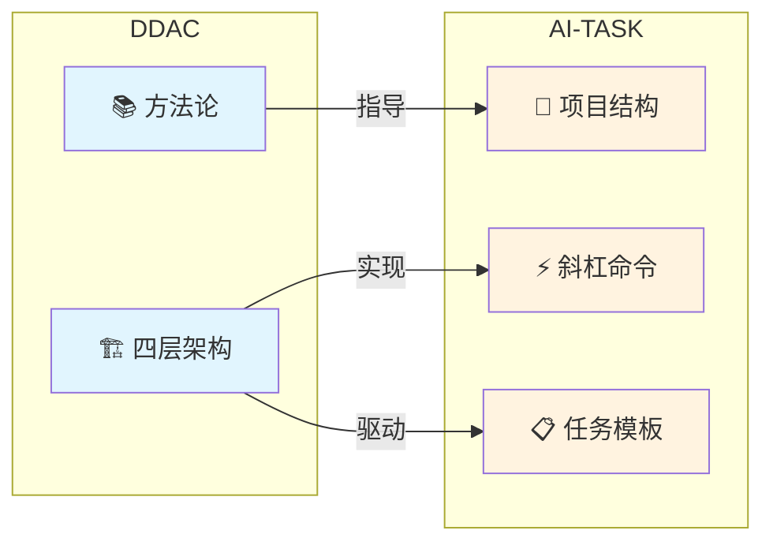
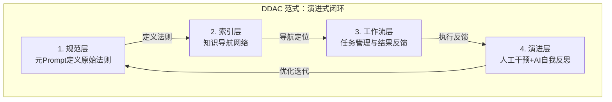
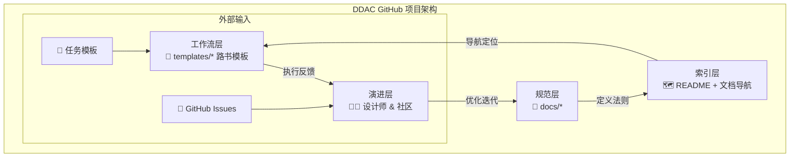

<div align="center">

# DDAC

**文档驱动的 AI 协作体系 · Document-Driven AI Collaboration**

用文档描述规范，用规范驱动 AI，用 AI 持续协作

[English](README.en.md) | 简体中文

[](https://github.com/ArnoFrost/DDAC/stargazers)
[](https://github.com/ArnoFrost/DDAC/network)
[](https://github.com/ArnoFrost/DDAC/commits)
[](https://creativecommons.org/licenses/by-sa/4.0/)
[](CHANGELOG.md)
[](https://obsidian.md/)
[](https://github.com/ArnoFrost/AI-TASK)

<p>
  <a href="#-快速开始">快速开始</a> •
  <a href="#-落地实现ai-task">AI-TASK</a> •
  <a href="#️-四层架构详解">架构</a> •
  <a href="#-核心工具元prompt库">元Prompt库</a> •
  <a href="#-文档导航">文档</a>
</p>

</div>

---

<details>
<summary>📖 目录 / Table of Contents</summary>

- [什么是 DDAC](#-什么是-ddac)
- [落地实现：AI-TASK](#-落地实现ai-task)
- [四层架构详解](#️-四层架构详解)
- [快速开始](#-快速开始)
- [核心工具：元Prompt库](#-核心工具元prompt库)
- [核心工具：路书系统](#-核心工具路书系统)
- [文档导航](#-文档导航)
- [项目结构](#️-项目结构)
- [核心特性](#-核心特性)
- [贡献与联系](#-贡献与联系)

</details>

---

## 🎯 什么是 DDAC？

**DDAC（Document-Driven AI Collaboration）** 是一种**"元Prompt"设计模式**，将 AI 协作从"临时对话"升级为"持续伙伴关系"。

> 💡 **核心理念**：不是教 AI 做事，而是让 AI 学会自己理解规范

### 核心能力

| 能力 | 描述 |
|:---:|---|
| 🧠 | **自我理解** - 读取规范文档，理解工作标准和上下文 |
| 🎯 | **自主执行** - 根据规范自动推导执行步骤，无需反复指导 |
| 🔄 | **持续协作** - 跨会话保持上下文，任务接续无缝衔接 |
| 📈 | **自我优化** - 通过反馈闭环，持续完善规范体系 |

### 从"对话"到"协作"

```
传统 AI 对话：用户 ←→ AI（每次都是新开始，上下文易丢失）

DDAC 协作模式：用户 ←→ [规范文档系统] ←→ AI
                        ↑
                   持久化的"长期记忆"
```

| 维度 | 传统对话 | DDAC 模式 |
|------|---------|----------|
| 上下文 | 临时的，易丢失 | 持久化，可追溯 |
| 一致性 | 依赖 AI 记忆 | 规范文档保证 |
| 可复用性 | 低，需重复说明 | 高，一次定义多次使用 |
| 协作效率 | 每次都要详细指导 | AI 自动理解规范 |
| 任务接续 | 困难，需重新说明 | 轻松，读取路书即可 |

### 🚀 落地实现：AI-TASK

**[AI-TASK](https://github.com/ArnoFrost/AI-TASK)** 是基于 DDAC 方法论构建的任务管理系统，专为单人多项目、跨设备协作场景设计。



| | DDAC | AI-TASK |
|:---:|------|---------|
| 📖 | 方法论 · 理论框架 | 落地实现 · MVP |
| 🎯 | 知识管理、规范体系设计 | 任务管理、跨项目协作 |
| 👤 | 理解设计哲学 | 直接上手使用 |

---

## 🏗️ 四层架构详解

> 💡 **DDAC 的核心：一个能自我进化的闭环系统**



| 层次 | 职责 | 关键产物 | 维护者 |
|------|------|----------|--------|
| 规范层 | 定义"是什么"和"怎么做" | `docs/` 规范文档 | 人类 |
| 索引层 | 定义"在哪里"和"有什么" | MOC索引、双向链接 | 人类 + AI |
| 工作流层 | 任务管理与结果反馈 | 路书、报告 | AI + 人类 |
| 演进层 | 分析反馈，优化规范 | 规范迭代 | 人类 + AI |

### GitHub 项目落地



| 组成部分 | 职责 | 对应架构层 |
|---------|------|------------|
| **规范文档（docs/）** | 面向 AI 与使用者的规范与实施文档 | 规范层 |
| **README + 文档导航** | 提供知识地图和快速导航 | 索引层 |
| **模板（templates/）** | 可复用的执行模板，驱动轻量路书与报告产出 | 工作流层 |
| **Issues & Discussions** | 社区协作与反馈入口 | 演进层 |

---

## 🚀 快速开始

### 适用场景

| 场景 | 描述 |
|:---:|---|
| ✅ | **知识管理** - Obsidian 笔记整理、知识体系构建 |
| ✅ | **内容创作** - 写作规范、风格统一、SEO 优化 |
| ✅ | **软件开发** - 代码规范、文档管理、团队协作 |
| ✅ | **学习系统** - 学习路径规划、笔记管理、复习系统 |

### 5 分钟体验

```bash
# 1. 克隆项目
git clone https://github.com/ArnoFrost/DDAC.git
cd DDAC

# 2. 在 Obsidian 中打开
# 选择"打开文件夹作为仓库" → 选择 DDAC 目录

# 3. 快速体验（推荐）⭐
# 使用 templates/04-元Prompt库/快速启动/01-首次体验.md
# 复制 Prompt，与 AI 开始首次协作
```

### 查看示例

- 浏览 `templates/` 目录
- 查看**元Prompt库**（17个开箱即用的Prompt模板）⭐
- 查看**场景示例**（知识管理场景完整配置）⭐

---

## 🎯 核心工具：元Prompt库

> 开箱即用的 Prompt 模板，降低上手门槛，提升协作效率

**元Prompt库**是 DDAC v1.1 的核心创新，提供 **17 个精心设计的 Prompt 模板**。

### 五大类模板

| 类别 | 模板数 | 典型场景 |
|------|--------|----------|
| **快速启动** | 3个 | 首次体验、轻量路书、会话起手式 |
| **规范建立** | 3个 | 建立规范体系、设计标签体系、创建MOC索引 |
| **文档处理** | 4个 | 批量添加YAML、批量添加标签、建立双链网络 |
| **任务管理** | 4个 | 创建任务路书、继续任务、完成任务、生成报告 |
| **质量检查** | 3个 | 文档质量检查、链接有效性检查、规范一致性检查 |

> 📁 位置：`templates/04-元Prompt库/`

### 场景化配置

**知识管理场景**（已完成）：
- 📋 完整的规范配置（YAML、标签、双链、目录结构）
- 🔄 三大核心工作流（笔记整理、知识提炼、体系优化）
- 📝 三个使用示例（简单/中等/复杂场景）

> 📁 位置：`templates/场景示例/知识管理场景/`

---

## 📋 核心工具：路书系统

> 结构化任务管理，让 AI 理解上下文、保持工作连续性

路书（Roadmap）是 DDAC 的**任务管理核心工具**。

### 四层路书结构

```
路书索引 → 当前任务 → 任务详情 → 历史归档
```

| 层级 | 职责 | 大小 | 更新频率 |
|------|------|------|----------|
| 路书索引 | 全局视图 | <200行 | 月度 |
| 当前任务 | 活跃任务 | <150行 | 实时 |
| 任务详情 | 完整信息 | <300行 | 任务更新 |
| 历史归档 | 已完成任务 | <500行 | 归档时 |

### 路书四大法则

| 法则 | 说明 |
|------|------|
| **倒排原则** | 最新任务在前（时间倒序 + 优先级倒序） |
| **归档原则** | 完成后立即归档，保持简洁（活跃任务≤3个） |
| **更新原则** | 进度实时更新，状态及时变更 |
| **格式标准** | 统一模板、唯一ID、完整链接 |

> 📖 详细说明见 [实施指南](docs/03-实施指南.md)

---

## 📖 文档导航

> 💡 建议学习路径：按顺序阅读核心文档 → 动手实践 → 查阅进阶内容

### 核心文档（必读）

| 文档 | 内容概要 | 阅读时间 |
|------|---------|----------|
| **[01-核心概念](docs/01-核心概念.md)** ⭐ | DDAC 是什么？核心价值、理论基础 | 15分钟 |
| **[02-架构设计](docs/02-架构设计.md)** ⭐ | 四层架构模型、目录结构设计 | 20分钟 |
| **[03-实施指南](docs/03-实施指南.md)** ⭐ | 从零到一的完整步骤、核心Prompt模板库 | 30分钟 |

### 进阶内容（选读）

| 文档 | 内容概要 | 阅读时间 |
|------|---------|----------|
| **[04-进阶技巧](docs/04-进阶技巧.md)** | 版本管理、自动化脚本、多人协作 | 25分钟 |
| **[05-常见问题](docs/05-常见问题.md)** | 适用性问题、实施问题、技术问题 | 按需查阅 |

---

## 🏗️ 项目结构

```text
DDAC/
├── README.md                 # 本文件
├── LICENSE                   # CC BY-SA 4.0 协议
├── CHANGELOG.md              # 版本变更历史
├── docs/                     # 文档目录（规范层）
│   ├── 01-核心概念.md
│   ├── 02-架构设计.md
│   ├── 03-实施指南.md
│   ├── 04-进阶技巧.md
│   └── 05-常见问题.md
└── templates/                # 模板文件（工作流层）
    ├── 规范层模板/
    ├── 索引层模板/
    ├── 工作流层模板/
    ├── 04-元Prompt库/        # 核心 Prompt 模板 ⭐
    │   ├── 快速启动/
    │   ├── 规范建立/
    │   ├── 文档处理/
    │   ├── 任务管理/
    │   └── 质量检查/
    └── 场景示例/             # 场景化配置 ⭐
        └── 知识管理场景/
```

---

## 💡 核心特性

| 特性 | 描述 |
|:---:|---|
| 🧠 | **持久化上下文** - 规范文档成为 AI 的"长期记忆"，跨会话保持一致性 |
| 🗺️ | **MOC 导航网络** - 通过双向链接和结构化索引建立知识导航网络 |
| 📝 | **声明式协作** - 告诉 AI"应该是什么样"，AI 自动推导执行步骤 |
| 🔗 | **可复用思维链** - 将 CoT 固化为文档，可反复使用 |
| 🔄 | **持续优化闭环** - 执行 → 反馈 → 优化 → 执行 |

### 与 RAG 的区别

- RAG 需要向量数据库和检索系统（技术实现）
- DDAC 只需 Markdown + 双链 + 清晰结构（方法论创新）
- 两者可结合，但 DDAC 的核心在于文档组织范式

---

## 🛠️ 技术栈

| 类型 | 工具 |
|------|------|
| 笔记工具 | Obsidian（推荐）/ Logseq / Notion |
| 格式 | Markdown + YAML Front Matter |
| 链接 | 双向链接（WikiLinks） |
| 查询 | Dataview（可选） |
| 版本控制 | Git |
| AI 模型 | GPT-4 / Claude / 其他大语言模型 |

---

## 📚 使用示例

<details>
<summary>场景1：技术笔记整理</summary>

```markdown
参考AI指导目录，请帮我整理技术笔记。

目录：技术栈/Python/
文件数：约20个

要求：
1. 添加YAML头部
2. 按标签规范添加标签
3. 建立双链网络
4. 生成进度报告
```

</details>

<details>
<summary>场景2：知识体系构建</summary>

```markdown
参考AI指导目录，帮我构建Python学习体系。

要求：
1. 分析现有笔记
2. 建立知识图谱
3. 规划学习路径
4. 创建MOC索引
```

</details>

<details>
<summary>场景3：持续任务管理</summary>

```markdown
参考AI指导目录，继续任务：Python学习体系构建

当前任务路书：使用 templates/ 中的路书模板创建

请：
1. 读取任务进度
2. 继续执行下一步
3. 更新进度
4. 遇到问题反馈
```

</details>

---

## 🎓 学习路径

<details>
<summary>新手路径（2-3天）</summary>

**Day 1：理解概念**
- [ ] 阅读[核心概念](docs/01-核心概念.md)
- [ ] 理解DDAC原理
- [ ] 查看示例模板

**Day 2：动手实践**
- [ ] 阅读[实施指南](docs/03-实施指南.md)
- [ ] 选择10-20个文件试点
- [ ] 建立最小可用规范

**Day 3：优化迭代**
- [ ] 复盘首次实践
- [ ] 优化规范文档
- [ ] 扩大应用范围

</details>

<details>
<summary>进阶路径（1-2周）</summary>

- [ ] 阅读[架构设计](docs/02-架构设计.md)
- [ ] 建立完整的规范体系
- [ ] 设计工作流系统
- [ ] 学习[进阶技巧](docs/04-进阶技巧.md)
- [ ] 开发自动化脚本
- [ ] 应用于团队协作

</details>

---

## 🤝 贡献与联系

欢迎贡献！

| 方式 | 描述 |
|------|------|
| 🐛 报告问题 | 提交 Issue 描述问题 |
| 💡 提出建议 | 分享你的想法和改进建议 |
| 📝 完善文档 | 改进文档质量 |
| 🔧 贡献代码 | 提交自动化脚本或工具 |
| 🌟 分享经验 | 分享你的实践案例 |

### 贡献流程

```bash
# 1. Fork 本项目
# 2. 创建特性分支
git checkout -b feature/AmazingFeature

# 3. 提交更改
git commit -m 'Add some AmazingFeature'

# 4. 推送到分支
git push origin feature/AmazingFeature

# 5. 提交 Pull Request
```

### 联系方式

- [GitHub Issues](https://github.com/ArnoFrost/DDAC/issues)
- [Discussions](https://github.com/ArnoFrost/DDAC/discussions)

---

## 📄 开源说明

### 许可协议

本项目采用 [CC BY-SA 4.0](https://creativecommons.org/licenses/by-sa/4.0/) 协议。

| 权利 | 说明 |
|------|------|
| ✅ 分享 | 复制、发行本作品 |
| ✅ 演绎 | 修改、转换或以本作品为基础进行创作 |
| 📝 署名 | 必须给出适当的署名 |
| 🔄 相同方式共享 | 如果改编本作品，必须以相同的许可协议分发 |

### 版本

当前版本：**v1.1** - 元Prompt库（17个模板）、场景示例、四层架构重构

---

## 💬 常见问题

<details>
<summary>这个体系适合我吗？</summary>

如果你需要长期积累知识、需要 AI 持续协作、追求系统化，那么 DDAC 很适合你。详见[常见问题](docs/05-常见问题.md)。

</details>

<details>
<summary>需要多长时间建立？</summary>

初始建设 5-8 小时，1 周后开始见效，3 个月后体系成熟。

</details>

<details>
<summary>必须使用 Obsidian 吗？</summary>

不是必须，但强烈推荐。任何支持 Markdown 和双链的工具都可以。

</details>

> 更多问题请查看：[常见问题文档](docs/05-常见问题.md)

---

## 🌟 致谢

| 类型 | 项目 |
|------|------|
| 理论 | [Zettelkasten](https://zettelkasten.de/)、[Building a Second Brain](https://www.buildingasecondbrain.com/)、[Agentic Design Patterns](https://github.com/Mathews-Tom/Agentic-Design-Pattern) |
| 工具 | [Obsidian](https://obsidian.md/)、[腾讯云开发助手](https://www.codebuddy.ai/) |

---

## 🔗 相关项目

| 项目 | 描述 |
|------|------|
| [](https://github.com/ArnoFrost/AI-TASK) | DDAC 方法论的落地实践，面向单人多项目的任务管理系统 |

---

<div align="center">

**⭐ 如果这个项目对你有帮助，请给个 Star！⭐**

Made with ❤️ by [ArnoFrost](https://github.com/ArnoFrost)

[](https://github.com/ArnoFrost)

</div>