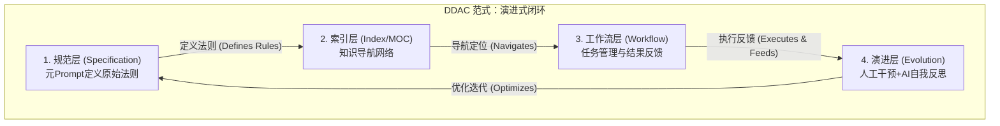
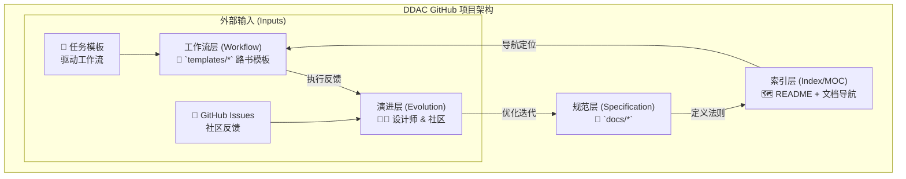

# 📚 DDAC - 文档驱动的AI协作体系

> **Document-Driven AI Collaboration**
> 
> 用文档描述规范，用规范驱动AI，用AI持续协作

[](https://creativecommons.org/licenses/by-sa/4.0/)
[](https://obsidian.md/)

**Languages**: [English](README.en.md) | 中文

---

## 🎯 什么是DDAC？

**DDAC（Document-Driven AI Collaboration）** 是一种**"元Prompt"设计模式**，它将AI协作从"临时对话"升级为"持续伙伴关系"。

### 核心理念

> 💡 **不是教AI做事，而是让AI学会自己理解规范**

通过建立结构化的规范文档系统，DDAC让AI具备四大能力：

- 🧠 **自我理解**：读取规范文档，理解工作标准和上下文
- 🎯 **自主执行**：根据规范自动推导执行步骤，无需反复指导
- 🔄 **持续协作**：跨会话保持上下文，任务接续无缝衔接
- 📈 **自我优化**：通过反馈闭环，持续完善规范体系

### 核心价值：从"对话"到"协作"

```
传统AI对话：
用户 ←→ AI
(每次都是新开始，上下文易丢失，需要反复说明)

DDAC协作模式：
用户 ←→ [规范文档系统] ←→ AI
         ↑
    (持久化的"长期记忆")
(一次定义，持续使用，自动理解)
```

**关键差异对比**：

| 维度 | 传统对话 | DDAC模式 | 提升 |
|------|---------|----------|------|
| 上下文 | 临时的，易丢失 | 持久化，可追溯 | ⬆️ 90% |
| 一致性 | 依赖AI记忆 | 规范文档保证 | ⬆️ 85% |
| 可复用性 | 低，需重复说明 | 高，一次定义多次使用 | ⬆️ 80% |
| 协作效率 | 每次都要详细指导 | AI自动理解规范 | ⬆️ 70% |
| 任务接续 | 困难，需重新说明 | 轻松，读取路书即可 | ⬆️ 75% |

---

## 🏗️ 四层架构详解

> 💡 **DDAC的核心：一个能自我进化的闭环系统**

DDAC不是简单的文档管理，而是一个**演进式闭环系统**。我们通过两张图来理解：
- **理论内核图**：展示DDAC的哲学思想（与工具无关）
- **项目实践图**：展示如何在GitHub项目中落地

### 1. DDAC 范式：理论内核

这张图展示了DDAC的核心哲学——一个由四个层次构成的、能**自我进化**的闭环系统。



**四层架构说明**：

| 层次 | 职责 | 关键产物 | 维护者 |
|------|------|----------|--------|
| 规范层 | 定义"是什么"和"怎么做" | docs/ 规范文档 | 人类 |
| 索引层 | 定义"在哪里"和"有什么" | MOC索引、双向链接 | 人类 + AI |
| 工作流层 | 任务管理与结果反馈 | 路书、报告 | AI + 人类 |
| 演进层 | 分析反馈，优化规范 | 规范迭代 | 人类 + AI |

### 2. GitHub 项目：实践落地

这张图展示了DDAC理论如何在**本开源项目**中落地实现，以及如何通过GitHub生态实现社区协作。



**项目结构说明**：

| 组成部分 | 职责 | 对应架构层 |
|---------|------|------------|
| **规范文档（docs/）** | 面向AI与使用者的规范与实施文档，提供"长期记忆"和协作标准 | 规范层 |
| **README + 文档导航** | 提供知识地图和快速导航，定义"在哪里"和"有什么" | 索引层 |
| **模板（templates/）** | 可复用的执行模板，驱动轻量路书与报告产出 | 工作流层 |
| **Issues & Discussions** | 社区协作与反馈入口，推动规范与模板的持续优化 | 演进层 |

**设计灵感来源**：
- 借鉴 [Agentic Design Patterns](https://github.com/Mathews-Tom/Agentic-Design-Pattern) 的智能体设计思想
- 参考 [腾讯云开发助手](https://www.codebuddy.ai/) 的AI协作实践

---

## 🚀 快速开始

### 适用场景

- ✅ **知识管理**：Obsidian笔记整理、知识体系构建
- ✅ **内容创作**：写作规范、风格统一、SEO优化
- ✅ **软件开发**：代码规范、文档管理、团队协作
- ✅ **学习系统**：学习路径规划、笔记管理、复习系统

### 5分钟体验

1. **克隆项目**
   ```bash
   git clone https://github.com/ArnoFrost/DDAC.git
   cd DDAC
   ```

2. **在Obsidian中打开**
   - 打开Obsidian
   - 选择"打开文件夹作为仓库"
   - 选择DDAC目录

### 3. 查看示例模板
   - 浏览 `templates/` 目录
   - 查看**元Prompt库**（17个开箱即用的Prompt模板）⭐
   - 查看**场景示例**（知识管理场景完整配置）⭐
   - 了解规范文档结构

4. **快速体验（推荐）**⭐
   - 使用 `templates/04-元Prompt库/快速启动/01-首次体验.md`
   - 复制Prompt，与AI开始首次协作
   - 5分钟体验DDAC的核心价值

5. **阅读文档**
   - 从[核心概念](docs/01-核心概念.md)开始
   - 按顺序阅读文档系列
   - 理解DDAC原理

---

## 🎯 核心工具：元Prompt库（新增）⭐

> 开箱即用的Prompt模板，降低上手门槛，提升协作效率

**元Prompt库**是DDAC v1.1的核心创新，提供**17个精心设计的Prompt模板**，覆盖从快速启动到质量检查的完整工作流。

### 五大类模板

| 类别 | 模板数 | 典型场景 | 位置 |
|------|--------|----------|------|
| **快速启动** | 3个 | 首次体验、轻量路书、会话起手式 | `templates/04-元Prompt库/快速启动/` |
| **规范建立** | 3个 | 建立规范体系、设计标签体系、创建MOC索引 | `templates/04-元Prompt库/规范建立/` |
| **文档处理** | 4个 | 批量添加YAML、批量添加标签、建立双链网络、草稿精炼 | `templates/04-元Prompt库/文档处理/` |
| **任务管理** | 4个 | 创建任务路书、继续任务、完成任务、生成报告 | `templates/04-元Prompt库/任务管理/` |
| **质量检查** | 3个 | 文档质量检查、链接有效性检查、规范一致性检查 | `templates/04-元Prompt库/质量检查/` |

### 快速上手

```markdown
# 1. 首次体验（5分钟）
复制 templates/04-元Prompt库/快速启动/01-首次体验.md 中的Prompt
→ 与AI对话，体验DDAC的核心价值

# 2. 建立规范（30分钟）
使用 templates/04-元Prompt库/规范建立/ 中的模板
→ 快速建立你的规范体系

# 3. 处理文档（1小时）
使用 templates/04-元Prompt库/文档处理/ 中的模板
→ 批量处理文档，建立知识网络
```

### 场景化配置

**知识管理场景**（已完成）：
- 📋 完整的规范配置（YAML、标签、双链、目录结构）
- 🔄 三大核心工作流（笔记整理、知识提炼、体系优化）
- 📝 三个使用示例（简单/中等/复杂场景）
- 位置：`templates/场景示例/知识管理场景/`

**其他场景**（规划中）：
- 技术学习场景、内容创作场景、项目协作场景

---

## 📋 核心工具：路书系统

> 结构化任务管理，让AI理解上下文、保持工作连续性

路书（Roadmap）是DDAC的**任务管理核心工具**，通过四层结构和四大法则，实现高效的任务跟踪和AI协作。

### 四层路书结构

```
路书索引 → 当前任务 → 任务详情 → 历史归档
```

| 层级 | 职责 | 大小 | 更新频率 |
|------|------|------|----------|
| 路书索引 | 全局视图 | <200行 | 月度 |
| 当前任务 | 活跃任务 | <150行 | 实时 |
| 任务详情 | 完整信息 | <300行 | 任务更新 |
| 历史归档 | 已完成任务 | <500行 | 归档时 |

### 路书生成四大法则

1. **倒排原则**：最新任务在前（时间倒序 + 优先级倒序）
2. **归档原则**：完成后立即归档，保持简洁（活跃任务≤3个）
3. **更新原则**：进度实时更新，状态及时变更
4. **格式标准**：统一模板、唯一ID、完整链接

### 快速上手

1. 查看 `templates/` 中的路书模板
2. 创建你的第一个路书
3. 应用四大法则管理任务
4. 详细说明见 [实施指南](docs/03-实施指南.md)

---

## 📖 文档导航

> 💡 **建议学习路径**：按顺序阅读核心文档 → 动手实践 → 查阅进阶内容

### 📚 核心文档（必读）

| 文档 | 内容概要 | 适合人群 | 阅读时间 |
|------|---------|---------|----------|
| **[01-核心概念](docs/01-核心概念.md)** ⭐⭐⭐ | DDAC是什么？核心价值、理论基础、与传统AI协作的区别 | 所有人 | 15分钟 |
| **[02-架构设计](docs/02-架构设计.md)** ⭐⭐⭐ | 四层架构模型、目录结构设计、设计原则 | 所有人 | 20分钟 |
| **[03-实施指南](docs/03-实施指南.md)** ⭐⭐⭐ | 从零到一的完整步骤、核心Prompt模板库、首次实践指导 | 实践者 | 30分钟 |

### 🚀 进阶内容（选读）

| 文档 | 内容概要 | 适合人群 | 阅读时间 |
|------|---------|---------|----------|
| **[04-进阶技巧](docs/04-进阶技巧.md)** ⭐⭐ | 版本管理、自动化脚本、多人协作、效果评估 | 进阶用户 | 25分钟 |
| **[05-常见问题](docs/05-常见问题.md)** ⭐⭐ | 适用性问题、实施问题、技术问题、优化建议 | 遇到问题时 | 按需查阅 |

### 🎯 快速导航

```
新手入门：01核心概念 → 02架构设计 → 03实施指南（第1-2章）
           ↓
        动手实践（选择10-20个文件试点）
           ↓
深入学习：03实施指南（完整） → 04进阶技巧
           ↓
        遇到问题查阅 05常见问题
```

---

## 🏗️ 项目结构

```
DDAC/
├── README.md                          # 本文件（精简版）
├── LICENSE                            # CC BY-SA 4.0协议
├── CHANGELOG.md                       # 版本变更历史
│
├── docs/                              # 文档目录（规范层）
│   ├── 01-核心概念.md                 # DDAC基础概念
│   ├── 02-架构设计.md                 # 体系架构设计
│   ├── 03-实施指南.md                 # 从零到一实施
│   ├── 04-进阶技巧.md                 # 高级使用技巧
│   ├── 05-常见问题.md                 # FAQ
│   └── assets/                        # 文档资源
│
└── templates/                         # 模板文件（工作流层）
    ├── README.md                      # 模板使用指南
    ├── 规范层模板/                    # 规范文档模板
    ├── 索引层模板/                    # MOC索引模板
    ├── 工作流层模板/                  # 路书与报告模板
    ├── 04-元Prompt库/                 # 核心Prompt模板（新增⭐）
    │   ├── 快速启动/                  # 3个快速上手模板
    │   ├── 规范建立/                  # 3个规范建立模板
    │   ├── 文档处理/                  # 4个文档处理模板
    │   ├── 任务管理/                  # 4个任务管理模板
    │   └── 质量检查/                  # 3个质量检查模板
    └── 场景示例/                      # 场景化配置（新增⭐）
        ├── 知识管理场景/              # 完整配置示例
        ├── 技术学习场景/              # （规划中）
        ├── 内容创作场景/              # （规划中）
        └── 项目协作场景/              # （规划中）
```

---

## 💡 核心特性

### 1. 持久化的上下文

规范文档成为AI的"长期记忆"，跨会话保持一致性。

### 2. MOC导航网络

基于**Map of Content（内容地图）**理念，通过双向链接和结构化索引建立知识导航网络，让AI快速理解文档关系和上下文。

**与RAG的区别**：
- RAG需要向量数据库和检索系统（技术实现）
- DDAC只需Markdown + 双链 + 清晰结构（方法论创新）
- 两者可结合，但DDAC的核心在于文档组织范式

### 3. 声明式协作

告诉AI"应该是什么样"，而非"怎么做"，AI自动推导执行步骤。

### 4. 可复用的思维链

将CoT（Chain of Thought）固化为文档，可反复使用。

### 5. 持续优化闭环

```
执行任务 → 生成报告 → 发现问题 → 优化规范 → 执行任务
    ↑                                              ↓
    └──────────────────────────────────────────────┘
```

---

## 📊 示例指标（非真实数据，仅用于理解）

以下为基于通用场景的示例性指标，便于读者理解DDAC可能带来的提升；实际效果会因个人与团队实践而异。

| 指标 | 参考范围（实施前） | 参考范围（实施后） | 说明 |
|------|-------------------|-------------------|------|
| AI读取效率 | 10-30秒 | 3-10秒 | 规范化入口与文档导航可降低理解时间 |
| 信息查找速度 | 2-10分钟 | 15-60秒 | 目录与标签体系提升检索体验 |
| 任务接续时间 | 5-15分钟 | 1-5分钟 | 路书与报告索引维持连续性 |
| 文件标签完整率 | 20-50% | 80-100% | 标签与双链规范提升结构化程度 |
| 跨会话协作成功率 | 40-70% | 80-95% | 规范与流程降低上下文丢失 |

> 注：以上为示例数据，用于说明方向性收益，不代表任何个人/组织的真实测量。

---

## 🛠️ 技术栈

- **笔记工具**：Obsidian（推荐）/ Logseq / Notion
- **格式**：Markdown + YAML Front Matter
- **链接**：双向链接（WikiLinks）
- **查询**：Dataview（可选）
- **版本控制**：Git
- **AI模型**：GPT-4 / Claude / 其他大语言模型

---

## 📚 使用示例

### 场景1：技术笔记整理

```markdown
参考AI指导目录，请帮我整理技术笔记。

目录：技术栈/Python/
文件数：约20个

要求：
1. 添加YAML头部
2. 按标签规范添加标签
3. 建立双链网络
4. 生成进度报告

请开始执行。
```

### 场景2：知识体系构建

```markdown
参考AI指导目录，帮我构建Python学习体系。

要求：
1. 分析现有笔记
2. 建立知识图谱
3. 规划学习路径
4. 创建MOC索引

请制定详细计划。
```

### 场景3：持续任务管理

```markdown
参考AI指导目录，继续任务：Python学习体系构建

当前任务路书：请在你的仓库中新建 `路书系统/当前任务路书.md`（中性占位路径），或使用 `templates/` 中的路书模板创建。

请：
1. 读取任务进度
2. 继续执行下一步
3. 更新进度
4. 遇到问题反馈
```

---

## 🎓 学习路径

### 新手路径（2-3天）

**Day 1：理解概念**
- [ ] 阅读[核心概念](docs/01-核心概念.md)
- [ ] 理解DDAC原理
- [ ] 查看示例模板

**Day 2：动手实践**
- [ ] 阅读[实施指南](docs/03-实施指南.md)
- [ ] 选择10-20个文件试点
- [ ] 建立最小可用规范
- [ ] 完成首次实践

**Day 3：优化迭代**
- [ ] 复盘首次实践
- [ ] 优化规范文档
- [ ] 扩大应用范围

### 进阶路径（1-2周）

- [ ] 阅读[架构设计](docs/02-架构设计.md)
- [ ] 建立完整的规范体系
- [ ] 设计工作流系统
- [ ] 学习[进阶技巧](docs/04-进阶技巧.md)
- [ ] 开发自动化脚本
- [ ] 应用于团队协作

---

## 🤝 贡献与联系

欢迎贡献！你可以：

- 🐛 **报告问题**：提交Issue描述问题
- 💡 **提出建议**：分享你的想法和改进建议
- 📝 **完善文档**：改进文档质量
- 🔧 **贡献代码**：提交自动化脚本或工具
- 🌟 **分享经验**：分享你的实践案例

### 贡献流程

1. Fork本项目
2. 创建特性分支 (`git checkout -b feature/AmazingFeature`)
3. 提交更改 (`git commit -m 'Add some AmazingFeature'`)
4. 推送到分支 (`git push origin feature/AmazingFeature`)
5. 提交Pull Request

### 联系我们

- **GitHub Issues**：[提交问题](https://github.com/ArnoFrost/DDAC/issues)
- **讨论区**：[参与讨论](https://github.com/ArnoFrost/DDAC/discussions)

---

## 📄 开源说明

### 许可协议

本项目采用 [CC BY-SA 4.0](https://creativecommons.org/licenses/by-sa/4.0/) 协议。

**你可以自由地**：
- ✅ **分享**：复制、发行本作品
- ✅ **演绎**：修改、转换或以本作品为基础进行创作

**惟须遵守下列条件**：
- 📝 **署名**：必须给出适当的署名
- 🔄 **相同方式共享**：如果你改编了本作品，必须以相同的许可协议分发

### 开源范围

- ✅ **包含**：`docs/*` 规范文档、`templates/*` 模板文件
- ❌ **不包含**：私有实现、自动化脚本、运营细节

### 隐私策略

- 所有示例使用占位命名（如"项目A/主题X"），不含个人敏感信息
- 贡献时请确保提交内容不含隐私数据
- 详细指引见 [常见问题](docs/05-常见问题.md)

### 版本与路线图

- 遵循语义化版本（SemVer）
- 每次更新同步 `CHANGELOG.md`
- 通过 Issues 跟踪问题和建议

**v1.1（当前）**：元Prompt库（17个模板）、场景示例、四层架构重构 ⭐  
**v1.2（计划）**：英文版文档、更多场景示例、自动化工具、视频教程  
**v2.0（未来）**：Web工具、AI插件、社区案例库、多语言支持

---

## 💬 常见问题

**Q: 这个体系适合我吗？**
A: 如果你需要长期积累知识、需要AI持续协作、追求系统化，那么DDAC很适合你。详见[常见问题](docs/05-常见问题.md)。

**Q: 需要多长时间建立？**
A: 初始建设5-8小时，1周后开始见效，3个月后体系成熟。

**Q: 必须使用Obsidian吗？**
A: 不是必须，但强烈推荐。任何支持Markdown和双链的工具都可以。

**Q: 如何开始？**
A: 从[实施指南](docs/03-实施指南.md)开始，选择10-20个文件试点。

更多问题请查看：[常见问题文档](docs/05-常见问题.md)

---

## 📖 延伸阅读

- [Prompt Engineering Guide](https://www.promptingguide.ai/)
- [How to Take Smart Notes](https://www.soenkeahrens.de/en/takesmartnotes)
- [The PARA Method](https://fortelabs.co/blog/para/)
- [Obsidian Hub](https://publish.obsidian.md/hub/)

---

## 🌟 致谢与支持

感谢以下项目和社区的启发：

### 理论与方法论
- [Zettelkasten](https://zettelkasten.de/) - 卡片笔记法，启发了双链和知识网络设计
- [Building a Second Brain](https://www.buildingasecondbrain.com/) - 第二大脑方法论，启发了知识管理理念
- [Agentic Design Patterns](https://github.com/Mathews-Tom/Agentic-Design-Pattern) - 智能体设计模式，启发了四层架构设计

### 工具与实践
- [Obsidian](https://obsidian.md/) - 强大的知识管理工具，DDAC的最佳实践平台
- [腾讯云开发助手](https://www.codebuddy.ai/) - AI协作实践，启发了规范文档设计

---

<div align="center">

**⭐ 如果这个项目对你有帮助，请给个Star！⭐**

Made with ❤️ by DDAC Community

</div>