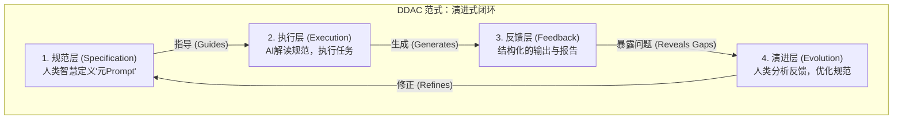
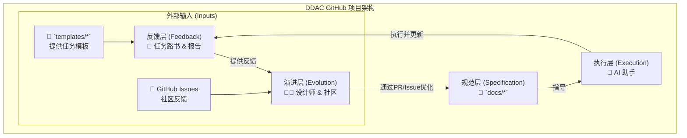

# 📚 DDAC - 文档驱动的AI协作体系

> **Document-Driven AI Collaboration**
> 
> 用文档描述规范，用规范驱动AI，用AI持续协作

[](https://creativecommons.org/licenses/by-sa/4.0/)
[](https://obsidian.md/)

**Languages**: [English](README.en.md) | 中文

---

## 🎯 什么是DDAC？

DDAC是一种**"元Prompt"设计模式**，通过建立结构化的规范文档系统，让AI能够：

- ✅ **自我理解**：通过读取规范文档理解工作标准
- ✅ **自主执行**：根据规范自动推导执行步骤
- ✅ **持续协作**：跨会话保持上下文和工作连续性
- ✅ **自我优化**：通过反馈不断完善规范体系

### 核心价值

```
传统AI对话：
用户 ←→ AI
(每次对话都是新的开始，上下文容易丢失)

DDAC模式：
用户 ←→ [规范文档系统] ←→ AI
         ↑
    (持久化的"程序")
```

**关键差异**：

| 维度 | 传统对话 | DDAC模式 |
|------|---------|----------|
| 上下文 | 临时的 | 持久化的 |
| 一致性 | 依赖记忆 | 规范保证 |
| 可复用 | 低 | 高 |
| 协作效率 | 需要反复说明 | 自动理解 |

---

## 🚀 快速开始

### 适用场景

- ✅ **知识管理**：Obsidian笔记整理、知识体系构建
- ✅ **内容创作**：写作规范、风格统一、SEO优化
- ✅ **软件开发**：代码规范、文档管理、团队协作
- ✅ **学习系统**：学习路径规划、笔记管理、复习系统

### 5分钟体验

1. **克隆项目**
   ```bash
   git clone https://github.com/ArnoFrost/DDAC.git
   cd DDAC
   ```

2. **在Obsidian中打开**
   - 打开Obsidian
   - 选择"打开文件夹作为仓库"
   - 选择DDAC目录

3. **查看示例模板**
   - 浏览 `templates/` 目录
   - 查看文档管理模板
   - 了解规范文档结构

4. **阅读文档**
   - 从[核心概念](docs/01-核心概念.md)开始
   - 按顺序阅读文档系列
   - 理解DDAC原理

---

## ✍️ 轻量写作新范式（LWP）

> 用最小结构 + 明确意图 + 快速迭代，建立 AI 与人协作的轻量写作闭环。

### 为什么需要 LWP？
- **降低心智负担**：不被复杂流程束缚，专注表达与产出
- **保留个性风格**：在精炼中保持作者语气与观点
- **快速形成可交付物**：以 15-30 分钟为单位产出微成果

### LWP 三原则
- **最小结构**：提纲/要点/微报告优先，避免过度格式化
- **清晰意图**：一句话主题 + 1-2 个目标 + 明确产出
- **短周期迭代**：每轮小步快跑，复盘后立即下一轮

### 快速上手
1. 打开 `docs/03-实施指南.md` → 查看「轻量写作 Prompt 合集（LWP）」章节
2. 复制使用 `轻量路书（Micro-Routebook）` 模板（位于 `docs` 与 `templates` 公开部分）
3. 在 15-30 分钟内完成一次小成果并生成 `轻量完成报告`

### 推荐工作流
- 在 Obsidian 中新建笔记 → 添加 YAML 头部（title/tags/updated）
- 使用 LWP 模板驱动会话 → 产出草稿/提纲/要点清单
- 应用 `草稿精炼` 与 `标签与双链` 模板 → 完成微成果 → 提交 PR 或归档

> 结合 DDAC 的持久化规范系统，LWP 为内容创作提供“轻量却严谨”的协作路径。

---

## 🧩 体系架构一图览

为了更好地理解DDAC，我们将其拆解为“理论内核”与“项目实践”两张图。

### 1. DDAC 范式：理论内核

这张图展示了DDAC最核心的、不涉及任何具体工具的哲学思想——一个由四个层次构成的、能自我进化的闭环。



### 2. GitHub 项目：实践落地

这张图展示了DDAC的理论，是如何在我们这个具体的GitHub开源项目中被实现的。



- 说明：
  - **规范文档（docs/）**：面向 AI 与使用者的规范与实施文档，提供“长期记忆”和协作标准。
  - **模板（templates/）**：可复用的执行模板，驱动轻量路书与报告产出。
  - **仓库基座**：保障版本可追踪与开源合规的基础文件。
  - **Issues 与 Discussions**：社区协作与反馈入口，推动规范与模板的持续优化。

---

## 📖 文档导航

### 核心文档

1. **[核心概念](docs/01-核心概念.md)** ⭐⭐⭐
   - 什么是DDAC？
   - 核心价值和理论基础
   - 与传统AI协作的区别

2. **[架构设计](docs/02-架构设计.md)** ⭐⭐⭐
   - 四层架构模型
   - 目录结构设计
   - 设计原则

3. **[实施指南](docs/03-实施指南.md)** ⭐⭐⭐
   - 从零到一的完整步骤
   - 核心Prompt模板库
   - 首次实践指导

4. **[进阶技巧](docs/04-进阶技巧.md)** ⭐⭐
   - 版本管理
   - 自动化脚本
   - 多人协作
   - 效果评估

5. **[常见问题](docs/05-常见问题.md)** ⭐⭐
   - 适用性问题
   - 实施问题
   - 技术问题
   - 优化建议

---

## 🏗️ 项目结构

```
DDAC/
├── README.md                          # 本文件（精简版）
├── LICENSE                            # CC BY-SA 4.0协议
├── CHANGELOG.md                       # 版本变更历史
│
├── docs/                              # 文档目录
│   ├── 01-核心概念.md                 # DDAC基础概念
│   ├── 02-架构设计.md                 # 体系架构设计
│   ├── 03-实施指南.md                 # 从零到一实施
│   ├── 04-进阶技巧.md                 # 高级使用技巧
│   ├── 05-常见问题.md                 # FAQ
│   └── assets/                        # 文档资源
│
└── templates/                         # 模板文件
    └── 文档整理/                      # 文档管理模板
        └── AI 指导目录/               # AI协作规范示例
```

---

## 💡 核心特性

### 1. 持久化的上下文

规范文档成为AI的"长期记忆"，跨会话保持一致性。

### 2. 声明式协作

告诉AI"应该是什么样"，而非"怎么做"，AI自动推导执行步骤。

### 3. 可复用的思维链

将CoT（Chain of Thought）固化为文档，可反复使用。

### 4. 持续优化闭环

```
执行任务 → 生成报告 → 发现问题 → 优化规范 → 执行任务
    ↑                                              ↓
    └──────────────────────────────────────────────┘
```

---

## 📊 示例指标（非真实数据，仅用于理解）

以下为基于通用场景的示例性指标，便于读者理解DDAC可能带来的提升；实际效果会因个人与团队实践而异。

| 指标 | 参考范围（实施前） | 参考范围（实施后） | 说明 |
|------|-------------------|-------------------|------|
| AI读取效率 | 10-30秒 | 3-10秒 | 规范化入口与文档导航可降低理解时间 |
| 信息查找速度 | 2-10分钟 | 15-60秒 | 目录与标签体系提升检索体验 |
| 任务接续时间 | 5-15分钟 | 1-5分钟 | 路书与报告索引维持连续性 |
| 文件标签完整率 | 20-50% | 80-100% | 标签与双链规范提升结构化程度 |
| 跨会话协作成功率 | 40-70% | 80-95% | 规范与流程降低上下文丢失 |

> 注：以上为示例数据，用于说明方向性收益，不代表任何个人/组织的真实测量。

---

## 🛠️ 技术栈

- **笔记工具**：Obsidian（推荐）/ Logseq / Notion
- **格式**：Markdown + YAML Front Matter
- **链接**：双向链接（WikiLinks）
- **查询**：Dataview（可选）
- **版本控制**：Git
- **AI模型**：GPT-4 / Claude / 其他大语言模型

---

## 📚 使用示例

### 场景1：技术笔记整理

```markdown
参考AI指导目录，请帮我整理技术笔记。

目录：技术栈/Python/
文件数：约20个

要求：
1. 添加YAML头部
2. 按标签规范添加标签
3. 建立双链网络
4. 生成进度报告

请开始执行。
```

### 场景2：知识体系构建

```markdown
参考AI指导目录，帮我构建Python学习体系。

要求：
1. 分析现有笔记
2. 建立知识图谱
3. 规划学习路径
4. 创建MOC索引

请制定详细计划。
```

### 场景3：持续任务管理

```markdown
参考AI指导目录，继续任务：Python学习体系构建

当前任务路书：请在你的仓库中新建 `路书系统/当前任务路书.md`（中性占位路径），或使用 `templates/` 中的路书模板创建。

请：
1. 读取任务进度
2. 继续执行下一步
3. 更新进度
4. 遇到问题反馈
```

---

## 🎓 学习路径

### 新手路径（2-3天）

**Day 1：理解概念**
- [ ] 阅读[核心概念](docs/01-核心概念.md)
- [ ] 理解DDAC原理
- [ ] 查看示例模板

**Day 2：动手实践**
- [ ] 阅读[实施指南](docs/03-实施指南.md)
- [ ] 选择10-20个文件试点
- [ ] 建立最小可用规范
- [ ] 完成首次实践

**Day 3：优化迭代**
- [ ] 复盘首次实践
- [ ] 优化规范文档
- [ ] 扩大应用范围

### 进阶路径（1-2周）

- [ ] 阅读[架构设计](docs/02-架构设计.md)
- [ ] 建立完整的规范体系
- [ ] 设计工作流系统
- [ ] 学习[进阶技巧](docs/04-进阶技巧.md)
- [ ] 开发自动化脚本
- [ ] 应用于团队协作

---

## 🤝 贡献指南

欢迎贡献！你可以：

- 🐛 **报告问题**：提交Issue描述问题
- 💡 **提出建议**：分享你的想法和改进建议
- 📝 **完善文档**：改进文档质量
- 🔧 **贡献代码**：提交自动化脚本或工具
- 🌟 **分享经验**：分享你的实践案例

### 贡献流程

1. Fork本项目
2. 创建特性分支 (`git checkout -b feature/AmazingFeature`)
3. 提交更改 (`git commit -m 'Add some AmazingFeature'`)
4. 推送到分支 (`git push origin feature/AmazingFeature`)
5. 提交Pull Request

---

## 📄 开源协议

本项目采用 [CC BY-SA 4.0](https://creativecommons.org/licenses/by-sa/4.0/) 协议。

**你可以自由地**：
- ✅ **分享**：复制、发行本作品
- ✅ **演绎**：修改、转换或以本作品为基础进行创作

**惟须遵守下列条件**：
- 📝 **署名**：必须给出适当的署名
- 🔄 **相同方式共享**：如果你改编了本作品，必须以相同的许可协议分发

---

## 🌟 致谢

感谢以下项目和社区的启发：

- [Obsidian](https://obsidian.md/) - 强大的知识管理工具
- [Zettelkasten](https://zettelkasten.de/) - 卡片笔记法
- [Building a Second Brain](https://www.buildingasecondbrain.com/) - 第二大脑方法论
- Obsidian中文社区

---

## 📞 联系方式

- **GitHub Issues**：[提交问题](https://github.com/ArnoFrost/DDAC/issues)
- **讨论区**：[参与讨论](https://github.com/ArnoFrost/DDAC/discussions)

---

## 🔒 私有实现说明（简版）

本项目的开源部分仅包含规范与模板（位于 `docs/` 与 `templates/`）。任何私有实现与运营细节均不在开源范围内。

- **你将获得**：
  - 完整的概念与架构说明（`docs/*`）
  - 可直接使用的场景模板与 LWP 指南（`templates/`）
- **不包含**：
  - 具体的内部流程、自动化脚本与度量指标

为了保持简洁与可维护性，我们刻意避免在公开文档中提及任何私有目录与实现细节。

### 🛡️ 隐私与示例策略（面向贡献者与使用者）
- 开源文档中的目录与案例均为**隐私清洗后的通用示例**，不包含个人敏感信息
- 示例使用占位命名（如“作品A/主题X/子主题Y”），便于开发者映射到自己的 Obsidian 目录
- 克隆后即可按 `docs/03-实施指南.md` 进行快速上手：在本地创建你的主题目录 → 使用模板生成路书与微报告 → 按需定制标签与双链
- 如需贡献，请确保提交的示例与截图不含隐私数据，并遵循 `docs/05-常见问题.md` 中的隐私指引

### 🔧 隐私清洗与占位规范（开发者版）
- **路径占位**：使用 `示例仓库/作品A/主题X/子主题Y` 类似的通用结构，不引用个人真实路径或私有目录
- **名称占位**：将项目名、人物名、机构名替换为“项目A/角色B/机构C”等中性占位
- **数据占位**：对数量、时间、指标等敏感信息使用区间或近似值（例如“约20个文件”“近一周”）
- **截图与附件**：避免上传包含个人信息的图片与附件；必要时打码或使用示例图片
- **链接范围**：公开文档中的链接仅指向 `docs/*` 与 `templates/*`；避免出现 `.internal/*` 或个人云盘链接
- **模板映射**：优先从 `templates/文档整理/AI 指导目录/` 选择模板，在本地复制到你的主题目录后再定制

> 检查清单（提交PR前）：路径中性、名称中性、数据中性、图片合规、链接范围合规、模板映射明确。

---

## ✅ 开源规范强化（简表）

- **开源范围**：仅包含 `docs/*` 与 `templates/*` 的规范与模板；不包含任何私有实现、自动化脚本或运营细节；公开文档中的链接均指向公开目录。
- **项目结构**：必须包含 `README.md`、`LICENSE`、`CHANGELOG.md`、`docs/*`、`templates/*`；确保导航与目录一致。
- **文档质量**：全局使用 YAML 头部（title/tags/updated）；标题层级清晰；标签遵循中文名词优先；提供双链或导航回到 `docs/01-核心概念.md`。
- **版本管理**：遵循 SemVer；每次更新同步 `CHANGELOG.md` 与 Tag；README 顶部的 `updated` 字段与版本一致。
- **贡献流程**：建议使用 Issue 模板与 PR 规范（计划在 v1.1 引入）；在 README 的“贡献流程”保持简洁明确。
- **国际化**：英文版文档与多语言支持作为 v1.1/v2.0 路线图目标，不在当前版本强制。

### 最小可用（MVP）标准

- **可读性**：新用户 5 分钟内理解 DDAC 与 LWP；从 `docs/03-实施指南.md` 即可落地一次轻量实践。
- **可操作性**：`templates/` 至少包含文档管理模板与 LWP 的「轻量路书」「草稿精炼」「轻量完成报告」。
- **可导航**：README → 文档导航 → 模板目录的路径清晰；无死链。
- **可维护**：版本与变更可追踪；不依赖任何未公开的目录或工具。

### 术语速查（面向读者）

- **DDAC**：Document-Driven AI Collaboration，文档驱动的 AI 协作体系。
- **LWP**：轻量写作新范式；最小结构、清晰意图、短周期迭代。
- **Micro-Routebook**：轻量路书；用 3-5 个最小步骤组织一次 15-30 分钟的写作协作。
- **报告索引**：实践完成后，按版本与主题归档的微报告入口（公开部分仅保留抽象索引）。

---

## 🧭 版本与维护策略

- **版本号**：遵循语义化版本（SemVer），重大更新提升主版本，兼容改进提升次版本，修复提升补丁版本
- **发布流程**：完善文档 → 更新 `CHANGELOG.md` → 打标签（如 `v1.1.0`）→ 发布
- **问题反馈**：统一通过 Issues 跟踪；建议使用模板提交（Bug/建议/文档改进）
- **长期维护**：优先保证 `docs/*` 的正确性与可用性，模板随版本迭代

## 🗺️ 路线图

### v1.0（当前版本）✅
- [x] 核心概念文档
- [x] 基础架构设计
- [x] 实施指南
- [x] 文档管理模板

### v1.1（计划中）🚧
- [ ] 英文版文档
- [ ] 更多场景模板
- [ ] 自动化工具集
- [ ] 视频教程

### v2.0（未来）💡
- [ ] Web可视化工具
- [ ] AI助手插件
- [ ] 社区案例库
- [ ] 多语言支持

---

## 💬 常见问题

**Q: 这个体系适合我吗？**
A: 如果你需要长期积累知识、需要AI持续协作、追求系统化，那么DDAC很适合你。详见[常见问题](docs/05-常见问题.md)。

**Q: 需要多长时间建立？**
A: 初始建设5-8小时，1周后开始见效，3个月后体系成熟。

**Q: 必须使用Obsidian吗？**
A: 不是必须，但强烈推荐。任何支持Markdown和双链的工具都可以。

**Q: 如何开始？**
A: 从[实施指南](docs/03-实施指南.md)开始，选择10-20个文件试点。

更多问题请查看：[常见问题文档](docs/05-常见问题.md)

---

## 📖 延伸阅读

- [Prompt Engineering Guide](https://www.promptingguide.ai/)
- [How to Take Smart Notes](https://www.soenkeahrens.de/en/takesmartnotes)
- [The PARA Method](https://fortelabs.co/blog/para/)
- [Obsidian Hub](https://publish.obsidian.md/hub/)

---

<div align="center">

**⭐ 如果这个项目对你有帮助，请给个Star！⭐**

Made with ❤️ by DDAC Community

</div>

---

**最后更新**: 2025-10-18  
**文档版本**: v1.0  
**维护者**: 用户 + AI 协作