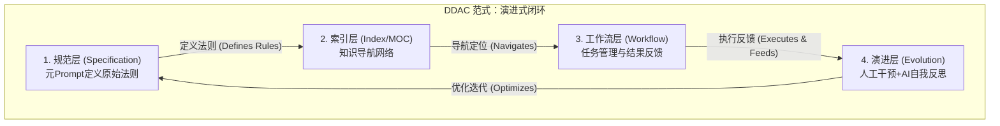

# 架构设计

> **返回**：[主文档](../README.md) | **上一篇**：[核心概念](./01-核心概念.md) | **下一篇**：[实施指南](./03-实施指南.md)

---

## 🏗️ 四层架构模型

> 💡 **核心理念**：DDAC是一个能自我进化的闭环系统

### 理论内核：DDAC范式

DDAC的核心是一个由四个层次构成的、能**自我进化**的闭环系统：



**四层架构说明**：

| 层次 | 职责 | 关键产物 | 维护者 | 核心价值 |
|------|------|----------|--------|----------|
| **规范层** | 定义"是什么"和"怎么做" | docs/ 规范文档 | 人类 | 持久化的"元Prompt" |
| **索引层** | 定义"在哪里"和"有什么" | MOC索引、双向链接 | 人类 + AI | 知识导航网络 |
| **工作流层** | 任务管理与结果反馈 | 路书、报告 | AI + 人类 | 暴露问题与差距 |
| **演进层** | 分析反馈，优化规范 | 规范迭代 | 人类 + AI | 持续改进闭环 |

**闭环机制**：

```
规范层（定义法则）
    ↓ 指导
索引层（导航定位）
    ↓ 引导
工作流层（执行反馈）
    ↓ 暴露问题
演进层（优化迭代）
    ↓ 修正
规范层（更新法则）
    ↓ ...
```

**关键特性**：
- ✅ **自我进化**：通过反馈闭环持续优化
- ✅ **人机协作**：人类定义规范，AI执行任务
- ✅ **持久化上下文**：规范文档成为"长期记忆"
- ✅ **可追溯性**：每次迭代都有记录

---

## 📂 目录结构设计

> 💡 **重要区分**：方法论架构 vs 项目结构

### 方法论架构（理论层面）

这是DDAC方法论的抽象架构，适用于任何实施场景：

```
规范层（Specification）
  ↓ 定义法则和标准
索引层（Index/MOC）
  ↓ 导航定位
工作流层（Workflow）
  ↓ 执行任务与反馈
演进层（Evolution）
  ↓ 分析反馈优化规范
```

### 项目结构（实践层面）

#### 1. 个人知识库实施示例

如果你在个人知识库中实施DDAC，推荐的目录结构：

```
AI指导目录/
├── 核心规范/                    # 规范层
│   ├── 📖 总览手册.md           # 入口文档
│   ├── 🗺️ 结构索引.md          # 知识库结构
│   ├── 📋 分类指南.md           # 分类规则
│   ├── 🏷️ 标签规范.md          # 标签体系
│   └── 🔗 双链规范.md           # 关联规则
│
├── 路书系统/                    # 反馈层
│   ├── 📋 路书索引.md           # 路书总览
│   ├── 🎯 当前任务路书.md       # 当前任务
│   ├── 活跃任务/                # 任务详情
│   │   ├── 任务A.md
│   │   └── 任务B.md
│   └── 任务历史/                # 已完成任务
│       └── 2025-10/
│           └── 任务X-已完成.md
│
└── 进度报告/                    # 反馈层 + 演进层
    ├── 📋 报告索引.md           # 报告总览
    ├── 体系建设/                # 分类报告
    ├── 写作项目/
    ├── 技术处理/
    └── ...
```

**架构映射说明**：
- **规范层** → `核心规范/` 目录
- **索引层** → `核心规范/结构索引.md` + MOC文档 + 双向链接
- **工作流层** → `路书系统/` + `进度报告/` 目录
- **演进层** → 人类分析报告并更新规范（体现在规范文档的版本迭代中）

#### 2. DDAC开源项目结构

本开源项目的目录结构（GitHub仓库）：

```
DDAC/
├── README.md                          # 精简版主文档
├── LICENSE                            # CC BY-SA 4.0协议
├── CHANGELOG.md                       # 版本变更历史
├── .gitignore                         # Git忽略规则
│
├── docs/                              # 规范层：详细文档目录
│   ├── 01-核心概念.md                 # 什么是DDAC
│   ├── 02-架构设计.md                 # 四层架构详解
│   ├── 03-实施指南.md                 # 从零到一实践
│   ├── 04-进阶技巧.md                 # 高级用法
│   ├── 05-常见问题.md                 # FAQ
│   └── assets/                        # 文档资源（图片等）
│
└── templates/                         # 反馈层：模板文件目录
    ├── README.md                      # 模板使用总览
    ├── 文档整理/                      # 文档管理模板
    │   └── AI 指导目录/               # AI协作规范示例
    └── ...
```

**架构映射说明**：
- **规范层** → `docs/` 目录（面向AI与使用者的规范文档）
- **索引层** → `README.md` + 文档导航（提供知识地图和快速导航）
- **工作流层** → `templates/` 目录（提供任务模板，驱动轻量路书与报告产出）
- **演进层** → GitHub Issues & Discussions（社区反馈推动规范优化）

**设计理念**：
- 本项目是DDAC方法论的"元实现"
- `docs/` 是规范层，定义DDAC是什么
- `templates/` 是反馈层，提供可复用的执行模板
- 社区协作是演进层，推动方法论持续优化

---

## 🎨 设计原则

### 原则1：单一职责（Single Responsibility）

**定义**：每个文档只负责一个方面，避免职责混乱。

**理由**：
- AI读取效率更高（聚焦单一主题）
- 维护成本更低（修改影响范围小）
- 复用性更强（可独立使用）

**实践**：
```yaml
✅ 好的设计：
- 标签规范.md：只定义标签体系
- 分类指南.md：只定义分类规则
- 当前任务路书.md：只记录当前任务

❌ 坏的设计：
- 超级文档.md：包含所有规范、任务、报告
  （AI难以快速定位，维护困难）
```

### 原则2：分层清晰（Clear Layering）

**定义**：规范 → 执行 → 反馈 → 演进，层次分明。

**理由**：
- 职责边界清晰
- 信息流向明确
- 便于理解和维护

**实践**：
```yaml
层次划分：
  规范层: 定义"是什么"和"怎么做"
  执行层: AI根据规范执行任务
  反馈层: 生成结构化输出
  演进层: 分析反馈优化规范

避免跨层：
  ❌ 在规范文档中记录任务进度（跨到反馈层）
  ❌ 在任务路书中定义标签规范（跨到规范层）
```

### 原则3：轻量高效（Lightweight & Efficient）

**定义**：每个文档控制在合理大小，便于AI快速读取。

**理由**：
- AI读取速度更快
- Token消耗更少
- 理解效率更高

**实践**：
```yaml
文档大小建议：
  规范文档: <200行
  任务路书: <150行
  任务详情: <300行
  报告文档: <250行

优化策略：
  - 使用双链引用，避免重复内容
  - 分层组织，避免单文档过大
  - 定期归档，保持活跃文档简洁
```

### 原则4：自我描述（Self-Documenting）

**定义**：文档本身就是最好的说明，无需额外解释。

**理由**：
- 降低学习成本
- 减少沟通成本
- 提升可维护性

**实践**：
```yaml
自我描述要素：
  - 清晰的标题和章节结构
  - 完整的YAML头部元数据
  - 明确的职责说明
  - 丰富的示例和模板
  - 相关文档的双链引用

示例：
  ✅ 好的文档开头：
  ---
  title: 标签体系规范
  purpose: 定义知识库的标签分类体系
  audience: AI助手 + 用户
  ---
  
  # 标签体系规范
  
  > 本文档定义知识库的标签分类体系，用于...
```

### 原则5：演进式设计（Evolutionary Design）

**定义**：从最小可用版本开始，根据实践反馈持续优化。

**理由**：
- 避免过度设计
- 快速验证假设
- 适应变化需求

**实践**：
```yaml
演进路径：
  v1.0: 最小可用版本（MVP）
    - 核心规范文档
    - 基础路书系统
    - 简单报告模板
  
  v1.1: 根据实践优化
    - 补充遗漏规范
    - 优化工作流程
    - 增强自动化
  
  v2.0: 功能扩展
    - 新增高级特性
    - 集成外部工具
    - 多人协作支持

避免：
  ❌ 一开始就追求完美
  ❌ 设计过于复杂的架构
  ❌ 忽视实践反馈
```

---

## 🔄 工作流系统（反馈层实践）

### 四层路书结构

路书系统是DDAC反馈层的核心工具，通过四层结构实现高效的任务跟踪和AI协作：

```yaml
第一层 - 路书索引（📋 路书索引.md）:
  职责: 总览所有任务，提供全局视图
  内容:
    - 活跃任务列表（≤3个）
    - 历史任务索引
    - 任务统计数据
    - 使用指南
  大小: <200行
  更新频率: 月度

第二层 - 当前任务路书（🎯 当前任务路书.md）:
  职责: 聚焦当前工作，保持简洁
  内容:
    - 当前任务概览
    - 下一步行动
    - 最近进展
    - 快速链接
  大小: <150行
  更新频率: 实时

第三层 - 任务详情（活跃任务/*.md）:
  职责: 完整任务信息，详细记录
  内容:
    - 任务目标
    - 详细计划
    - 执行记录
    - 问题与解决
  大小: <300行
  更新频率: 任务更新时

第四层 - 历史归档（任务历史/*.md）:
  职责: 归档已完成任务，保持简洁
  内容:
    - 完成任务记录
    - 按月份组织
    - 经验教训总结
  大小: <500行/月
  更新频率: 归档时
```

### 路书生成四大法则

1. **倒排原则**：最新任务在前（时间倒序 + 优先级倒序）
2. **归档原则**：完成后立即归档，保持简洁（活跃任务≤3个）
3. **更新原则**：进度实时更新，状态及时变更
4. **格式标准**：统一模板、唯一ID、完整链接

### 任务生命周期（闭环机制）

```
创建任务 → 活跃任务 → 执行中 → 完成 → 归档历史
   ↓          ↓         ↓        ↓       ↓
路书索引   当前路书   进度更新  生成报告  历史目录
                                  ↓
                            分析反馈 → 优化规范（演进层）
```

**闭环说明**：
- 任务执行过程中生成结构化反馈（路书、报告）
- 人类分析反馈，发现规范的不足
- 优化规范文档，提升下次执行效率
- 形成持续改进的闭环

---

## 📊 进度报告系统

### 报告分类

```yaml
报告类型：
  1. 阶段完成报告:
    - 记录阶段性成果
    - 统计数据分析
    - 问题与改进
  
  2. 任务完成报告:
    - 完整任务总结
    - 工作亮点
    - 经验教训
  
  3. 周期性总结报告:
    - 定期回顾
    - 趋势分析
    - 优化建议
```

### 报告目录结构

```
进度报告/
├── 📋 报告索引.md
├── 体系建设/
│   ├── 路书系统重构完成报告.md
│   └── AI指导目录建立完成报告.md
├── 写作项目/
├── 技术处理/
└── ...
```

---

## 🔗 相关文档

- **上一篇**：[核心概念](./01-核心概念.md) - 理解DDAC是什么
- **下一篇**：[实施指南](./03-实施指南.md) - 开始搭建你的体系
- **进阶技巧**：[高级用法](./04-进阶技巧.md) - 提升协作效率
- **常见问题**：[FAQ](./05-常见问题.md) - 解答疑惑

---

**上一篇**：[核心概念](./01-核心概念.md) | **下一篇**：[实施指南](./03-实施指南.md)