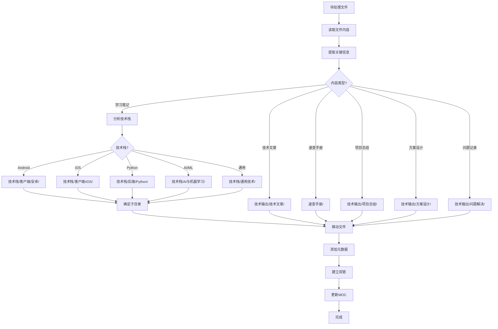
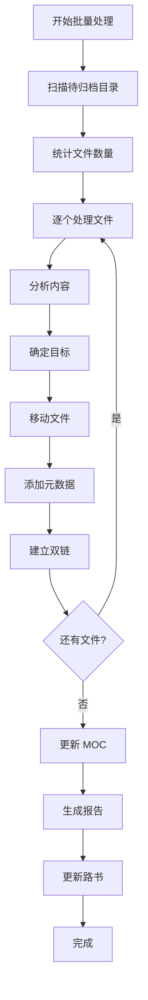

# 📋 文件分类与归档指南

> **目的**：为 AI 提供自动分类和归档的完整规则，实现智能文件管理

---

## 🎯 核心原则

1. **内容优先**：根据文件内容而非文件名分类
2. **技术栈明确**：每个文件必须有明确的技术栈归属
3. **类型清晰**：区分学习笔记、技术文章、速查手册等
4. **避免重复**：同类内容归入同一目录
5. **便于检索**：目录结构要直观易懂

---

## 🔍 自动分类流程

### 完整流程图



---

## 📝 分类规则详解

### 规则 1：内容类型识别

#### 1.1 学习笔记

**特征**：
- 包含学习过程、笔记、总结
- 有代码示例和解释
- 结构：概念 → 用法 → 示例 → 总结
- 关键词：学习、笔记、教程、入门、进阶

**目标目录**：`技术栈/[领域]/[技术]/`

**示例**：
```
文件：Jetpack Compose 状态管理学习笔记.md
分析：学习笔记 + Android + Compose + 状态管理
目标：技术栈/客户端/安卓/Compose/状态管理/
```

#### 1.2 技术文章

**特征**：
- 原创技术分享
- 有完整的论述和结论
- 结构：背景 → 分析 → 方案 → 总结
- 关键词：深入、原理、实践、分享

**目标目录**：`技术输出/技术文章/[技术]/`

**示例**：
```
文件：深入理解 Compose 重组机制.md
分析：技术文章 + Android + Compose
目标：技术输出/技术文章/Android/
```

#### 1.3 速查手册

**特征**：
- 快速参考用途
- 命令、API、配置等列表
- 结构：分类 → 命令 → 说明 → 示例
- 关键词：速查、手册、命令、API、配置

**目标目录**：`速查手册/`

**示例**：
```
文件：Docker 常用命令速查.md
分析：速查手册 + Docker
目标：速查手册/Docker速查手册.md
```

#### 1.4 项目总结

**特征**：
- 项目复盘和总结
- 包含背景、过程、结果、反思
- 结构：项目背景 → 技术方案 → 遇到的问题 → 总结
- 关键词：项目、总结、复盘、回顾

**目标目录**：`技术输出/项目总结/[年份]/`

**示例**：
```
文件：XX App 重构项目总结.md
分析：项目总结 + 2025年
目标：技术输出/项目总结/2025/
```

#### 1.5 方案设计

**特征**：
- 技术方案设计文档
- 包含需求、方案、对比、决策
- 结构：需求 → 方案 → 对比 → 选择
- 关键词：方案、设计、架构、选型

**目标目录**：`技术输出/方案设计/[类型]/`

**示例**：
```
文件：App 架构设计方案.md
分析：方案设计 + 架构设计
目标：技术输出/方案设计/架构设计/
```

#### 1.6 问题记录

**特征**：
- 问题和解决方案
- 结构：问题描述 → 原因分析 → 解决方案
- 关键词：问题、bug、错误、解决

**目标目录**：`技术输出/问题解决/[技术]/`

**示例**：
```
文件：Compose 性能问题排查.md
分析：问题记录 + Android
目标：技术输出/问题解决/Android问题/
```

#### 1.7 源码阅读

**特征**：
- 源码分析和笔记
- 结构：源码结构 → 核心逻辑 → 设计思想
- 关键词：源码、阅读、分析、实现原理

**目标目录**：`技术栈/[技术]/源码阅读/`

**示例**：
```
文件：Compose 源码分析 - 重组机制.md
分析：源码阅读 + Android + Compose
目标：技术栈/客户端/安卓/Compose/源码阅读/
```

---

### 规则 2：技术栈识别

#### 2.1 移动端开发

**Android 相关**：
- 关键词：Android, Kotlin, Compose, Jetpack, View, Activity, Fragment
- 目标：`技术栈/客户端/安卓/`
- 子分类：
  - Compose → `Compose/`
  - Kotlin → `Kotlin/`
  - Android 基础 → `Android基础/`

**iOS 相关**：
- 关键词：iOS, Swift, SwiftUI, UIKit, Objective-C
- 目标：`技术栈/客户端/iOS/`
- 子分类：
  - Swift → `Swift/`
  - SwiftUI → `SwiftUI/`

**跨平台**：
- 关键词：Flutter, React Native, Dart
- 目标：`技术栈/客户端/Flutter/` 或 `技术栈/客户端/ReactNative/`

#### 2.2 后端开发

**Python 相关**：
- 关键词：Python, Django, FastAPI, Flask
- 目标：`技术栈/后端/Python/`
- 子分类：
  - Python 基础 → `Python基础/`
  - Django → `Django/`
  - FastAPI → `FastAPI/`

**数据库相关**：
- 关键词：MySQL, PostgreSQL, Redis, MongoDB, SQL
- 目标：`技术栈/后端/数据库/`
- 子分类：
  - MySQL → `MySQL/`
  - Redis → `Redis/`

**微服务相关**：
- 关键词：微服务, Docker, Kubernetes, gRPC
- 目标：`技术栈/后端/微服务/`

#### 2.3 AI 与机器学习

**机器学习**：
- 关键词：机器学习, ML, 算法, scikit-learn, 特征工程
- 目标：`技术栈/AI与机器学习/机器学习/`

**深度学习**：
- 关键词：深度学习, DL, PyTorch, TensorFlow, 神经网络, CNN, RNN
- 目标：`技术栈/AI与机器学习/深度学习/`

**AI 应用**：
- 关键词：LLM, GPT, RAG, Embedding, 向量数据库
- 目标：`技术栈/AI与机器学习/AI应用/`

#### 2.4 通用技术

**设计模式**：
- 关键词：设计模式, 单例, 工厂, 观察者, SOLID
- 目标：`技术栈/通用技术/设计模式/`

**算法与数据结构**：
- 关键词：算法, 数据结构, LeetCode, 排序, 搜索
- 目标：`技术栈/通用技术/算法与数据结构/`

**版本控制**：
- 关键词：Git, GitHub, 版本控制
- 目标：`技术栈/通用技术/Git/`

**DevOps**：
- 关键词：CI/CD, Jenkins, GitHub Actions, 部署
- 目标：`技术栈/通用技术/DevOps/`

---

### 规则 3：子目录确定

#### 3.1 按主题分类

**示例：Compose 目录**
```
Compose/
├── 状态管理/          # 状态相关
├── 布局/              # 布局相关
├── 动画/              # 动画相关
├── 性能优化/          # 性能相关
├── 规范/              # 开发规范
└── 源码阅读/          # 源码分析
```

**判断逻辑**：
1. 文件主题是否明确？
2. 是否已有对应子目录？
3. 是否需要创建新子目录？

#### 3.2 创建新子目录的条件

**应该创建**：
- ✅ 同主题文件 ≥ 3 个
- ✅ 主题明确且独立
- ✅ 未来可能继续增加

**不应该创建**：
- ❌ 只有 1-2 个文件
- ❌ 主题不明确
- ❌ 可以归入现有目录

---

## 🤖 AI 自动化处理步骤

### 步骤 1：扫描待归档目录

```python
# 伪代码示例
files = scan_directory("待归档/")
for file in files:
    process_file(file)
```

### 步骤 2：读取文件内容

```python
def process_file(file):
    content = read_file(file)
    metadata = extract_metadata(content)
    return metadata
```

### 步骤 3：分析文件内容

```python
def extract_metadata(content):
    # 提取关键信息
    content_type = identify_content_type(content)
    tech_stack = identify_tech_stack(content)
    topic = identify_topic(content)
    difficulty = identify_difficulty(content)
    
    return {
        "content_type": content_type,
        "tech_stack": tech_stack,
        "topic": topic,
        "difficulty": difficulty
    }
```

### 步骤 4：确定目标目录

```python
def determine_target_directory(metadata):
    if metadata["content_type"] == "学习笔记":
        base = "技术栈/"
        if metadata["tech_stack"] == "Android":
            if metadata["topic"] == "Compose":
                return "技术栈/客户端/安卓/Compose/"
        # ... 其他逻辑
    elif metadata["content_type"] == "速查手册":
        return "速查手册/"
    # ... 其他类型
```

### 步骤 5：移动文件

```python
def move_file(file, target_dir):
    # 确保目标目录存在
    ensure_directory_exists(target_dir)
    
    # 移动文件
    new_path = target_dir + file.name
    move(file.path, new_path)
    
    return new_path
```

### 步骤 6：添加元数据

```python
def add_metadata(file, metadata):
    # 添加 YAML 头部
    yaml_header = generate_yaml_header(metadata)
    
    # 添加导航链接
    navigation = generate_navigation(metadata)
    
    # 添加标签
    tags = generate_tags(metadata)
    
    # 更新文件
    update_file(file, yaml_header, navigation, tags)
```

### 步骤 7：建立双链

```python
def create_backlinks(file, metadata):
    # 查找相关文档
    related_docs = find_related_documents(metadata)
    
    # 添加双链
    for doc in related_docs:
        add_link(file, doc)
        add_link(doc, file)
```

### 步骤 8：更新 MOC

```python
def update_moc(file, metadata):
    # 确定相关 MOC
    moc_file = find_related_moc(metadata)
    
    # 添加到 MOC
    add_to_moc(moc_file, file)
```

### 步骤 9：生成报告

```python
def generate_report(processed_files):
    report = {
        "total": len(processed_files),
        "by_type": count_by_type(processed_files),
        "by_tech": count_by_tech(processed_files),
        "moved": list_moved_files(processed_files)
    }
    
    save_report(report)
```

---

## 📊 分类决策树

### 决策树 1：内容类型

```
文件内容
├── 包含"学习"、"笔记"、"教程" → 学习笔记
├── 包含"深入"、"原理"、"实践" → 技术文章
├── 包含"速查"、"命令"、"API" → 速查手册
├── 包含"项目"、"总结"、"复盘" → 项目总结
├── 包含"方案"、"设计"、"架构" → 方案设计
├── 包含"问题"、"bug"、"解决" → 问题记录
└── 包含"源码"、"分析"、"实现" → 源码阅读
```

### 决策树 2：技术栈

```
关键词
├── Android/Kotlin/Compose → 技术栈/客户端/安卓/
├── iOS/Swift/SwiftUI → 技术栈/客户端/iOS/
├── Python/Django/FastAPI → 技术栈/后端/Python/
├── MySQL/Redis/数据库 → 技术栈/后端/数据库/
├── 机器学习/ML/算法 → 技术栈/AI与机器学习/机器学习/
├── 深度学习/PyTorch/神经网络 → 技术栈/AI与机器学习/深度学习/
├── 设计模式/SOLID → 技术栈/通用技术/设计模式/
└── 算法/数据结构/LeetCode → 技术栈/通用技术/算法与数据结构/
```

---

## 🎯 特殊情况处理

### 情况 1：多技术栈文件

**问题**：文件涉及多个技术栈（如 Android + Python）

**解决方案**：
1. 确定主要技术栈（内容占比最大）
2. 放入主要技术栈目录
3. 在其他技术栈的 MOC 中添加引用

**示例**：
```
文件：Android App 与 Python 后端通信.md
主要技术栈：Android (70%)
次要技术栈：Python (30%)
目标：技术栈/客户端/安卓/网络通信/
同时在：技术栈/后端/Python/ 的 MOC 中添加引用
```

### 情况 2：主题不明确

**问题**：文件主题模糊，难以分类

**解决方案**：
1. 仔细阅读文件内容
2. 提取核心关键词
3. 如果仍不确定，放入"待归档"并标记
4. 人工确认后再处理

### 情况 3：目录不存在

**问题**：目标目录不存在

**解决方案**：
1. 检查是否应该创建新目录
2. 如果符合创建条件（≥3 个文件），创建新目录
3. 如果不符合，归入上级目录
4. 更新知识库结构索引

### 情况 4：文件名冲突

**问题**：目标目录已有同名文件

**解决方案**：
1. 比较文件内容
2. 如果内容相同，合并或删除重复
3. 如果内容不同，重命名（添加日期或序号）

---

## 📝 实战示例

### 示例 1：处理 Compose 学习笔记

**文件**：`Compose 状态管理.md`

**内容分析**：
```
标题：Jetpack Compose 状态管理学习笔记
内容：
- State 和 MutableState 的使用
- remember 和 rememberSaveable
- ViewModel 集成
- 代码示例和解释
```

**分类过程**：
1. **内容类型**：学习笔记（包含"学习笔记"、代码示例）
2. **技术栈**：Android + Compose
3. **主题**：状态管理
4. **目标目录**：`技术栈/客户端/安卓/Compose/状态管理/`

**处理步骤**：
```yaml
1. 移动文件到目标目录
2. 添加 YAML 头部：
   ---
   title: Jetpack Compose 状态管理学习笔记
   created: 2025-10-15
   updated: 2025-10-15
   tags:
     - 技术栈/Android/Compose
     - 内容类型/学习笔记
     - 难度/中级
     - 状态/已完成
     - 重要度/高
   type: 学习笔记
   status: 已完成
   ---

3. 添加导航：
   ## 📋 导航
   - 返回：[[🤖 Android开发 MOC]]
   - 上级：[[Jetpack Compose 目录]]

4. 添加双链：
   ## 🔗 相关文档
   - [[Compose 基础概念]]
   - [[ViewModel 使用指南]]
   
   ## 📚 延伸阅读
   - [[Compose 性能优化]]
   - [[Compose 最佳实践]]

5. 更新 MOC：
   在 [[🤖 Android开发 MOC]] 中添加链接

6. 添加底部标签：
   ---
   #技术栈/Android/Compose #内容类型/学习笔记 #难度/中级
```

### 示例 2：处理技术文章

**文件**：`深入理解 Compose 重组机制.md`

**内容分析**：
```
标题：深入理解 Jetpack Compose 重组机制
内容：
- 重组的触发条件
- 重组的优化策略
- 源码分析
- 实践建议
```

**分类过程**：
1. **内容类型**：技术文章（深入分析、原创内容）
2. **技术栈**：Android + Compose
3. **目标目录**：`技术输出/技术文章/Android/`

**处理步骤**：
```yaml
1. 移动到：技术输出/技术文章/Android/
2. 添加元数据（同上）
3. 标签：
   - 技术栈/Android/Compose
   - 内容类型/技术文章
   - 难度/高级
   - 状态/已发布
   - 重要度/高
```

### 示例 3：处理速查手册

**文件**：`Compose 常用组件速查.md`

**内容分析**：
```
标题：Jetpack Compose 常用组件速查手册
内容：
- Text 组件
- Button 组件
- LazyColumn 组件
- 每个组件的常用参数和示例
```

**分类过程**：
1. **内容类型**：速查手册（快速参考）
2. **技术栈**：Android + Compose
3. **目标目录**：`速查手册/`
4. **文件名**：`Compose组件速查手册.md`

---

## ✅ 质量检查清单

### 处理前检查

- [ ] 文件内容完整（不是空文件）
- [ ] 文件格式正确（Markdown）
- [ ] 文件名有意义（不是"未命名"）

### 处理后检查

- [ ] 文件已移动到正确目录
- [ ] YAML 头部完整（title, created, updated, tags, type, status）
- [ ] 至少 3 个标签（技术栈、内容类型、难度）
- [ ] 有导航链接（返回上级 MOC）
- [ ] 至少 2 个双链（相关文档或延伸阅读）
- [ ] 底部有标签索引
- [ ] 相关 MOC 已更新
- [ ] 工作流路书已更新

---

## 🔄 批量处理流程

### 流程概览



### 批量处理脚本（伪代码）

```python
def batch_process():
    # 1. 扫描目录
    files = scan_directory("待归档/")
    print(f"发现 {len(files)} 个文件待处理")
    
    # 2. 初始化统计
    stats = {
        "total": len(files),
        "processed": 0,
        "failed": 0,
        "by_type": {},
        "by_tech": {}
    }
    
    # 3. 逐个处理
    for file in files:
        try:
            # 分析文件
            metadata = analyze_file(file)
            
            # 确定目标
            target_dir = determine_target(metadata)
            
            # 移动文件
            new_path = move_file(file, target_dir)
            
            # 添加元数据
            add_metadata(new_path, metadata)
            
            # 建立双链
            create_backlinks(new_path, metadata)
            
            # 更新统计
            stats["processed"] += 1
            update_stats(stats, metadata)
            
            print(f"✅ 处理完成: {file.name} → {target_dir}")
            
        except Exception as e:
            stats["failed"] += 1
            print(f"❌ 处理失败: {file.name} - {e}")
    
    # 4. 更新 MOC
    update_all_mocs()
    
    # 5. 生成报告
    report = generate_report(stats)
    save_report(report)
    
    # 6. 更新路书
    update_workflow_log(report)
    
    print(f"\n🎉 批量处理完成！")
    print(f"成功: {stats['processed']}/{stats['total']}")
    print(f"失败: {stats['failed']}/{stats['total']}")
```

---

## 📊 处理报告模板

```markdown
# 文件分类处理报告

**处理时间**：2025-10-15 18:30  
**处理目录**：待归档/  
**处理人员**：AI 助手

## 📈 统计概览

| 指标 | 数量 |
|------|------|
| 总文件数 | 25 |
| 成功处理 | 23 |
| 处理失败 | 2 |
| 成功率 | 92% |

## 📋 按内容类型分类

| 类型 | 数量 | 占比 |
|------|------|------|
| 学习笔记 | 15 | 65% |
| 技术文章 | 5 | 22% |
| 速查手册 | 2 | 9% |
| 项目总结 | 1 | 4% |

## 🔧 按技术栈分类

| 技术栈 | 数量 | 占比 |
|--------|------|------|
| Android | 12 | 52% |
| Python | 6 | 26% |
| AI/ML | 3 | 13% |
| 通用 | 2 | 9% |

## 📁 文件移动记录

| 原文件 | 目标目录 | 状态 |
|--------|---------|------|
| Compose状态管理.md | 技术栈/客户端/安卓/Compose/状态管理/ | ✅ |
| Python装饰器.md | 技术栈/后端/Python/Python基础/ | ✅ |
| ... | ... | ... |

## ❌ 失败文件

| 文件 | 原因 | 建议 |
|------|------|------|
| 未命名.md | 文件为空 | 删除或补充内容 |
| test.md | 内容不明确 | 人工确认分类 |

## 🎯 下一步行动

- [ ] 处理失败文件
- [ ] 检查处理质量
- [ ] 更新相关 MOC
- [ ] 继续处理其他目录
```

---

## 🔗 相关文档

- [[AI协作指导手册 - 总览]] - 返回总览
- [[知识库结构索引]] - 目录结构
- [[标签体系规范]] - 标签规范
- [[双链建立规范]] - 双链规范
- [[AI工作流路书]] - 工作进度

---

**创建时间**：2025-10-15 18:15  
**更新频率**：规则变化时更新  
**重要程度**：⭐⭐⭐⭐⭐

---

> 💡 **AI 使用提示**：
> 1. 处理文件前，先完整阅读本指南
> 2. 严格遵循分类规则，不要凭记忆
> 3. 遇到不确定的情况，标记并人工确认
> 4. 每次处理后，生成详细报告
> 5. 持续优化规则，提高准确率

---

#AI指导 #自动化 #分类规则 #归档 #重要
