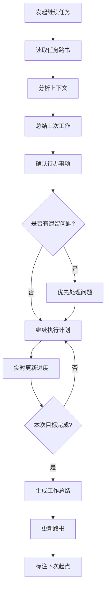

# 元Prompt - 继续任务

> **适用场景**：跨会话继续执行未完成的任务，快速恢复上下文
> 
> **核心价值**：通过路书系统实现任务接续，避免重复说明

---

## 🎯 使用场景

### 适用情况
- ✅ 任务被中断，需要继续执行
- ✅ 跨会话恢复工作
- ✅ 多人协作接力
- ✅ 定期任务推进

### 不适用情况
- ❌ 任务已完成（使用"完成任务"模板）
- ❌ 任务需要重新规划（使用"创建任务路书"模板）
- ❌ 任务目标发生重大变化

---

## 📋 标准Prompt模板

### 基础版（最小化）

```markdown
参考 .internal/ai-guide，继续任务：[任务名称]

当前任务路书：[路书文件路径]

请：
1. 读取任务路书，了解当前进度
2. 继续执行下一步
3. 更新进度
4. 遇到问题及时反馈
```

### 完整版（推荐）

```markdown
参考 .internal/ai-guide，继续任务：[任务名称]

**任务信息**：
- 任务ID：[任务ID]
- 当前路书：[路书文件路径]
- 上次更新：[最后更新时间]
- 当前进度：[百分比]

**本次目标**：
- [ ] [本次要完成的目标1]
- [ ] [本次要完成的目标2]
- [ ] [本次要完成的目标3]

**已知问题**（如有）：
- [问题1描述]
- [问题2描述]

请：
1. 读取任务路书，快速了解上下文
2. 确认当前阶段和待办事项
3. 继续执行下一步（或从指定步骤开始）
4. 实时更新进度到路书
5. 遇到阻碍及时反馈
6. 完成后总结本次工作
```

### 高级版（复杂任务）

```markdown
参考 .internal/ai-guide，继续任务：[任务名称]

**任务信息**：
- 任务ID：[任务ID]
- 当前路书：[路书文件路径]
- 相关文档：[相关文档列表]
- 上次更新：[最后更新时间]
- 当前进度：[百分比]
- 当前阶段：[阶段名称]

**上次工作回顾**：
- 已完成：[上次完成的工作]
- 遗留问题：[未解决的问题]
- 待办事项：[下一步计划]

**本次工作计划**：
- [ ] [本次目标1]
- [ ] [本次目标2]
- [ ] [本次目标3]

**约束条件**：
- 时间限制：[本次工作时长]
- 质量要求：[质量标准]
- 依赖关系：[依赖的其他任务]

**已知风险**：
- [风险1及应对方案]
- [风险2及应对方案]

请：
1. 读取任务路书和相关文档，全面了解上下文
2. 分析上次工作成果和遗留问题
3. 确认本次工作计划的可行性
4. 按计划执行，实时更新进度
5. 遇到阻碍立即反馈，提出解决方案
6. 完成后生成本次工作总结
7. 更新路书，标注下次工作起点
```

---

## 💡 使用技巧

### 1. 快速恢复上下文

**技巧**：让AI先总结上次工作，再继续执行

```markdown
继续任务前，请先：
1. 总结上次工作成果（3-5条要点）
2. 列出当前待办事项（优先级排序）
3. 确认下一步行动计划
4. 等我确认后再执行
```

### 2. 分阶段推进

**技巧**：明确本次工作范围，避免过度执行

```markdown
本次工作范围：
- 只完成阶段X的步骤Y
- 预计时间：30分钟
- 产出：[具体产出]

请严格控制范围，完成后停止并汇报。
```

### 3. 问题优先处理

**技巧**：先解决遗留问题，再推进新工作

```markdown
继续任务前，请先处理遗留问题：
1. [问题1]：[期望解决方案]
2. [问题2]：[期望解决方案]

问题解决后，再继续执行计划任务。
```

### 4. 多人协作接力

**技巧**：明确交接信息，确保协作顺畅

```markdown
接力信息：
- 上一位协作者：[姓名/角色]
- 交接时间：[时间]
- 交接内容：[已完成工作]
- 待办事项：[需要继续的工作]

请确认交接信息无误后继续执行。
```

---

## 📊 执行流程



---

## ✅ 检查清单

### 继续任务前
- [ ] 任务路书存在且可访问
- [ ] 上次工作状态清晰
- [ ] 本次目标明确
- [ ] 时间和资源充足

### 执行过程中
- [ ] 上下文恢复完整
- [ ] 遗留问题已处理
- [ ] 进度实时更新
- [ ] 问题及时反馈

### 完成后
- [ ] 本次工作总结完整
- [ ] 路书更新及时
- [ ] 下次起点标注清晰
- [ ] 产出符合预期

---

## 🎯 示例场景

### 场景1：简单任务接续

```markdown
参考 .internal/ai-guide，继续任务：Python学习笔记整理

当前路书：路书系统/Python学习笔记整理.md
上次更新：2025-10-20 15:30
当前进度：60%

请：
1. 读取路书，了解进度
2. 继续执行下一步
3. 更新进度
```

### 场景2：复杂项目推进

```markdown
参考 .internal/ai-guide，继续任务：知识管理体系重构

任务信息：
- 任务ID：KM-REFACTOR-2025-10
- 当前路书：路书系统/知识管理体系重构.md
- 相关文档：规范文档/知识管理规范.md
- 上次更新：2025-10-20 18:00
- 当前进度：45%
- 当前阶段：阶段2 - 标签体系设计

上次工作回顾：
- 已完成：完成了标签分类设计
- 遗留问题：部分标签命名冲突
- 待办事项：解决命名冲突，开始标签应用

本次工作计划：
- [ ] 解决标签命名冲突
- [ ] 设计标签应用规则
- [ ] 完成10个示例文档的标签添加

约束条件：
- 时间限制：本次工作1小时
- 质量要求：标签命名符合规范，无冲突
- 依赖关系：依赖标签规范文档

请按计划执行，实时更新进度。
```

### 场景3：跨会话协作

```markdown
参考 .internal/ai-guide，继续任务：技术文档翻译

接力信息：
- 上一位协作者：AI助手A
- 交接时间：2025-10-20 20:00
- 交接内容：已完成前3章翻译
- 待办事项：继续翻译第4-6章

本次目标：
- [ ] 翻译第4章
- [ ] 翻译第5章
- [ ] 质量检查前5章

请确认交接信息，继续执行。
```

---

## 🔗 相关模板

- [创建任务路书](./01-创建任务路书.md) - 创建新任务
- [完成任务](./03-完成任务.md) - 任务收尾
- [生成报告](./04-生成报告.md) - 生成工作报告

---

## 📝 版本历史

### v1.0.0 (2025-10-21)
- ✅ 创建元Prompt模板
- ✅ 提供三个版本的Prompt
- ✅ 添加使用技巧和示例

---

**维护者**：DDAC项目组  
**最后更新**：2025-10-21  
**文档版本**：v1.0.0
