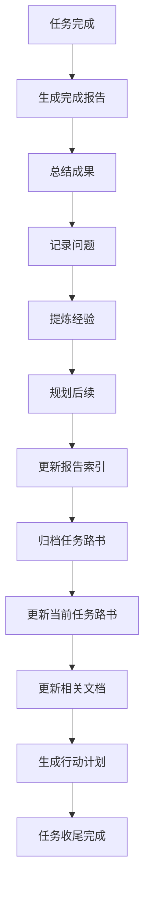

# 元Prompt - 完成任务

> **适用场景**：任务完成后的收尾工作，包括报告生成、归档和索引更新
> 
> **核心价值**：规范化任务收尾流程，沉淀经验和成果

---

## 🎯 使用场景

### 适用情况
- ✅ 任务目标已达成
- ✅ 需要生成完成报告
- ✅ 需要归档任务路书
- ✅ 需要更新索引和文档

### 不适用情况
- ❌ 任务未完成（使用"继续任务"模板）
- ❌ 任务需要暂停（更新路书即可）
- ❌ 任务被取消（标注状态后归档）

---

## 📋 标准Prompt模板

### 基础版（最小化）

```markdown
参考 .internal/ai-guide，任务已完成：[任务名称]

请：
1. 生成完成报告
2. 归档任务路书
3. 更新当前任务路书
4. 建议下一步行动
```

### 完整版（推荐）

```markdown
参考 .internal/ai-guide，任务已完成：[任务名称]

**任务信息**：
- 任务ID：[任务ID]
- 任务路书：[路书文件路径]
- 开始时间：[开始日期]
- 完成时间：[完成日期]
- 最终进度：100%

**完成情况**：
- 目标达成度：[百分比]
- 主要成果：[成果列表]
- 遗留问题：[问题列表]

请：
1. 生成完成报告（包含成果、问题、建议）
2. 更新报告索引
3. 归档任务路书到历史归档
4. 更新当前任务路书（移除已完成任务）
5. 建议下一步行动计划
```

### 高级版（复杂任务）

```markdown
参考 .internal/ai-guide，任务已完成：[任务名称]

**任务信息**：
- 任务ID：[任务ID]
- 任务类型：[重构/新功能/文档/维护]
- 优先级：[P0/P1/P2]
- 任务路书：[路书文件路径]
- 相关文档：[文档列表]
- 开始时间：[开始日期]
- 完成时间：[完成日期]
- 实际用时：[小时数]

**完成情况**：
- 目标达成度：[百分比]
- 主要成果：
  - [成果1]
  - [成果2]
  - [成果3]
- 关键指标：
  - [指标1]：[数值]
  - [指标2]：[数值]
- 遗留问题：
  - [问题1]：[影响和建议]
  - [问题2]：[影响和建议]

**经验总结**：
- 做得好的：[亮点]
- 需改进的：[改进点]
- 经验教训：[教训]

**后续建议**：
- 短期行动：[1-2周内]
- 中期规划：[1-3个月]
- 长期优化：[3个月以上]

请：
1. 生成详细完成报告（包含以上所有内容）
2. 更新报告索引，添加本次报告链接
3. 归档任务路书到历史归档（按类型分类）
4. 更新当前任务路书（移除已完成任务，更新统计）
5. 更新相关文档（如有变更）
6. 生成下一步行动计划（基于后续建议）
7. 标注需要跟进的遗留问题
```

---

## 💡 使用技巧

### 1. 全面总结成果

**技巧**：从多个维度总结成果，便于复盘

```markdown
成果总结维度：
- 产出物：[文档/代码/工具/流程]
- 数量指标：[文件数/行数/覆盖率]
- 质量指标：[完整性/准确性/可用性]
- 效率提升：[时间节省/流程优化]
- 经验沉淀：[方法论/最佳实践]
```

### 2. 诚实记录问题

**技巧**：记录遗留问题和改进点，推动持续优化

```markdown
遗留问题记录：
- 问题描述：[具体问题]
- 影响范围：[影响程度]
- 原因分析：[根本原因]
- 解决方案：[建议方案]
- 优先级：[P0/P1/P2]
- 跟进人：[负责人]
```

### 3. 提炼经验教训

**技巧**：将经验固化为规范，避免重复犯错

```markdown
经验教训提炼：
- 场景：[什么情况下]
- 问题：[遇到了什么问题]
- 原因：[为什么会出现]
- 解决：[如何解决的]
- 规范：[应该如何避免]
- 更新：[需要更新哪些文档]
```

### 4. 规划后续行动

**技巧**：基于成果和问题，规划下一步行动

```markdown
后续行动规划：
- 立即行动（本周）：
  - [ ] [紧急问题修复]
  - [ ] [关键文档更新]
- 短期计划（本月）：
  - [ ] [功能优化]
  - [ ] [流程改进]
- 中期规划（本季度）：
  - [ ] [体系完善]
  - [ ] [工具开发]
```

---

## 📊 执行流程



---

## ✅ 检查清单

### 报告生成
- [ ] 成果总结完整
- [ ] 问题记录详细
- [ ] 经验提炼有价值
- [ ] 后续建议可行

### 归档工作
- [ ] 任务路书已归档
- [ ] 归档位置正确
- [ ] 归档格式规范
- [ ] 链接关系完整

### 索引更新
- [ ] 报告索引已更新
- [ ] 当前任务路书已更新
- [ ] 统计数据已更新
- [ ] 相关文档已更新

### 后续规划
- [ ] 行动计划明确
- [ ] 优先级合理
- [ ] 责任人清晰
- [ ] 时间节点明确

---

## 🎯 示例场景

### 场景1：简单任务完成

```markdown
参考 .internal/ai-guide，任务已完成：Python笔记整理

任务信息：
- 任务ID：PYTHON-NOTES-2025-10
- 完成时间：2025-10-21
- 最终进度：100%

完成情况：
- 目标达成度：100%
- 主要成果：整理了20个Python笔记文件
- 遗留问题：无

请生成完成报告并归档。
```

### 场景2：复杂项目完成

```markdown
参考 .internal/ai-guide，任务已完成：知识管理体系重构

任务信息：
- 任务ID：KM-REFACTOR-2025-10
- 任务类型：重构
- 优先级：P0
- 任务路书：路书系统/知识管理体系重构.md
- 开始时间：2025-10-15
- 完成时间：2025-10-21
- 实际用时：40小时

完成情况：
- 目标达成度：95%
- 主要成果：
  - 重构了目录结构（3层架构）
  - 建立了标签体系（5大类，50+标签）
  - 创建了MOC索引（10个主题）
  - 整理了200+文档
- 关键指标：
  - 文档标签完整率：从30%提升到95%
  - 信息查找速度：从5分钟降到30秒
  - 双链网络密度：从10%提升到60%
- 遗留问题：
  - 部分历史文档格式不统一：影响中等，建议后续批量处理
  - MOC索引需要持续维护：影响低，建议每月更新

经验总结：
- 做得好的：分阶段推进，每阶段都有明确产出
- 需改进的：初期规划不够详细，导致中期调整较多
- 经验教训：大型重构需要更充分的前期调研

后续建议：
- 短期行动：处理历史文档格式问题
- 中期规划：建立MOC维护机制
- 长期优化：开发自动化工具

请生成详细完成报告并归档。
```

### 场景3：带遗留问题的任务

```markdown
参考 .internal/ai-guide，任务已完成：技术文档翻译

任务信息：
- 任务ID：DOC-TRANSLATE-2025-10
- 完成时间：2025-10-21
- 最终进度：100%

完成情况：
- 目标达成度：90%
- 主要成果：完成了6章技术文档翻译
- 遗留问题：
  - 第3章部分术语翻译不统一：需要统一术语表
  - 第5章代码示例未测试：需要验证代码可用性

经验总结：
- 做得好的：翻译质量较高，保持了原文风格
- 需改进的：应该先建立术语表，避免后期返工
- 经验教训：技术文档翻译需要技术验证环节

后续建议：
- 立即行动：建立术语表，统一第3章术语
- 短期计划：测试第5章代码示例
- 中期规划：建立翻译质量检查流程

请生成完成报告，特别标注遗留问题的跟进计划。
```

---

## 🔗 相关模板

- [创建任务路书](./01-创建任务路书.md) - 创建新任务
- [继续任务](./02-继续任务.md) - 任务接续
- [生成报告](./04-生成报告.md) - 生成工作报告

---

## 📝 版本历史

### v1.0.0 (2025-10-21)
- ✅ 创建元Prompt模板
- ✅ 提供三个版本的Prompt
- ✅ 添加使用技巧和示例

---

**维护者**：DDAC项目组  
**最后更新**：2025-10-21  
**文档版本**：v1.0.0
