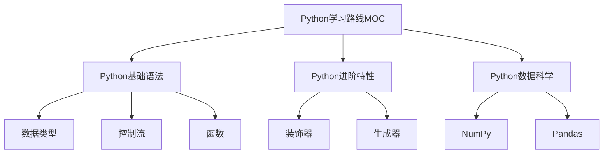

# 🔗 建立双链网络

> **适用场景**：为文档建立双向链接，构建知识网络

---

## 🎯 使用场景

### 适合你，如果：
- ✅ 文档间有明显的关联关系
- ✅ 需要构建知识图谱
- ✅ 想要提升知识发现能力
- ✅ 使用Obsidian等支持双链的工具

### 不适合，如果：
- ❌ 文档数量太少（<10个）
- ❌ 文档间关联性很弱
- ❌ 使用的工具不支持双链

---

## 📝 Prompt模板

### 基础版（推荐新手）

```markdown
参考 .internal/ai-guide 和 docs/03-实施指南.md：

建立双链网络任务：
- 目录：[填写目录路径]
- 文件数：约[N]个
- 主题：[描述主题]

请：
1. 分析文件内容，识别关键概念
2. 发现文档间的关联关系
3. 为每个文档建议3-5个双链目标
4. 逐个确认后添加双链
5. 生成双链网络报告

双链规则：
- 使用WikiLinks格式：[[文件名]]
- 链接到相关概念、主题、案例
- 避免过度链接（每个文档3-10个链接）
- 优先链接核心概念和MOC索引

注意：
- 双链应该是双向的（A链接B，B也应链接A）
- 链接文本应该自然融入内容
- 避免为了链接而链接
```

### 进阶版（基于知识图谱）

```markdown
参考 .internal/ai-guide 和 docs/03-实施指南.md：

知识图谱构建任务：
- 目录：[路径]
- 文件数：约[N]个
- 主题：[主题]

知识图谱设计：
1. **核心概念识别**
   - 提取每个文档的核心概念
   - 识别概念间的关系类型
   - 建立概念层次结构

2. **关系类型定义**
   - 上下位关系（is-a）：如"Python是编程语言"
   - 部分整体关系（part-of）：如"函数是Python的一部分"
   - 关联关系（related-to）：如"Python与数据科学相关"
   - 因果关系（cause-effect）：如"学习基础语法是学习高级特性的前提"

3. **双链策略**
   - 每个文档链接到上级概念（MOC）
   - 每个文档链接到相关概念（横向）
   - 每个文档链接到下级概念（细节）
   - 每个文档链接到实践案例（应用）

执行步骤：
1. 分析文档，提取概念和关系
2. 绘制知识图谱（文本或Mermaid格式）
3. 根据图谱添加双链
4. 验证双链的双向性
5. 生成知识图谱报告

请开始执行。
```

### 专家版（智能双链网络）

```markdown
参考 .internal/ai-guide 和 docs/03-实施指南.md：

智能双链网络构建任务：

目标目录：
- 主目录：[路径]
- 子目录：[是否递归]
- 文件过滤：[特定类型]

双链网络设计：
1. **层次化链接**
   - L1：MOC索引链接（导航层）
   - L2：主题链接（概念层）
   - L3：细节链接（内容层）
   - L4：案例链接（应用层）

2. **语义化链接**
   - 概念定义链接：链接到概念的定义文档
   - 概念应用链接：链接到概念的应用案例
   - 概念对比链接：链接到相关或对比概念
   - 概念扩展链接：链接到深入学习资源

3. **智能链接策略**
   - 基于内容相似度：计算文档相似度，推荐相关链接
   - 基于标签关联：相同标签的文档互相链接
   - 基于路径关系：同一目录或相邻目录的文档链接
   - 基于引用关系：被引用的概念自动创建链接

质量检查：
- [ ] 链接数量：每个文档3-10个链接
- [ ] 链接质量：链接目标相关且有价值
- [ ] 链接双向性：A链接B，B也链接A
- [ ] 链接自然性：链接文本自然融入内容
- [ ] 链接有效性：所有链接目标存在

输出要求：
1. 双链添加报告（成功/失败/跳过）
2. 知识图谱（Mermaid或文本格式）
3. 链接统计（入链/出链/孤立节点）
4. 优化建议（链接网络改进建议）

请制定详细计划并执行。
```

---

## 🎓 使用指南

### 第一步：理解双链概念

1. **什么是双向链接？**
   - 使用`[[文件名]]`格式创建链接
   - 链接是双向的：A链接B，B也能看到来自A的反向链接
   - 形成知识网络而非树状结构

2. **双链的价值**
   - 发现知识间的隐藏关联
   - 提升知识检索效率
   - 促进创造性思考
   - 构建个人知识图谱

3. **双链的类型**
   - 上级链接：链接到MOC或父概念
   - 平级链接：链接到相关概念
   - 下级链接：链接到子概念或细节
   - 案例链接：链接到实践案例

### 第二步：执行任务

1. **选择合适的Prompt版本**
   - 新手：基础版
   - 有经验：进阶版
   - 构建知识图谱：专家版

2. **填写Prompt信息**
   - 目录路径
   - 文件数量
   - 主题描述
   - 双链策略（如有）

3. **发送给AI并确认**
   - 检查AI识别的关联关系
   - 确认双链建议的合理性
   - 同意后批量添加

### 第三步：质量检查

1. **检查链接数量**
   - 每个文档3-10个链接
   - 避免过度链接或链接不足

2. **检查链接质量**
   - 链接目标是否相关
   - 链接是否有价值
   - 链接文本是否自然

3. **检查链接双向性**
   - A链接B，B是否也链接A
   - 使用Obsidian的Graph View检查

4. **检查孤立节点**
   - 是否有文档没有任何链接
   - 孤立节点是否需要链接

---

## 💡 最佳实践

### ✅ 推荐做法

1. **建立MOC索引**
   - 先创建主题MOC（Map of Content）
   - 所有相关文档链接到MOC
   - MOC链接到所有相关文档

2. **使用层次化链接**
   - 上级链接：链接到MOC或父概念
   - 平级链接：链接到相关概念
   - 下级链接：链接到子概念

3. **保持链接自然**
   - 链接文本应该自然融入内容
   - 避免为了链接而链接
   - 链接应该对读者有价值

4. **定期维护链接**
   - 检查失效链接
   - 补充缺失链接
   - 优化链接质量

### ❌ 避免做法

1. **不要过度链接**
   - 每个文档不超过10个链接
   - 避免链接到不相关的文档

2. **不要忽略双向性**
   - A链接B，B也应该链接A
   - 单向链接会破坏知识网络

3. **不要创建孤立节点**
   - 每个文档至少有1-2个链接
   - 孤立节点难以被发现

4. **不要使用模糊链接**
   - 链接文本应该明确
   - 避免"这里"、"点击"等模糊文本

---

## 📊 效果评估

### 成功标准

- ✅ 所有文档都有3-10个双链
- ✅ 链接目标相关且有价值
- ✅ 链接双向性良好（>80%）
- ✅ 链接文本自然融入内容
- ✅ 无孤立节点或失效链接
- ✅ 知识图谱结构清晰

### 常见问题

**Q: 如何确定哪些文档应该链接？**
A: 基于内容相关性、标签关联、路径关系、引用关系等。AI可以帮助分析和推荐。

**Q: 双链数量多少合适？**
A: 一般每个文档3-10个链接。太少难以形成网络，太多会导致混乱。

**Q: 如何保证链接的双向性？**
A: 使用Obsidian的Graph View检查，或让AI分析并补充反向链接。

**Q: 如何处理失效链接？**
A: 定期使用[链接有效性检查](../质量检查/02-链接有效性检查.md)工具检查并修复。

---

## 🔗 相关资源

### 相关文档
- [实施指南 - MOC索引](../../docs/03-实施指南.md#moc索引系统)
- [核心概念 - 索引层](../../docs/01-核心概念.md#索引层)
- [创建MOC索引](../规范建立/03-创建MOC索引.md)

### 相关模板
- [批量添加YAML](./01-批量添加YAML.md)
- [批量添加标签](./02-批量添加标签.md)
- [链接有效性检查](../质量检查/02-链接有效性检查.md)

### 下一步
- 完成双链建设后，可以进行[文档质量检查](../质量检查/01-文档质量检查.md)
- 或者创建[MOC索引](../规范建立/03-创建MOC索引.md)

---

## 📝 示例

### 示例1：技术笔记双链

**文件**：`技术笔记/Python/基础语法.md`

**添加双链**：
```markdown
# Python基础语法

Python是一门[[编程语言]]，以简洁和易读著称。

## 变量和数据类型
Python支持多种[[数据类型]]，包括整数、浮点数、字符串等。

## 控制流
Python的[[控制流]]包括if语句、for循环、while循环等。

## 相关主题
- [[Python进阶特性]]
- [[Python数据科学]]
- [[编程语言对比]]

返回：[[Python学习路线MOC]]
```

### 示例2：知识图谱示例



---

**维护者**：DDAC社区  
**最后更新**：2025-10-21  
**模板版本**：v1.0.0
