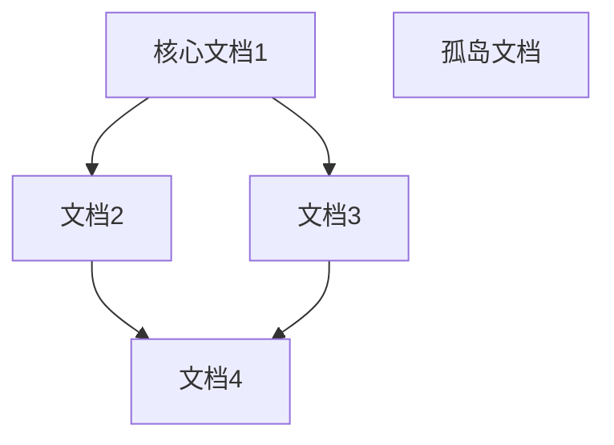

# 元Prompt - 链接有效性检查

> **适用场景**：检查文档中的内部链接和外部链接是否有效
> 
> **核心价值**：确保链接网络完整，避免死链影响使用体验

---

## 🎯 使用场景

### 适用情况
- ✅ 文档重构后的链接验证
- ✅ 定期链接健康检查
- ✅ 文档发布前的链接审核
- ✅ 双链网络完整性检查

### 不适用情况
- ❌ 文档内容质量检查（使用"文档质量检查"模板）
- ❌ 规范一致性检查（使用"规范一致性检查"模板）
- ❌ 外部链接内容审核（需要人工审核）

---

## 📋 标准Prompt模板

### 基础版（最小化）

```markdown
参考 .internal/ai-guide，检查链接有效性：[目录/文件]

检查范围：[目录路径或文件列表]

请检查：
1. 内部链接（双链、相对路径）
2. 外部链接（HTTP/HTTPS）
3. 生成问题清单
```

### 完整版（推荐）

```markdown
参考 .internal/ai-guide，检查链接有效性：[目录/文件]

**检查范围**：
- 目录：[目录路径]
- 文件数：[预计数量]
- 检查深度：[当前目录/递归子目录]

**检查类型**：
- [ ] 内部链接（双链 [[]]）
- [ ] 相对路径链接（Markdown []()）
- [ ] 外部链接（HTTP/HTTPS）
- [ ] 图片链接
- [ ] 附件链接

**检查标准**：
- 内部链接：目标文件存在
- 相对路径：路径正确，文件存在
- 外部链接：URL格式正确（可选：检查可访问性）
- 图片链接：图片文件存在
- 附件链接：附件文件存在

请：
1. 扫描所有文档中的链接
2. 验证链接有效性
3. 记录无效链接（文件+行号+链接+问题）
4. 统计链接健康度
5. 生成检查报告
6. 提供修复建议
```

### 高级版（全面审计）

```markdown
参考 .internal/ai-guide，执行链接健康审计：[目录/项目]

**审计范围**：
- 目录：[目录路径]
- 文件数：[预计数量]
- 检查深度：递归所有子目录
- 排除目录：[排除列表]

**审计维度**：

1. **内部链接（双链）**
   - [ ] 目标文件存在性
   - [ ] 链接文本准确性
   - [ ] 双向链接完整性
   - [ ] 孤岛文档识别

2. **相对路径链接**
   - [ ] 路径格式正确性
   - [ ] 目标文件存在性
   - [ ] 路径层级合理性
   - [ ] 跨目录链接有效性

3. **外部链接**
   - [ ] URL格式正确性
   - [ ] 协议规范性（HTTPS优先）
   - [ ] 可访问性（可选）
   - [ ] 链接时效性

4. **图片链接**
   - [ ] 图片文件存在性
   - [ ] 图片路径正确性
   - [ ] 图片格式支持性
   - [ ] 图片大小合理性

5. **附件链接**
   - [ ] 附件文件存在性
   - [ ] 附件路径正确性
   - [ ] 附件类型合理性

6. **链接网络分析**
   - [ ] 链接密度统计
   - [ ] 链接方向分析
   - [ ] 孤岛文档识别
   - [ ] 核心节点识别

**检查标准**：
- 规范文档：[规范文档路径]
- 严格程度：严格
- 外部链接检查：[是/否]

**输出要求**：
1. 生成详细审计报告
2. 按类型统计链接（总数/有效/无效）
3. 列出无效链接清单（文件+行号+链接+问题+建议）
4. 分析链接网络健康度
5. 识别孤岛文档和核心节点
6. 提供修复方案（批量/单个）
7. 生成链接网络可视化（可选）

请开始执行链接健康审计。
```

---

## 💡 使用技巧

### 1. 分类检查策略

**技巧**：按链接类型分别检查

```markdown
检查顺序：
1. 内部双链（最重要）
   - 检查目标文件存在性
   - 检查双向链接完整性
2. 相对路径链接
   - 检查路径格式
   - 检查目标文件存在性
3. 图片和附件
   - 检查文件存在性
   - 检查路径正确性
4. 外部链接（最后）
   - 检查URL格式
   - 可选：检查可访问性
```

### 2. 问题分级策略

**技巧**：按严重程度分级

```markdown
问题分级：
- P0（严重）：影响使用，必须修复
  - 内部链接指向不存在的文件
  - 图片链接失效
  - 关键外部链接失效
- P1（重要）：影响体验，建议修复
  - 相对路径格式不规范
  - 外部链接格式不规范
  - 双向链接不完整
- P2（一般）：优化建议，可选修复
  - 链接文本不够清晰
  - 外部链接使用HTTP而非HTTPS
  - 链接密度过低
```

### 3. 批量修复策略

**技巧**：识别可批量修复的问题

```markdown
可批量修复：
- 文件重命名导致的链接失效 → 批量替换
- 目录结构调整导致的路径错误 → 批量更新
- HTTP链接升级为HTTPS → 批量替换
- 链接格式不统一 → 批量规范化

需人工修复：
- 目标文件已删除 → 需要决策（删除链接/创建文件/替换目标）
- 外部链接失效 → 需要查找替代链接
- 链接文本不准确 → 需要人工判断
```

### 4. 链接网络优化

**技巧**：优化链接网络结构

```markdown
优化方向：
1. 消除孤岛文档
   - 识别无入链的文档
   - 建立合理的链接关系
2. 强化核心节点
   - 识别高价值文档
   - 增加相关链接
3. 平衡链接密度
   - 过密：精简冗余链接
   - 过疏：增加关联链接
4. 完善双向链接
   - 识别单向链接
   - 建立双向关系
```

---

## 📊 链接健康度评分

### 评分维度和权重

| 维度 | 权重 | 满分 | 说明 |
|------|------|------|------|
| 内部链接有效性 | 30% | 30分 | 双链和相对路径链接的有效率 |
| 外部链接有效性 | 20% | 20分 | 外部链接的格式和可访问性 |
| 图片附件有效性 | 15% | 15分 | 图片和附件链接的有效率 |
| 双向链接完整性 | 15% | 15分 | 双向链接的完整程度 |
| 链接网络密度 | 10% | 10分 | 文档间链接的丰富程度 |
| 孤岛文档比例 | 10% | 10分 | 无链接文档的比例（越低越好） |
| **总分** | **100%** | **100分** | - |

### 健康度等级划分

| 等级 | 分数范围 | 说明 | 建议 |
|------|---------|------|------|
| 优秀 | 90-100分 | 链接网络健康，几乎无问题 | 保持现状 |
| 良好 | 80-89分 | 链接网络较好，有少量问题 | 优化改进 |
| 合格 | 70-79分 | 基本合格，有一些问题 | 重点改进 |
| 待改进 | 60-69分 | 问题较多，需要整改 | 全面整改 |
| 不合格 | <60分 | 问题严重，影响使用 | 紧急修复 |

---

## ✅ 检查清单

### 内部链接检查
- [ ] 双链目标文件存在
- [ ] 双链文本准确
- [ ] 双向链接完整
- [ ] 相对路径格式正确
- [ ] 相对路径目标存在

### 外部链接检查
- [ ] URL格式正确
- [ ] 协议规范（HTTPS优先）
- [ ] 链接可访问（可选）
- [ ] 链接文本清晰

### 图片附件检查
- [ ] 图片文件存在
- [ ] 图片路径正确
- [ ] 图片格式支持
- [ ] 附件文件存在
- [ ] 附件路径正确

### 链接网络检查
- [ ] 无孤岛文档
- [ ] 链接密度合理
- [ ] 核心节点明确
- [ ] 链接方向合理

---

## 🎯 示例场景

### 场景1：快速链接检查

```markdown
参考 .internal/ai-guide，检查链接有效性：Python学习笔记

检查范围：技术栈/Python/
文件数：约20个

请检查：
1. 内部双链有效性
2. 图片链接有效性
3. 生成问题清单
```

### 场景2：标准链接审计

```markdown
参考 .internal/ai-guide，检查链接有效性：知识管理目录

检查范围：
- 目录：知识管理/
- 文件数：约100个
- 检查深度：递归子目录

检查类型：
- [x] 内部链接（双链）
- [x] 相对路径链接
- [x] 外部链接
- [x] 图片链接
- [x] 附件链接

检查标准：
- 内部链接：目标文件必须存在
- 外部链接：URL格式正确，不检查可访问性
- 图片附件：文件必须存在

请生成详细检查报告，包含：
1. 链接统计（各类型总数/有效/无效）
2. 无效链接清单（文件+行号+链接+问题）
3. 修复建议（批量/单个）
4. 链接健康度评分
```

### 场景3：全面链接审计

```markdown
参考 .internal/ai-guide，执行链接健康审计：整个知识库

审计范围：
- 目录：根目录
- 文件数：约500个
- 检查深度：递归所有子目录
- 排除目录：.git, .obsidian, templates

审计维度：全部6个维度

检查标准：
- 规范文档：规范文档/文档编写规范.md
- 严格程度：严格
- 外部链接检查：是（检查可访问性）

输出要求：
1. 详细审计报告
2. 链接统计（各类型+各维度）
3. 无效链接清单（分级+分类）
4. 链接网络分析（密度+孤岛+核心节点）
5. 修复方案（批量+单个）
6. 健康度评分（各维度+总分）
7. 链接网络可视化（Mermaid图）

请开始执行全面链接审计。
```

---

## 📋 检查报告模板

```markdown
# 链接有效性检查报告

## 📋 基本信息
- 检查范围：[目录/文件]
- 检查时间：[日期]
- 文件总数：[数量]
- 检查文件数：[数量]

## 📊 链接统计

### 总体统计
- **链接总数**：XXX个
- **有效链接**：XXX个（XX%）
- **无效链接**：XXX个（XX%）
- **健康度得分**：XX/100分

### 分类统计
| 链接类型 | 总数 | 有效 | 无效 | 有效率 |
|---------|------|------|------|--------|
| 内部双链 | XXX | XXX | XXX | XX% |
| 相对路径 | XXX | XXX | XXX | XX% |
| 外部链接 | XXX | XXX | XXX | XX% |
| 图片链接 | XXX | XXX | XXX | XX% |
| 附件链接 | XXX | XXX | XXX | XX% |

## ⚠️ 无效链接清单

### P0问题（严重，必须修复）
1. [文件名:行号] - [链接] - [问题] - [建议]
2. ...

### P1问题（重要，建议修复）
1. [文件名:行号] - [链接] - [问题] - [建议]
2. ...

### P2问题（一般，可选修复）
1. [文件名:行号] - [链接] - [问题] - [建议]
2. ...

## 📈 链接网络分析

### 链接密度
- 平均每文档链接数：XX个
- 链接密度评价：[过密/适中/过疏]

### 孤岛文档
- 孤岛文档数：XX个（XX%）
- 孤岛文档列表：
  1. [文件名]
  2. ...

### 核心节点
- 核心节点数：XX个
- 核心节点列表（按入链数排序）：
  1. [文件名] - 入链XX个，出链XX个
  2. ...

### 双向链接
- 双向链接对数：XX对
- 单向链接数：XX个
- 双向链接完整度：XX%

## 💡 修复建议

### 批量修复方案
1. [问题类型] - [修复方案] - [影响链接数]
2. ...

### 单个修复建议
1. [文件名] - [问题] - [建议方案]
2. ...

### 优化建议
1. [优化方向] - [具体建议]
2. ...

## 📊 健康度评分

| 维度 | 得分 | 满分 | 达标率 | 等级 |
|------|------|------|--------|------|
| 内部链接有效性 | XX | 30 | XX% | XX |
| 外部链接有效性 | XX | 20 | XX% | XX |
| 图片附件有效性 | XX | 15 | XX% | XX |
| 双向链接完整性 | XX | 15 | XX% | XX |
| 链接网络密度 | XX | 10 | XX% | XX |
| 孤岛文档比例 | XX | 10 | XX% | XX |
| **总分** | **XX** | **100** | **XX%** | **XX** |

## 🔗 链接网络可视化



## 📊 趋势分析
- 对比上次检查：[提升/下降] XX%
- 主要改进：[改进点]
- 主要退步：[退步点]
```

---

## 🔗 相关模板

- [文档质量检查](./01-文档质量检查.md) - 检查文档质量
- [规范一致性检查](./03-规范一致性检查.md) - 检查规范
- [建立双链网络](../文档处理/03-建立双链网络.md) - 建立链接

---

## 📝 版本历史

### v1.0.0 (2025-10-21)
- ✅ 创建元Prompt模板
- ✅ 提供三个版本的Prompt
- ✅ 添加健康度评分和报告模板

---

**维护者**：DDAC项目组  
**最后更新**：2025-10-21  
**文档版本**：v1.0.0
