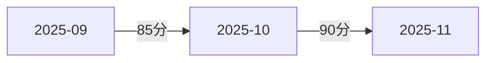

# 元Prompt - 规范一致性检查

> **适用场景**：检查文档是否符合项目规范，确保一致性
> 
> **核心价值**：维护规范统一，提升协作效率

---

## 🎯 使用场景

### 适用情况
- ✅ 新文档创建后的规范检查
- ✅ 批量文档整理后的规范验证
- ✅ 定期规范一致性审计
- ✅ 多人协作的规范对齐

### 不适用情况
- ❌ 文档内容质量检查（使用"文档质量检查"模板）
- ❌ 链接有效性检查（使用"链接有效性检查"模板）
- ❌ 内容准确性审核（需要人工审核）

---

## 📋 标准Prompt模板

### 基础版（最小化）

```markdown
参考 .internal/ai-guide，检查规范一致性：[目录/文件]

检查范围：[目录路径或文件列表]
规范文档：[规范文档路径]

请检查：
1. 文件命名规范
2. YAML头部规范
3. 标签体系规范
4. 生成问题清单
```

### 完整版（推荐）

```markdown
参考 .internal/ai-guide，检查规范一致性：[目录/文件]

**检查范围**：
- 目录：[目录路径]
- 文件数：[预计数量]
- 检查深度：[当前目录/递归子目录]

**规范文档**：
- 项目规范：[项目结构规范路径]
- 文档规范：[文档编写规范路径]
- 标签规范：[标签体系规范路径]

**检查维度**：
- [ ] 文件命名规范（格式、语义、编号）
- [ ] 目录结构规范（层级、命名、组织）
- [ ] YAML头部规范（字段、格式、内容）
- [ ] 标签体系规范（命名、层级、一致性）
- [ ] Markdown格式规范（标题、列表、代码块）
- [ ] 内容风格规范（语言、术语、排版）

**检查标准**：
- 严格程度：[严格/标准/宽松]
- 采样方式：[全量/抽样]

请：
1. 读取规范文档，理解规范要求
2. 逐个检查文档的规范符合度
3. 记录不符合规范的问题
4. 统计规范符合率
5. 生成检查报告
6. 提供规范化建议
```

### 高级版（全面审计）

```markdown
参考 .internal/ai-guide，执行规范一致性审计：[目录/项目]

**审计范围**：
- 目录：[目录路径]
- 文件数：[预计数量]
- 检查深度：递归所有子目录
- 排除目录：[排除列表]

**规范文档**：
- 项目结构规范：[路径]
- 文档编写规范：[路径]
- 标签体系规范：[路径]
- Git工作流规范：[路径]
- 质量标准：[路径]

**审计维度**：

1. **文件命名规范**
   - [ ] 命名格式统一（编号-名称.md）
   - [ ] 命名语义化（见名知意）
   - [ ] 编号规则一致（01/02/03）
   - [ ] 无特殊字符（仅中英文数字-_）
   - [ ] 大小写规范（统一风格）

2. **目录结构规范**
   - [ ] 层级深度合理（≤4层）
   - [ ] 目录命名规范（语义化）
   - [ ] 目录组织逻辑（分类清晰）
   - [ ] 特殊目录规范（.internal等）

3. **YAML头部规范**
   - [ ] 必需字段完整（title/created/updated/tags）
   - [ ] 字段格式正确（日期/数组/字符串）
   - [ ] 字段内容规范（符合约定）
   - [ ] 可选字段规范（version/status等）
   - [ ] 字段顺序统一

4. **标签体系规范**
   - [ ] 标签命名规范（中文名词）
   - [ ] 标签数量合理（3-7个）
   - [ ] 标签层级清晰（主题/类型/状态）
   - [ ] 标签一致性（同类文档相似）
   - [ ] 标签覆盖度（无遗漏）

5. **Markdown格式规范**
   - [ ] 标题层级规范（H1唯一，层级连续）
   - [ ] 列表格式规范（缩进、符号）
   - [ ] 代码块规范（标注语言）
   - [ ] 表格格式规范（对齐、完整）
   - [ ] 引用格式规范（统一风格）
   - [ ] 链接格式规范（双链/相对路径）

6. **内容风格规范**
   - [ ] 语言风格统一（简洁/正式/口语）
   - [ ] 术语使用统一（无混用）
   - [ ] 排版风格统一（间距、强调）
   - [ ] 段落长度合理（≤10行）
   - [ ] 句子长度合理（≤30字）

7. **版本管理规范**
   - [ ] 版本号规范（语义化版本）
   - [ ] 更新日期准确（与实际一致）
   - [ ] 变更记录完整（CHANGELOG）
   - [ ] 版本历史清晰

**检查标准**：
- 严格程度：严格
- 采样方式：[全量/分层采样]
- 对比基准：[规范文档版本]

**输出要求**：
1. 生成详细审计报告
2. 按维度统计符合率
3. 列出不符合规范的问题（文件+问题+建议）
4. 分析规范偏差原因
5. 提供规范化方案（批量/单个）
6. 建议规范优化方向
7. 生成规范符合度趋势图

请开始执行规范一致性审计。
```

---

## 💡 使用技巧

### 1. 分层检查策略

**技巧**：从外到内，从结构到内容

```markdown
检查顺序：
1. 目录结构层（5分钟）
   - 目录命名
   - 目录层级
   - 目录组织
2. 文件命名层（10分钟）
   - 命名格式
   - 命名语义
   - 编号规则
3. 文档结构层（20分钟）
   - YAML头部
   - Markdown格式
   - 内容结构
4. 内容风格层（30分钟）
   - 语言风格
   - 术语使用
   - 排版风格
```

### 2. 对比检查策略

**技巧**：横向对比，发现不一致

```markdown
对比维度：
1. 同类文档对比
   - 相同类型的文档规范是否一致
   - 例如：所有"学习笔记"的标签是否相似
2. 同目录文档对比
   - 同一目录下的文档风格是否统一
   - 例如：命名格式、YAML字段
3. 历史版本对比
   - 新旧文档的规范是否一致
   - 例如：标签体系是否演进
4. 规范文档对比
   - 实际文档与规范文档是否一致
   - 例如：YAML字段是否符合规范
```

### 3. 问题分级策略

**技巧**：按影响程度分级

```markdown
问题分级：
- P0（严重）：违反核心规范，必须修复
  - YAML必需字段缺失
  - 文件命名严重不规范
  - 目录结构混乱
- P1（重要）：不符合标准规范，建议修复
  - 标签命名不规范
  - Markdown格式不统一
  - 术语使用不一致
- P2（一般）：优化建议，可选修复
  - 排版细节优化
  - 措辞改进
  - 风格统一
```

### 4. 规范化策略

**技巧**：制定规范化方案

```markdown
规范化方案：
1. 批量规范化（自动化）
   - 文件重命名
   - YAML字段补充
   - 标签格式统一
   - 日期格式转换
2. 模板规范化（半自动）
   - 提供标准模板
   - 按模板重写
   - 保留核心内容
3. 人工规范化（手动）
   - 内容风格调整
   - 术语统一替换
   - 结构重组
```

---

## 📊 规范符合度评分

### 评分维度和权重

| 维度 | 权重 | 满分 | 说明 |
|------|------|------|------|
| 文件命名规范 | 15% | 15分 | 命名格式和语义规范性 |
| 目录结构规范 | 10% | 10分 | 目录层级和组织规范性 |
| YAML头部规范 | 25% | 25分 | 字段完整性和格式规范性 |
| 标签体系规范 | 20% | 20分 | 标签命名和一致性 |
| Markdown格式规范 | 15% | 15分 | 格式统一性和规范性 |
| 内容风格规范 | 10% | 10分 | 语言和排版统一性 |
| 版本管理规范 | 5% | 5分 | 版本号和变更记录规范性 |
| **总分** | **100%** | **100分** | - |

### 符合度等级划分

| 等级 | 分数范围 | 说明 | 建议 |
|------|---------|------|------|
| 优秀 | 90-100分 | 高度符合规范，几乎无偏差 | 保持现状 |
| 良好 | 80-89分 | 基本符合规范，有少量偏差 | 优化改进 |
| 合格 | 70-79分 | 符合主要规范，有一些偏差 | 重点改进 |
| 待改进 | 60-69分 | 偏差较多，需要整改 | 全面整改 |
| 不合格 | <60分 | 严重偏离规范 | 重新规范化 |

---

## ✅ 检查清单

### 文件命名规范
- [ ] 命名格式统一
- [ ] 命名语义化
- [ ] 编号规则一致
- [ ] 无特殊字符
- [ ] 大小写规范

### 目录结构规范
- [ ] 层级深度合理
- [ ] 目录命名规范
- [ ] 目录组织逻辑
- [ ] 特殊目录规范

### YAML头部规范
- [ ] 必需字段完整
- [ ] 字段格式正确
- [ ] 字段内容规范
- [ ] 可选字段规范
- [ ] 字段顺序统一

### 标签体系规范
- [ ] 标签命名规范
- [ ] 标签数量合理
- [ ] 标签层级清晰
- [ ] 标签一致性
- [ ] 标签覆盖度

### Markdown格式规范
- [ ] 标题层级规范
- [ ] 列表格式规范
- [ ] 代码块规范
- [ ] 表格格式规范
- [ ] 链接格式规范

### 内容风格规范
- [ ] 语言风格统一
- [ ] 术语使用统一
- [ ] 排版风格统一
- [ ] 段落长度合理
- [ ] 句子长度合理

---

## 🎯 示例场景

### 场景1：新文档规范检查

```markdown
参考 .internal/ai-guide，检查规范一致性：新创建的Python学习笔记

检查范围：技术栈/Python/
文件数：约20个
规范文档：规范文档/文档编写规范.md

请检查：
1. 文件命名规范
2. YAML头部规范
3. 标签体系规范
4. 生成问题清单和修复建议
```

### 场景2：批量文档规范验证

```markdown
参考 .internal/ai-guide，检查规范一致性：知识管理目录

检查范围：
- 目录：知识管理/
- 文件数：约100个
- 检查深度：递归子目录

规范文档：
- 项目规范：规范文档/项目结构规范.md
- 文档规范：规范文档/文档编写规范.md
- 标签规范：规范文档/标签体系规范.md

检查维度：
- [x] 文件命名规范
- [x] 目录结构规范
- [x] YAML头部规范
- [x] 标签体系规范
- [x] Markdown格式规范

检查标准：
- 严格程度：标准
- 采样方式：全量

请生成详细检查报告，包含：
1. 规范符合率统计（各维度）
2. 不符合规范的问题清单
3. 规范化建议（批量/单个）
4. 规范符合度评分
```

### 场景3：全面规范审计

```markdown
参考 .internal/ai-guide，执行规范一致性审计：整个知识库

审计范围：
- 目录：根目录
- 文件数：约500个
- 检查深度：递归所有子目录
- 排除目录：.git, .obsidian, templates

规范文档：
- 项目结构规范：规范文档/项目结构规范.md
- 文档编写规范：规范文档/文档编写规范.md
- 标签体系规范：规范文档/标签体系规范.md
- Git工作流规范：规范文档/Git工作流规范.md
- 质量标准：规范文档/质量标准.md

审计维度：全部7个维度

检查标准：
- 严格程度：严格
- 采样方式：分层采样（每个目录抽样20%）
- 对比基准：规范文档v1.0.0

输出要求：
1. 详细审计报告
2. 规范符合率统计（各维度+总体）
3. 不符合规范的问题清单（分级+分类）
4. 规范偏差原因分析
5. 规范化方案（批量+单个）
6. 规范优化建议
7. 符合度趋势图（对比历史）

请开始执行全面规范审计。
```

---

## 📋 检查报告模板

```markdown
# 规范一致性检查报告

## 📋 基本信息
- 检查范围：[目录/文件]
- 检查时间：[日期]
- 文件总数：[数量]
- 检查文件数：[数量]
- 规范文档版本：[版本号]

## 📊 规范符合度评分

### 总体得分
- **总分**：XX/100分
- **等级**：[优秀/良好/合格/待改进/不合格]
- **符合率**：XX%

### 各维度得分
| 维度 | 得分 | 满分 | 符合率 | 等级 |
|------|------|------|--------|------|
| 文件命名规范 | XX | 15 | XX% | XX |
| 目录结构规范 | XX | 10 | XX% | XX |
| YAML头部规范 | XX | 25 | XX% | XX |
| 标签体系规范 | XX | 20 | XX% | XX |
| Markdown格式规范 | XX | 15 | XX% | XX |
| 内容风格规范 | XX | 10 | XX% | XX |
| 版本管理规范 | XX | 5 | XX% | XX |

## ⚠️ 不符合规范的问题

### P0问题（严重，必须修复）
1. [文件名] - [问题描述] - [规范要求] - [修复建议]
2. ...

### P1问题（重要，建议修复）
1. [文件名] - [问题描述] - [规范要求] - [修复建议]
2. ...

### P2问题（一般，可选修复）
1. [文件名] - [问题描述] - [规范要求] - [修复建议]
2. ...

## 📈 统计分析

### 问题分布
- P0问题：XX个（XX%）
- P1问题：XX个（XX%）
- P2问题：XX个（XX%）

### 问题类型
- 命名问题：XX个
- 结构问题：XX个
- YAML问题：XX个
- 标签问题：XX个
- 格式问题：XX个
- 风格问题：XX个

### 规范偏差原因分析
1. [原因1]：影响XX个文件
2. [原因2]：影响XX个文件
3. ...

## 💡 规范化建议

### 批量规范化方案
1. [问题类型] - [规范化方案] - [影响文件数] - [预计时间]
2. ...

### 单个规范化建议
1. [文件名] - [问题] - [建议方案]
2. ...

### 规范优化建议
1. [优化方向] - [具体建议] - [预期效果]
2. ...

## 📊 符合度趋势

### 历史对比
- 对比上次检查：[提升/下降] XX%
- 主要改进：[改进点]
- 主要退步：[退步点]

### 趋势图


## 🎯 下一步行动

### 立即行动（本周）
1. [行动1]
2. [行动2]

### 短期计划（本月）
1. [计划1]
2. [计划2]

### 长期优化（本季度）
1. [优化1]
2. [优化2]
```

---

## 🔗 相关模板

- [文档质量检查](./01-文档质量检查.md) - 检查文档质量
- [链接有效性检查](./02-链接有效性检查.md) - 检查链接
- [建立规范体系](../规范建立/01-建立规范体系.md) - 建立规范

---

## 📝 版本历史

### v1.0.0 (2025-10-21)
- ✅ 创建元Prompt模板
- ✅ 提供三个版本的Prompt
- ✅ 添加符合度评分和报告模板

---

**维护者**：DDAC项目组  
**最后更新**：2025-10-21  
**文档版本**：v1.0.0
