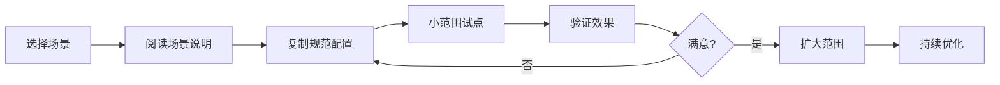

# 🎯 DDAC场景示例 - 总览

> 4大典型场景的完整配置和使用指南

---

## 📋 场景清单

### 1. 知识管理场景 ⭐⭐⭐

**适用人群**：知识工作者、终身学习者、研究人员、内容创作者

**核心目标**：
- 构建个人知识管理系统
- 规范化笔记格式和标签
- 建立知识网络和导航
- 提升AI协作效率

**配置文件**：
- [场景说明](./知识管理场景/README.md)
- [规范配置](./知识管理场景/规范配置.md)
- [工作流配置](./知识管理场景/工作流配置.md)
- [使用示例](./知识管理场景/使用示例.md)

**快速开始**：
```markdown
1. 阅读场景说明，了解适用性
2. 复制规范配置到你的仓库
3. 选择10-20个笔记试点
4. 参考使用示例执行整理
5. 验证效果后扩大范围
```

---

### 2. 技术学习场景 ⭐⭐

**适用人群**：程序员、技术学习者、IT从业者

**核心目标**：
- 构建技术学习体系
- 管理代码片段和技术笔记
- 建立技术知识图谱
- 规划学习路径

**配置文件**：
- [场景说明](./技术学习场景/README.md)
- [规范配置](./技术学习场景/规范配置.md)
- [工作流配置](./技术学习场景/工作流配置.md)
- [使用示例](./技术学习场景/使用示例.md)

**快速开始**：
```markdown
1. 选择一个技术主题（如Python/前端/数据库）
2. 复制规范配置并调整
3. 整理现有技术笔记
4. 建立技术知识图谱
5. 规划学习路径
```

---

### 3. 内容创作场景 ⭐⭐

**适用人群**：作家、博主、自媒体创作者、营销人员

**核心目标**：
- 管理创作素材和灵感
- 规范化内容创作流程
- 建立素材库和模板库
- 提升创作效率

**配置文件**：
- [场景说明](./内容创作场景/README.md)
- [规范配置](./内容创作场景/规范配置.md)
- [工作流配置](./内容创作场景/工作流配置.md)
- [使用示例](./内容创作场景/使用示例.md)

**快速开始**：
```markdown
1. 建立素材库和灵感库
2. 设计内容创作规范
3. 创建内容模板
4. 规划创作工作流
5. 使用AI辅助创作
```

---

### 4. 项目协作场景 ⭐⭐⭐

**适用人群**：项目经理、团队Leader、产品经理、协作团队

**核心目标**：
- 规范化项目文档管理
- 建立团队协作规范
- 管理任务和进度
- 提升团队协作效率

**配置文件**：
- [场景说明](./项目协作场景/README.md)
- [规范配置](./项目协作场景/规范配置.md)
- [工作流配置](./项目协作场景/工作流配置.md)
- [使用示例](./项目协作场景/使用示例.md)

**快速开始**：
```markdown
1. 建立项目文档规范
2. 设计团队协作流程
3. 创建项目模板
4. 使用路书管理任务
5. 定期生成项目报告
```

---

## 🎯 场景选择指南

### 按需求选择

| 需求 | 推荐场景 | 理由 |
|------|---------|------|
| 整理笔记 | 知识管理 | 专注个人知识体系构建 |
| 学习技术 | 技术学习 | 针对技术学习特点优化 |
| 写作创作 | 内容创作 | 素材管理和创作流程 |
| 团队协作 | 项目协作 | 团队规范和任务管理 |

### 按角色选择

| 角色 | 推荐场景 | 优先级 |
|------|---------|--------|
| 知识工作者 | 知识管理 | ⭐⭐⭐ |
| 程序员 | 技术学习 + 知识管理 | ⭐⭐⭐ |
| 内容创作者 | 内容创作 + 知识管理 | ⭐⭐⭐ |
| 项目经理 | 项目协作 + 知识管理 | ⭐⭐⭐ |
| 学生 | 知识管理 + 技术学习 | ⭐⭐ |
| 研究人员 | 知识管理 | ⭐⭐⭐ |

### 按复杂度选择

| 复杂度 | 场景 | 建议 |
|--------|------|------|
| 简单 | 知识管理 | 新手首选，快速上手 |
| 中等 | 技术学习、内容创作 | 有一定基础后尝试 |
| 复杂 | 项目协作 | 团队使用，需要培训 |

---

## 🚀 快速开始流程

### 新手路径（推荐）



**详细步骤**：

1. **选择场景**（5分钟）
   - 根据需求和角色选择场景
   - 阅读场景说明，确认适用性

2. **阅读文档**（15分钟）
   - 阅读场景说明（README.md）
   - 了解规范配置（规范配置.md）
   - 理解工作流程（工作流配置.md）

3. **复制配置**（10分钟）
   - 复制规范配置到你的仓库
   - 根据实际情况调整配置
   - 创建必要的目录结构

4. **小范围试点**（30-60分钟）
   - 选择10-20个文件试点
   - 参考使用示例执行
   - 让AI理解规范并执行任务

5. **验证效果**（15分钟）
   - 检查整理质量
   - 测试AI协作效果
   - 收集问题和反馈

6. **扩大范围**（按需）
   - 效果满意后扩大范围
   - 逐步应用到更多文件
   - 持续优化规范和流程

---

## 📊 场景对比

### 功能对比

| 功能 | 知识管理 | 技术学习 | 内容创作 | 项目协作 |
|------|---------|---------|---------|---------|
| 笔记规范化 | ✅ 核心 | ✅ 核心 | ✅ 核心 | ✅ 核心 |
| 标签体系 | ✅ 三层 | ✅ 四层 | ✅ 三层 | ✅ 四层 |
| 双链网络 | ✅ 强调 | ✅ 强调 | ⭐ 一般 | ✅ 强调 |
| MOC索引 | ✅ 多层 | ✅ 多层 | ⭐ 单层 | ✅ 多层 |
| 代码管理 | ❌ 不涉及 | ✅ 核心 | ❌ 不涉及 | ⭐ 可选 |
| 素材管理 | ⭐ 可选 | ❌ 不涉及 | ✅ 核心 | ⭐ 可选 |
| 任务管理 | ⭐ 可选 | ⭐ 可选 | ⭐ 可选 | ✅ 核心 |
| 团队协作 | ❌ 个人 | ❌ 个人 | ⭐ 可选 | ✅ 核心 |

### 复杂度对比

| 维度 | 知识管理 | 技术学习 | 内容创作 | 项目协作 |
|------|---------|---------|---------|---------|
| 学习成本 | ⭐ 低 | ⭐⭐ 中 | ⭐⭐ 中 | ⭐⭐⭐ 高 |
| 配置复杂度 | ⭐ 低 | ⭐⭐ 中 | ⭐⭐ 中 | ⭐⭐⭐ 高 |
| 维护成本 | ⭐ 低 | ⭐⭐ 中 | ⭐ 低 | ⭐⭐⭐ 高 |
| 适用范围 | ⭐⭐⭐ 广 | ⭐⭐ 中 | ⭐⭐ 中 | ⭐⭐ 中 |

---

## 💡 使用技巧

### 1. 场景组合使用

**推荐组合**：

```
知识管理（基础） + 技术学习（专项）
知识管理（基础） + 内容创作（专项）
知识管理（基础） + 项目协作（专项）
```

**组合策略**：
- 先建立知识管理基础
- 再根据需求添加专项场景
- 共享规范层和索引层
- 独立工作流层

### 2. 渐进式实施

**阶段1：基础建设**（1-2周）
- 选择1个场景
- 小范围试点（10-20个文件）
- 建立基础规范

**阶段2：扩展应用**（2-4周）
- 扩大应用范围（50-100个文件）
- 优化规范和流程
- 建立完整体系

**阶段3：深度优化**（1-3个月）
- 全面应用（所有文件）
- 持续优化改进
- 探索高级功能

### 3. 定制化调整

**调整原则**：
- 保持核心理念不变
- 根据实际情况调整细节
- 简化不必要的复杂度
- 持续迭代优化

**可调整内容**：
- 标签体系（层级和命名）
- 目录结构（深度和分类）
- 工作流程（步骤和频率）
- Prompt模板（详细度和风格）

---

## 📚 学习资源

### 核心文档
- [DDAC核心概念](../../docs/01-核心概念.md)
- [DDAC架构设计](../../docs/02-架构设计.md)
- [DDAC实施指南](../../docs/03-实施指南.md)
- [DDAC进阶技巧](../../docs/04-进阶技巧.md)

### 模板库
- [元Prompt库](../04-元Prompt库/README.md)
- [规范层模板](../01-规范层模板/)
- [索引层模板](../02-索引层模板/)
- [工作流层模板](../03-工作流层模板/)

### 场景文档
- [知识管理场景](./知识管理场景/README.md)
- [技术学习场景](./技术学习场景/README.md)
- [内容创作场景](./内容创作场景/README.md)
- [项目协作场景](./项目协作场景/README.md)

---

## ❓ 常见问题

### Q1: 如何选择适合的场景？
**A**: 
1. 根据主要需求选择（整理笔记→知识管理）
2. 根据角色选择（程序员→技术学习）
3. 可以组合使用多个场景
4. 建议从知识管理场景开始

### Q2: 可以同时使用多个场景吗？
**A**: 可以！建议：
1. 先建立知识管理基础
2. 再根据需求添加专项场景
3. 共享规范层和索引层
4. 独立工作流层

### Q3: 场景配置可以修改吗？
**A**: 可以！但建议：
1. 保持核心理念不变
2. 根据实际情况调整细节
3. 记录修改原因和效果
4. 持续迭代优化

### Q4: 如何评估场景效果？
**A**: 
1. 使用质量检查Prompt
2. 对比实施前后数据
3. 测试AI协作效果
4. 收集使用反馈

### Q5: 遇到问题怎么办？
**A**: 
1. 查看场景文档的常见问题
2. 参考使用示例调整
3. 在GitHub提Issue
4. 参与社区讨论

---

## 🤝 贡献场景

欢迎贡献新的场景配置！

### 贡献流程

1. **Fork项目**
2. **创建场景目录**
   ```
   templates/场景示例/你的场景名称/
   ├── README.md
   ├── 规范配置.md
   ├── 工作流配置.md
   └── 使用示例.md
   ```
3. **编写配置文档**
4. **提供使用示例**
5. **提交Pull Request**

### 场景要求

- ✅ 有明确的适用人群和目标
- ✅ 提供完整的配置文档
- ✅ 包含真实的使用示例
- ✅ 符合DDAC核心理念
- ✅ 经过实际验证

---

## 📝 反馈与改进

如果你在使用场景配置时遇到问题或有改进建议，欢迎：

- 📝 **提交Issue**：[GitHub Issues](https://github.com/ArnoFrost/DDAC/issues)
- 💬 **参与讨论**：[GitHub Discussions](https://github.com/ArnoFrost/DDAC/discussions)
- 🌟 **分享经验**：分享你的实践案例
- 🤝 **贡献场景**：提交新的场景配置

---

**维护者**：DDAC社区  
**最后更新**：2025-10-21  
**文档版本**：v1.0.0
