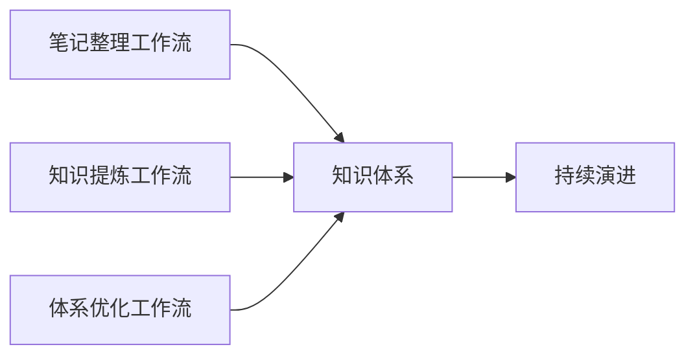
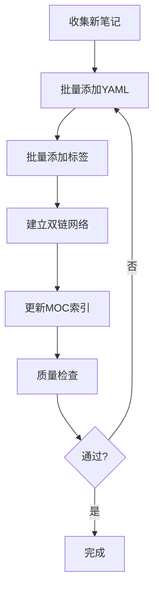
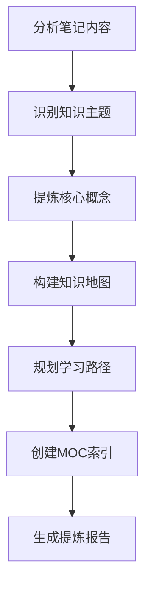
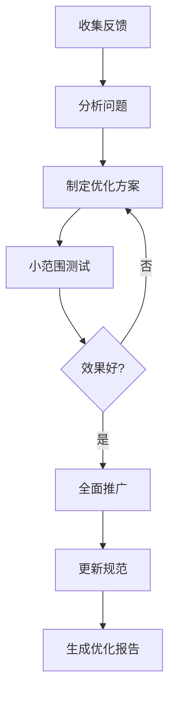

# 🔄 知识管理场景 - 工作流配置

> 定义笔记整理、知识提炼、体系优化的标准流程

---

## 📋 工作流概览

### 三大核心工作流



| 工作流 | 频率 | 时长 | 产出 |
|--------|------|------|------|
| 笔记整理 | 每周 | 30-60分钟 | 规范化笔记 |
| 知识提炼 | 每月 | 1-2小时 | MOC索引、知识地图 |
| 体系优化 | 每季度 | 2-3小时 | 优化后的规范和结构 |

---

## 1️⃣ 笔记整理工作流

> **目标**：将新增笔记规范化，融入知识体系

### 工作流程图



### 详细步骤

#### 步骤1：收集新笔记（5分钟）

**目标**：识别需要整理的笔记

**操作**：
```markdown
# 手动检查
- 查看最近7天新增的笔记
- 筛选出未规范化的笔记（无YAML头部或标签混乱）

# AI辅助
参考规范配置（路径：xxx/规范配置.md）

请扫描以下目录，找出需要整理的笔记：
- 目录：技术学习/Python/
- 时间范围：最近7天
- 筛选条件：缺少YAML头部或标签不规范

列出文件清单。
```

#### 步骤2：批量添加YAML（10分钟）

**目标**：为笔记添加标准化的YAML头部

**Prompt模板**：
```markdown
参考规范配置（路径：xxx/规范配置.md）
使用Prompt模板：templates/04-元Prompt库/文档处理/01-批量添加YAML.md

目录：技术学习/Python/
文件清单：
- Python-装饰器.md
- Python-生成器.md
- Python-上下文管理器.md

请批量添加YAML头部，包含：
- title（从文件名或内容提取）
- created（保持原创建时间）
- updated（当前时间）
- tags（根据内容推荐，遵循标签体系）
- status（根据内容完整度判断）
- category（根据目录结构判断）

逐个处理，每个文件完成后报告进度。
```

#### 步骤3：批量添加标签（10分钟）

**目标**：为笔记添加规范化的标签

**Prompt模板**：
```markdown
参考规范配置（路径：xxx/规范配置.md）
使用Prompt模板：templates/04-元Prompt库/文档处理/02-批量添加标签.md

标签体系：
- 主题标签：Python/数据分析/机器学习
- 类型标签：教程/笔记/实践/问题
- 状态标签：进行中/已完成/待复习

文件清单：
- Python-装饰器.md
- Python-生成器.md
- Python-上下文管理器.md

请为每个文件推荐3-5个标签，遵循标签体系规范。
```

#### 步骤4：建立双链网络（15分钟）

**目标**：建立笔记间的关联关系

**Prompt模板**：
```markdown
参考规范配置（路径：xxx/规范配置.md）
使用Prompt模板：templates/04-元Prompt库/文档处理/03-建立双链网络.md

目录：技术学习/Python/
文件清单：
- Python-装饰器.md
- Python-生成器.md
- Python-上下文管理器.md
- Python-闭包.md（已有）
- Python-迭代器.md（已有）

请分析笔记间的关联关系，建立双向链接：
1. 概念关联（如"装饰器"关联"闭包"）
2. 层级关联（如"基础语法"关联"变量类型"）
3. 实践关联（如"理论"关联"实战项目"）

每个笔记建议3-10个双链。
```

#### 步骤5：更新MOC索引（10分钟）

**目标**：将新笔记添加到知识地图

**Prompt模板**：
```markdown
参考规范配置（路径：xxx/规范配置.md）

MOC索引：00-索引/Python学习地图.md
新增笔记：
- Python-装饰器.md
- Python-生成器.md
- Python-上下文管理器.md

请：
1. 分析新笔记在知识体系中的位置
2. 更新MOC索引，添加新笔记链接
3. 调整知识地图结构（如需要）
4. 更新学习路径（如需要）
```

#### 步骤6：质量检查（10分钟）

**目标**：确保整理质量

**检查清单**：
```markdown
参考规范配置（路径：xxx/规范配置.md）
使用Prompt模板：templates/04-元Prompt库/质量检查/01-文档质量检查.md

目录：技术学习/Python/
检查范围：本次整理的所有笔记

请检查：
1. YAML头部完整性
2. 标签规范性
3. 双链有效性
4. MOC索引准确性

生成质量报告。
```

---

## 2️⃣ 知识提炼工作流

> **目标**：从笔记中提炼知识，构建知识体系

### 工作流程图



### 详细步骤

#### 步骤1：分析笔记内容（20分钟）

**Prompt模板**：
```markdown
参考规范配置（路径：xxx/规范配置.md）

主题：Python学习
目录：技术学习/Python/
文件数：约50个

请分析笔记内容：
1. 统计笔记数量和分布
2. 识别主要主题和子主题
3. 分析知识覆盖度
4. 发现知识盲区

生成分析报告。
```

#### 步骤2：识别知识主题（15分钟）

**Prompt模板**：
```markdown
基于上一步的分析报告，请：

1. 识别核心知识主题（5-10个）
2. 为每个主题分类笔记
3. 识别主题间的关系
4. 建议主题层级结构

生成主题清单。
```

#### 步骤3：提炼核心概念（20分钟）

**Prompt模板**：
```markdown
参考规范配置（路径：xxx/规范配置.md）

主题：Python进阶特性
相关笔记：
- Python-装饰器.md
- Python-生成器.md
- Python-上下文管理器.md
- Python-元类.md

请提炼核心概念：
1. 每个主题的核心概念（3-5个）
2. 概念间的关系
3. 学习难度和顺序
4. 实践应用场景

生成概念清单。
```

#### 步骤4：构建知识地图（25分钟）

**Prompt模板**：
```markdown
参考规范配置（路径：xxx/规范配置.md）
使用Prompt模板：templates/04-元Prompt库/规范建立/03-创建MOC索引.md

主题：Python学习体系
核心主题：
- 基础语法
- 数据结构
- 函数式编程
- 面向对象
- 进阶特性
- 实战项目

请构建知识地图：
1. 使用Mermaid绘制知识图谱
2. 标注主题间的关系
3. 标注学习路径
4. 标注难度等级

生成知识地图。
```

#### 步骤5：规划学习路径（20分钟）

**Prompt模板**：
```markdown
基于知识地图，请规划学习路径：

1. 入门路径（0-3个月）
2. 进阶路径（3-6个月）
3. 高级路径（6-12个月）

每个路径包含：
- 学习目标
- 核心笔记列表
- 实践项目建议
- 检验标准

生成学习路径文档。
```

#### 步骤6：创建MOC索引（20分钟）

**Prompt模板**：
```markdown
参考规范配置（路径：xxx/规范配置.md）
使用Prompt模板：templates/04-元Prompt库/规范建立/03-创建MOC索引.md

主题：Python学习体系
位置：00-索引/Python学习地图.md

请创建MOC索引，包含：
1. 知识地图（Mermaid图）
2. 学习路径（入门/进阶/高级）
3. 核心笔记列表（按主题分类）
4. 实践项目列表
5. 参考资源列表

生成MOC索引文档。
```

---

## 3️⃣ 体系优化工作流

> **目标**：定期优化知识体系，提升管理效率

### 工作流程图



### 详细步骤

#### 步骤1：收集反馈（30分钟）

**Prompt模板**：
```markdown
参考规范配置（路径：xxx/规范配置.md）

请分析过去3个月的使用情况：

1. 笔记整理效率
   - 平均整理时间
   - 常见问题
   - 瓶颈环节

2. 标签体系使用
   - 标签使用频率
   - 标签冲突情况
   - 标签覆盖度

3. 双链网络质量
   - 双链密度
   - 孤立笔记数量
   - 关联准确性

4. MOC索引效果
   - 索引完整性
   - 导航便利性
   - 更新及时性

生成反馈报告。
```

#### 步骤2：分析问题（20分钟）

**Prompt模板**：
```markdown
基于反馈报告，请分析主要问题：

1. 识别Top 3问题
2. 分析问题根因
3. 评估影响范围
4. 提出优化方向

生成问题分析报告。
```

#### 步骤3：制定优化方案（30分钟）

**Prompt模板**：
```markdown
针对识别的问题，请制定优化方案：

问题1：[具体问题]
- 优化目标
- 具体措施
- 预期效果
- 实施成本

问题2：[具体问题]
- ...

问题3：[具体问题]
- ...

生成优化方案文档。
```

#### 步骤4：小范围测试（1-2周）

**Prompt模板**：
```markdown
优化方案：[方案名称]
测试范围：[具体目录或主题]
测试时长：1-2周

请：
1. 在测试范围内实施优化
2. 记录实施过程
3. 收集效果数据
4. 对比优化前后

生成测试报告。
```

#### 步骤5：全面推广（1-2周）

**Prompt模板**：
```markdown
测试结果：[测试报告]
推广范围：全部笔记

请：
1. 制定推广计划
2. 批量执行优化
3. 更新相关文档
4. 通知相关人员

生成推广报告。
```

#### 步骤6：更新规范（30分钟）

**Prompt模板**：
```markdown
参考规范配置（路径：xxx/规范配置.md）

优化内容：[具体优化]

请更新规范文档：
1. 更新相关章节
2. 添加变更说明
3. 更新版本号
4. 记录变更历史

生成更新后的规范文档。
```

---

## 📊 工作流效果评估

### 评估指标

| 指标 | 计算方法 | 目标值 |
|------|---------|--------|
| 笔记规范率 | 规范笔记数 / 总笔记数 | ≥90% |
| 标签完整率 | 有标签笔记数 / 总笔记数 | ≥95% |
| 双链密度 | 总双链数 / 总笔记数 | ≥5 |
| MOC覆盖率 | MOC包含笔记数 / 总笔记数 | ≥80% |
| 整理效率 | 平均整理时间 / 笔记 | ≤3分钟 |

### 评估Prompt

```markdown
参考规范配置（路径：xxx/规范配置.md）
使用Prompt模板：templates/04-元Prompt库/质量检查/03-规范一致性检查.md

请评估知识管理体系质量：

1. 统计评估指标
2. 对比目标值
3. 分析差距原因
4. 提出改进建议

生成评估报告。
```

---

## 💡 工作流优化技巧

### 1. 批量处理优先
- 不要逐个处理笔记
- 使用批量Prompt模板
- 一次处理10-30个文件

### 2. 自动化辅助
- 使用Dataview查询
- 编写自动化脚本
- 定期自动检查

### 3. 定期维护
- 每周笔记整理
- 每月知识提炼
- 每季度体系优化

### 4. 持续改进
- 记录工作流问题
- 定期优化流程
- 更新Prompt模板

---

## 🔗 相关资源

### Prompt模板
- [批量添加YAML](../../04-元Prompt库/文档处理/01-批量添加YAML.md)
- [批量添加标签](../../04-元Prompt库/文档处理/02-批量添加标签.md)
- [建立双链网络](../../04-元Prompt库/文档处理/03-建立双链网络.md)
- [创建MOC索引](../../04-元Prompt库/规范建立/03-创建MOC索引.md)
- [文档质量检查](../../04-元Prompt库/质量检查/01-文档质量检查.md)

### 配置文档
- [规范配置](./规范配置.md)
- [使用示例](./使用示例.md)

---

**维护者**：DDAC社区  
**最后更新**：2025-10-21  
**文档版本**：v1.0.0
