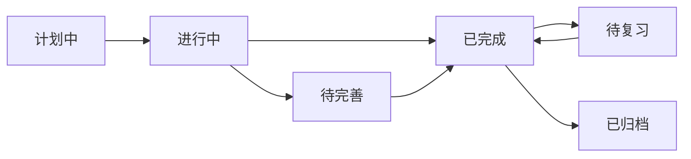
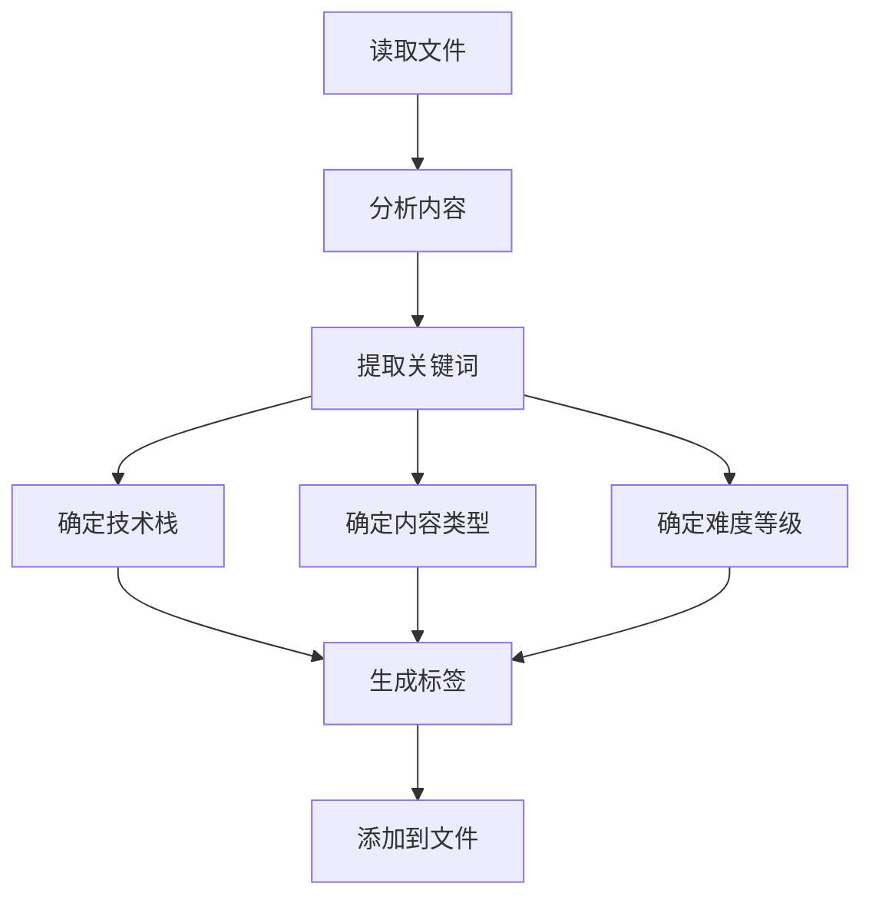

# 🏷️ 标签体系规范

> **目的**：定义统一的标签体系，实现多维度的知识分类和检索

---

## 🎯 核心原则

1. **5 维标签体系**：技术栈、内容类型、难度等级、学习状态、重要程度
2. **层级结构**：使用 `/` 分隔层级（如 `技术栈/Android/Compose`）
3. **统一命名**：使用中文，保持一致性
4. **必需标签**：每个文件至少包含 3 个维度的标签
5. **可扩展性**：支持添加新标签，但需保持体系一致

---

## 📋 5 维标签体系

### 维度 1：技术栈标签

**格式**：`技术栈/[领域]/[子领域]`

**层级结构**：
```
技术栈/
├── Android/
│   ├── Compose
│   ├── Kotlin
│   ├── Jetpack
│   ├── View
│   └── 性能优化
├── iOS/
│   ├── Swift
│   ├── SwiftUI
│   └── UIKit
├── Python/
│   ├── 基础
│   ├── Django
│   ├── FastAPI
│   └── 数据分析
├── 数据库/
│   ├── MySQL
│   ├── PostgreSQL
│   └── Redis
├── AI/
│   ├── 机器学习
│   ├── 深度学习
│   ├── LLM
│   └── RAG
└── 通用/
    ├── 设计模式
    ├── 算法
    ├── Git
    └── DevOps
```

**使用示例**：
```yaml
tags:
  - 技术栈/Android/Compose
  - 技术栈/Python/Django
  - 技术栈/AI/机器学习
```

---

### 维度 2：内容类型标签

**格式**：`内容类型/[类型]`

**可选值**：
```
内容类型/
├── 学习笔记        # 学习过程记录
├── 技术文章        # 原创技术分享
├── 速查手册        # 快速参考
├── 项目总结        # 项目复盘
├── 方案设计        # 技术方案
├── 问题记录        # 问题和解决方案
├── 源码阅读        # 源码分析
├── 读书笔记        # 技术书籍笔记
└── 实践案例        # 实战案例
```

**使用示例**：
```yaml
tags:
  - 内容类型/学习笔记
  - 内容类型/技术文章
  - 内容类型/速查手册
```

**选择指南**：
| 类型 | 特征 | 示例 |
|------|------|------|
| 学习笔记 | 学习过程、概念理解、代码示例 | Compose 状态管理学习笔记 |
| 技术文章 | 深入分析、原创见解、完整论述 | 深入理解 Compose 重组机制 |
| 速查手册 | 命令列表、API 参考、快速查找 | Docker 常用命令速查 |
| 项目总结 | 项目背景、技术方案、经验总结 | XX App 重构项目总结 |
| 方案设计 | 需求分析、方案对比、技术选型 | App 架构设计方案 |
| 问题记录 | 问题描述、原因分析、解决方案 | Compose 性能问题排查 |
| 源码阅读 | 源码结构、核心逻辑、设计思想 | Compose 源码分析 |

---

### 维度 3：难度等级标签

**格式**：`难度/[等级]`

**可选值**：
```
难度/
├── 入门        # 基础概念，适合初学者
├── 初级        # 基本使用，有一定基础
├── 中级        # 深入理解，需要实践经验
├── 高级        # 高级特性，需要深厚功底
└── 专家        # 底层原理，需要专家级理解
```

**使用示例**：
```yaml
tags:
  - 难度/入门
  - 难度/中级
  - 难度/高级
```

**判断标准**：
| 等级 | 特征 | 示例 |
|------|------|------|
| 入门 | 基础概念、快速入门、Hello World | Kotlin 基础语法 |
| 初级 | 基本使用、常见场景、简单示例 | Compose 基础组件使用 |
| 中级 | 深入理解、复杂场景、最佳实践 | Compose 状态管理 |
| 高级 | 高级特性、性能优化、架构设计 | Compose 性能优化 |
| 专家 | 底层原理、源码分析、创新方案 | Compose 重组机制源码分析 |

---

### 维度 4：学习状态标签

**格式**：`状态/[状态]`

**可选值**：
```
状态/
├── 计划中      # 计划学习，尚未开始
├── 进行中      # 正在学习或编写
├── 已完成      # 学习完成，文档完整
├── 待完善      # 基本完成，需要补充
├── 待复习      # 需要定期复习
└── 已归档      # 已过时或不再使用
```

**使用示例**：
```yaml
tags:
  - 状态/进行中
  - 状态/已完成
  - 状态/待复习
```

**状态转换**：


---

### 维度 5：重要程度标签

**格式**：`重要度/[等级]`

**可选值**：
```
重要度/
├── 低          # 了解即可
├── 中          # 需要掌握
├── 高          # 重点掌握
└── 极高        # 核心知识，必须精通
```

**使用示例**：
```yaml
tags:
  - 重要度/高
  - 重要度/极高
```

**判断标准**：
| 等级 | 特征 | 示例 |
|------|------|------|
| 低 | 了解即可，不常用 | 某个冷门 API |
| 中 | 需要掌握，偶尔使用 | 某个工具的使用 |
| 高 | 重点掌握，经常使用 | Compose 状态管理 |
| 极高 | 核心知识，必须精通 | Kotlin 协程 |

---

## 📝 YAML 头部模板

### 完整模板

```yaml
---
title: 文档标题
created: YYYY-MM-DD
updated: YYYY-MM-DD
tags:
  - 技术栈/[领域]/[子领域]
  - 内容类型/[类型]
  - 难度/[等级]
  - 状态/[状态]
  - 重要度/[等级]
type: 文档类型
status: 文档状态
---
```

### 示例 1：学习笔记

```yaml
---
title: Jetpack Compose 状态管理学习笔记
created: 2025-10-15
updated: 2025-10-15
tags:
  - 技术栈/Android/Compose
  - 内容类型/学习笔记
  - 难度/中级
  - 状态/已完成
  - 重要度/高
type: 学习笔记
status: 已完成
---
```

### 示例 2：技术文章

```yaml
---
title: 深入理解 Compose 重组机制
created: 2025-10-15
updated: 2025-10-15
tags:
  - 技术栈/Android/Compose
  - 内容类型/技术文章
  - 难度/高级
  - 状态/已完成
  - 重要度/极高
type: 技术文章
status: 已发布
---
```

### 示例 3：速查手册

```yaml
---
title: Docker 常用命令速查手册
created: 2025-10-15
updated: 2025-10-15
tags:
  - 技术栈/通用/DevOps
  - 内容类型/速查手册
  - 难度/初级
  - 状态/已完成
  - 重要度/高
type: 速查手册
status: 持续更新
---
```

---

## 🎯 标签使用规则

### 规则 1：必需标签

**每个文件必须包含**：
- ✅ 至少 1 个技术栈标签
- ✅ 1 个内容类型标签
- ✅ 1 个难度等级标签
- ✅ 可选：状态标签、重要度标签

**最少标签数**：3 个

### 规则 2：标签数量

**推荐**：
- 技术栈标签：1-2 个（主要技术栈）
- 内容类型标签：1 个
- 难度等级标签：1 个
- 状态标签：1 个
- 重要度标签：1 个

**总计**：5-6 个标签

**不要过多**：
- ❌ 避免超过 10 个标签
- ❌ 避免重复或冗余标签

### 规则 3：标签格式

**正确格式**：
```yaml
tags:
  - 技术栈/Android/Compose
  - 内容类型/学习笔记
  - 难度/中级
```

**错误格式**：
```yaml
# ❌ 不要使用空格
tags:
  - 技术栈 / Android / Compose

# ❌ 不要使用英文
tags:
  - TechStack/Android/Compose

# ❌ 不要混用格式
tags:
  - 技术栈/Android/Compose
  - Android  # 不完整
```

### 规则 4：标签一致性

**保持一致**：
- ✅ 使用统一的标签名称
- ✅ 使用统一的层级结构
- ✅ 使用统一的中文命名

**避免变体**：
```yaml
# ❌ 避免这些变体
- 技术栈/Android/Compose
- 技术栈/安卓/Compose      # 不一致
- 技术栈/Android/JetpackCompose  # 不一致
```

---

## 🔍 标签查询

### Dataview 查询示例

#### 查询 1：按技术栈查询

```dataview
TABLE 
  file.name as "文件名",
  type as "类型",
  status as "状态"
FROM #技术栈/Android/Compose
SORT file.mtime DESC
```

#### 查询 2：按内容类型查询

```dataview
TABLE 
  file.name as "文件名",
  tags as "标签"
FROM #内容类型/学习笔记
WHERE contains(tags, "技术栈/Android")
SORT file.ctime DESC
```

#### 查询 3：按难度等级查询

```dataview
LIST
FROM #难度/高级 OR #难度/专家
WHERE contains(tags, "技术栈/Android")
```

#### 查询 4：按状态查询

```dataview
TABLE 
  file.name as "文件名",
  type as "类型"
FROM #状态/进行中
SORT file.mtime DESC
```

#### 查询 5：多维度组合查询

```dataview
TABLE 
  file.name as "文件名",
  type as "类型",
  status as "状态"
FROM #技术栈/Android/Compose 
WHERE contains(tags, "难度/中级") 
  AND contains(tags, "状态/已完成")
SORT file.mtime DESC
```

---

## 📊 标签统计

### 统计查询示例

#### 统计 1：按技术栈统计

```dataview
TABLE 
  length(rows) as "文档数量"
FROM ""
WHERE contains(tags, "技术栈")
GROUP BY tags[0]
SORT length(rows) DESC
```

#### 统计 2：按内容类型统计

```dataview
TABLE 
  length(rows) as "文档数量"
FROM ""
WHERE contains(tags, "内容类型")
GROUP BY tags[1]
SORT length(rows) DESC
```

#### 统计 3：按难度等级统计

```dataview
TABLE 
  length(rows) as "文档数量"
FROM ""
WHERE contains(tags, "难度")
GROUP BY tags[2]
SORT length(rows) DESC
```

---

## 🎯 AI 自动标签

### 自动标签流程



### 自动标签规则

#### 规则 1：技术栈识别

**关键词映射**：
```python
tech_stack_keywords = {
    "技术栈/Android/Compose": [
        "Compose", "Jetpack Compose", "@Composable",
        "remember", "State", "LazyColumn"
    ],
    "技术栈/Android/Kotlin": [
        "Kotlin", "协程", "Flow", "suspend",
        "lateinit", "data class"
    ],
    "技术栈/Python/Django": [
        "Django", "Model", "View", "Template",
        "ORM", "QuerySet"
    ],
    # ... 更多映射
}
```

#### 规则 2：内容类型识别

**关键词映射**：
```python
content_type_keywords = {
    "内容类型/学习笔记": [
        "学习", "笔记", "教程", "入门",
        "基础", "概念"
    ],
    "内容类型/技术文章": [
        "深入", "原理", "实践", "分享",
        "探索", "研究"
    ],
    "内容类型/速查手册": [
        "速查", "手册", "命令", "API",
        "参考", "快速"
    ],
    # ... 更多映射
}
```

#### 规则 3：难度等级识别

**判断逻辑**：
```python
def determine_difficulty(content):
    if has_keywords(content, ["入门", "基础", "Hello World"]):
        return "难度/入门"
    elif has_keywords(content, ["源码", "底层", "原理"]):
        return "难度/高级"
    elif has_keywords(content, ["优化", "架构", "设计"]):
        return "难度/高级"
    else:
        return "难度/中级"  # 默认
```

---

## 🔗 相关文档

- [[AI协作指导手册 - 总览]] - 返回总览
- [[文件分类与归档指南]] - 分类规则
- [[双链建立规范]] - 双链规范
- [[知识库结构索引]] - 目录结构

---

**创建时间**：2025-10-15 18:20  
**更新频率**：标签体系变化时更新  
**重要程度**：⭐⭐⭐⭐⭐

---

#AI指导 #标签规范 #元数据 #重要
