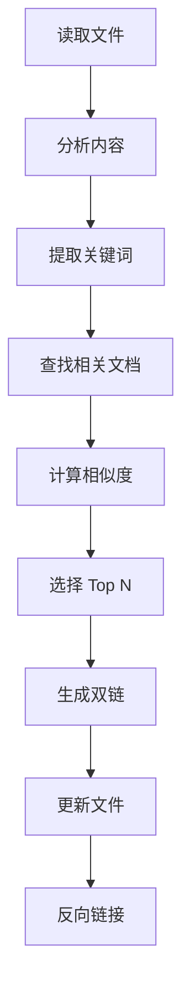

# 🔗 双链建立规范

> **目的**：定义双链建立的规则和策略，构建完整的知识网络，消除知识孤岛

---

## 🎯 核心原则

1. **消除孤岛**：每个文件至少有 2 个双链
2. **有意义关联**：双链要有实际意义，不是为了链接而链接
3. **层次清晰**：区分导航链接、相关文档、延伸阅读
4. **双向关联**：A 链接 B，B 也应链接 A
5. **持续维护**：定期检查和更新双链

---

## 📋 双链类型

### 类型 1：导航链接（必需）

**用途**：提供层级导航，返回上级 MOC

**位置**：文档开头，`## 📋 导航` 部分

**格式**：
```markdown
## 📋 导航
- 返回：[[上级 MOC]]
- 上级：[[父级文档]]
- 同级：[[同级文档1]] | [[同级文档2]]
```

**示例**：
```markdown
## 📋 导航
- 返回：[[🤖 Android开发 MOC]]
- 上级：[[Jetpack Compose 目录]]
- 同级：[[Compose 布局]] | [[Compose 动画]]
```

**规则**：
- ✅ 每个文件必须有"返回"链接
- ✅ 返回链接指向最近的 MOC
- ✅ 可选：上级、同级链接

---

### 类型 2：相关文档（推荐）

**用途**：链接相关的技术文档

**位置**：文档中部或末尾，`## 🔗 相关文档` 部分

**格式**：
```markdown
## 🔗 相关文档
- [[相关文档1]] - 简短说明
- [[相关文档2]] - 简短说明
- [[相关文档3]] - 简短说明
```

**示例**：
```markdown
## 🔗 相关文档
- [[Compose 基础概念]] - 了解 Compose 基础
- [[ViewModel 使用指南]] - 状态管理的最佳实践
- [[Kotlin 协程]] - 异步编程基础
```

**规则**：
- ✅ 至少 2-3 个相关文档
- ✅ 添加简短说明（可选）
- ✅ 按相关性排序

---

### 类型 3：延伸阅读（推荐）

**用途**：链接深入学习的文档

**位置**：文档末尾，`## 📚 延伸阅读` 部分

**格式**：
```markdown
## 📚 延伸阅读
- [[延伸文档1]] - 深入主题
- [[延伸文档2]] - 高级特性
- [[延伸文档3]] - 实战案例
```

**示例**：
```markdown
## 📚 延伸阅读
- [[Compose 性能优化]] - 深入性能优化
- [[Compose 最佳实践]] - 生产环境实践
- [[Compose 源码分析]] - 理解底层原理
```

**规则**：
- ✅ 2-4 个延伸文档
- ✅ 难度递进（从易到难）
- ✅ 主题相关但更深入

---

### 类型 4：内容中的链接（可选）

**用途**：在正文中引用其他文档

**位置**：正文中，自然嵌入

**格式**：
```markdown
关于状态管理，可以参考 [[Compose 状态管理]]。
更多关于协程的内容，见 [[Kotlin 协程]]。
```

**规则**：
- ✅ 自然嵌入，不影响阅读
- ✅ 链接有实际意义
- ❌ 不要过度链接

---

## 🎯 双链策略

### 策略 1：层级关联（纵向）

**目的**：建立层级导航体系

**关联方式**：
```
顶层 MOC
  ↕️
模块 MOC
  ↕️
子模块 MOC
  ↕️
具体文档
```

**示例**：
```
[[📚 技术知识体系 MOC]]
  ↕️
[[📱 移动端开发 MOC]]
  ↕️
[[🤖 Android开发 MOC]]
  ↕️
[[Jetpack Compose 目录]]
  ↕️
[[Compose 状态管理学习笔记]]
```

**实现**：
- 每个文档的"返回"链接指向上级 MOC
- 每个 MOC 包含下级文档的链接

---

### 策略 2：概念关联（横向）

**目的**：关联相同或相似概念

**关联方式**：
```
概念 A ←→ 概念 B ←→ 概念 C
```

**示例**：
```
[[Compose State]] ←→ [[Compose ViewModel]] ←→ [[Compose Flow]]
```

**实现**：
- 在"相关文档"中添加概念相关的链接
- 双向链接（A 链接 B，B 也链接 A）

---

### 策略 3：实践关联（应用）

**目的**：关联理论和实践

**关联方式**：
```
理论文档 ←→ 实践案例 ←→ 问题记录
```

**示例**：
```
[[Compose 状态管理]] ←→ [[Compose 状态管理实战]] ←→ [[Compose 状态问题排查]]
```

**实现**：
- 理论文档链接到实践案例
- 实践案例链接到问题记录
- 问题记录链接回理论文档

---

### 策略 4：技术栈关联（跨领域）

**目的**：关联不同技术栈的相关内容

**关联方式**：
```
Android 文档 ←→ iOS 文档 ←→ Flutter 文档
```

**示例**：
```
[[Compose 状态管理]] ←→ [[SwiftUI 状态管理]] ←→ [[Flutter 状态管理]]
```

**实现**：
- 在"延伸阅读"中添加跨技术栈链接
- 标注技术栈差异

---

### 策略 5：学习路径关联（进阶）

**目的**：构建学习路径

**关联方式**：
```
入门 → 初级 → 中级 → 高级 → 专家
```

**示例**：
```
[[Compose 入门]] → [[Compose 基础组件]] → [[Compose 状态管理]] → [[Compose 性能优化]] → [[Compose 源码分析]]
```

**实现**：
- 在"延伸阅读"中按难度排序
- 标注难度等级

---

## 📝 双链模板

### 模板 1：学习笔记

```markdown
# 文档标题

> 一句话描述

## 📋 导航
- 返回：[[🤖 Android开发 MOC]]
- 上级：[[Jetpack Compose 目录]]
- 同级：[[相关主题1]] | [[相关主题2]]

## 正文内容
...

## 🔗 相关文档
- [[基础概念文档]] - 了解基础概念
- [[相关技术文档]] - 相关技术
- [[配套工具文档]] - 配套工具

## 📚 延伸阅读
- [[进阶文档]] - 深入学习
- [[实战案例]] - 实践应用
- [[源码分析]] - 理解原理

---
#标签1 #标签2 #标签3
```

### 模板 2：技术文章

```markdown
# 文档标题

> 一句话描述

## 📋 导航
- 返回：[[📊 技术输出 MOC]]
- 相关：[[相关文章1]] | [[相关文章2]]

## 正文内容
...

## 🔗 相关文档
- [[理论基础]] - 理论支撑
- [[技术文档]] - 技术细节
- [[实践案例]] - 实践经验

## 📚 延伸阅读
- [[深入主题]] - 深入探讨
- [[相关技术]] - 相关技术
- [[最佳实践]] - 最佳实践

---
#标签1 #标签2 #标签3
```

### 模板 3：速查手册

```markdown
# 文档标题

> 一句话描述

## 📋 导航
- 返回：[[🔍 速查手册 MOC]]
- 相关：[[相关手册1]] | [[相关手册2]]

## 正文内容
...

## 🔗 相关文档
- [[详细教程]] - 详细学习
- [[配置指南]] - 配置说明
- [[问题排查]] - 常见问题

## 📚 延伸阅读
- [[高级用法]] - 高级特性
- [[最佳实践]] - 使用建议
- [[官方文档]] - 官方参考

---
#标签1 #标签2 #标签3
```

---

## 🤖 AI 自动建立双链

### 自动化流程



### 相似度计算

#### 方法 1：关键词匹配

```python
def calculate_similarity_by_keywords(doc1, doc2):
    keywords1 = extract_keywords(doc1)
    keywords2 = extract_keywords(doc2)
    
    common = set(keywords1) & set(keywords2)
    union = set(keywords1) | set(keywords2)
    
    similarity = len(common) / len(union)
    return similarity
```

#### 方法 2：标签匹配

```python
def calculate_similarity_by_tags(doc1, doc2):
    tags1 = extract_tags(doc1)
    tags2 = extract_tags(doc2)
    
    # 技术栈标签权重更高
    tech_match = len(set(tags1["tech"]) & set(tags2["tech"]))
    type_match = len(set(tags1["type"]) & set(tags2["type"]))
    
    similarity = tech_match * 0.7 + type_match * 0.3
    return similarity
```

#### 方法 3：内容相似度（未来：Embedding）

```python
def calculate_similarity_by_embedding(doc1, doc2):
    # 使用 Embedding 计算语义相似度
    embedding1 = get_embedding(doc1)
    embedding2 = get_embedding(doc2)
    
    similarity = cosine_similarity(embedding1, embedding2)
    return similarity
```

### 自动链接规则

#### 规则 1：导航链接

```python
def add_navigation_links(file, metadata):
    # 确定上级 MOC
    moc = find_parent_moc(metadata["tech_stack"])
    
    # 添加导航
    navigation = f"""
## 📋 导航
- 返回：[[{moc}]]
"""
    
    add_to_file(file, navigation)
```

#### 规则 2：相关文档

```python
def add_related_links(file, metadata):
    # 查找相关文档
    related_docs = find_related_documents(
        tech_stack=metadata["tech_stack"],
        content_type=metadata["content_type"],
        limit=3
    )
    
    # 生成链接
    links = "\n## 🔗 相关文档\n"
    for doc in related_docs:
        links += f"- [[{doc.title}]]\n"
    
    add_to_file(file, links)
```

#### 规则 3：延伸阅读

```python
def add_extended_reading(file, metadata):
    # 查找更高难度的文档
    extended_docs = find_documents(
        tech_stack=metadata["tech_stack"],
        difficulty_higher_than=metadata["difficulty"],
        limit=3
    )
    
    # 生成链接
    links = "\n## 📚 延伸阅读\n"
    for doc in extended_docs:
        links += f"- [[{doc.title}]]\n"
    
    add_to_file(file, links)
```

---

## 📊 双链质量检查

### 检查项 1：孤岛文件

**定义**：没有任何双链的文件

**检查方法**：
```dataview
LIST
FROM ""
WHERE length(file.outlinks) = 0
```

**处理**：
- 为孤岛文件添加至少 2 个双链
- 优先添加导航链接和相关文档

---

### 检查项 2：单向链接

**定义**：A 链接 B，但 B 没有链接 A

**检查方法**：
```python
def find_one_way_links():
    for file in all_files:
        for link in file.outlinks:
            target = get_file(link)
            if file not in target.outlinks:
                print(f"单向链接: {file} → {target}")
```

**处理**：
- 在 B 中添加到 A 的链接
- 确保双向关联

---

### 检查项 3：过度链接

**定义**：链接数量过多（>20 个）

**检查方法**：
```dataview
LIST
FROM ""
WHERE length(file.outlinks) > 20
```

**处理**：
- 保留最相关的链接
- 删除不必要的链接
- 考虑创建专门的 MOC

---

### 检查项 4：无效链接

**定义**：链接指向不存在的文件

**检查方法**：
```python
def find_broken_links():
    for file in all_files:
        for link in file.outlinks:
            if not file_exists(link):
                print(f"无效链接: {file} → {link}")
```

**处理**：
- 修复链接路径
- 或删除无效链接

---

## 🎯 双链最佳实践

### 实践 1：优先建立导航链接

**原因**：
- 提供清晰的层级导航
- 用户可以快速返回上级

**实施**：
- 每个文件必须有"返回"链接
- 返回链接指向最近的 MOC

---

### 实践 2：关联同难度文档

**原因**：
- 便于横向学习
- 构建知识网络

**实施**：
- 在"相关文档"中链接同难度文档
- 在"延伸阅读"中链接更高难度文档

---

### 实践 3：建立学习路径

**原因**：
- 提供清晰的学习路线
- 从易到难，循序渐进

**实施**：
- 在 MOC 中规划学习路径
- 在文档中链接前置和后续内容

---

### 实践 4：跨技术栈关联

**原因**：
- 发现技术之间的联系
- 促进知识迁移

**实施**：
- 关联相似概念（如 Compose State ←→ SwiftUI State）
- 关联相似模式（如 MVVM ←→ MVI）

---

### 实践 5：定期维护双链

**原因**：
- 保持链接有效性
- 优化知识网络

**实施**：
- 每月检查一次孤岛文件
- 每季度检查一次无效链接
- 持续优化双链质量

---

## 📈 双链统计

### 统计 1：双链密度

```dataview
TABLE 
  length(file.outlinks) as "出链数",
  length(file.inlinks) as "入链数"
FROM ""
SORT length(file.outlinks) DESC
```

### 统计 2：孤岛文件率

```dataview
TABLE 
  length(rows) as "孤岛文件数"
FROM ""
WHERE length(file.outlinks) = 0
```

### 统计 3：最受欢迎文档

```dataview
TABLE 
  length(file.inlinks) as "被链接次数"
FROM ""
SORT length(file.inlinks) DESC
LIMIT 10
```

---

## 🔗 相关文档

- [[AI协作指导手册 - 总览]] - 返回总览
- [[文件分类与归档指南]] - 分类规则
- [[标签体系规范]] - 标签规范
- [[知识库结构索引]] - 目录结构

---

**创建时间**：2025-10-15 18:25  
**更新频率**：双链策略变化时更新  
**重要程度**：⭐⭐⭐⭐⭐

---

#AI指导 #双链规范 #知识关联 #重要
