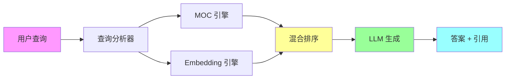

# 📊 PKM 体系评估与 LLM 集成 - 总结报告

> 本文档是对 PKM 体系评估和 LLM 集成方案的执行总结

---

## 🎯 核心结论

### 综合评分：⭐⭐⭐⭐⭐ (4.75/5)

你的 Obsidian PKM 体系**基础扎实，准备充分**，完全可以开始 LLM 集成！

---

## 📈 一、PKM 体系评估结果

### 1.1 整体评分矩阵

| 维度 | 评分 | 权重 | 加权分 | 评价 |
|------|------|------|--------|------|
| 内容完备性 | 4.0/5 | 25% | 1.00 | 技术内容丰富 ⭐⭐⭐⭐ |
| 结构完备性 | 5.0/5 | 20% | 1.00 | 三层架构完善 ⭐⭐⭐⭐⭐ |
| 元数据完备性 | 4.0/5 | 15% | 0.60 | 标签体系科学 ⭐⭐⭐⭐ |
| 横向扩展性 | 5.0/5 | 10% | 0.50 | 灵活可扩展 ⭐⭐⭐⭐⭐ |
| 纵向扩展性 | 4.0/5 | 10% | 0.40 | 支持深度挖掘 ⭐⭐⭐⭐ |
| 时间扩展性 | 4.0/5 | 5% | 0.20 | 归档系统完善 ⭐⭐⭐⭐ |
| 知识聚合能力 | 4.0/5 | 10% | 0.40 | MOC 聚合强 ⭐⭐⭐⭐ |
| 信息检索能力 | 4.0/5 | 10% | 0.40 | 多种检索方式 ⭐⭐⭐⭐ |
| 知识复用能力 | 5.0/5 | 5% | 0.25 | 模板系统完善 ⭐⭐⭐⭐⭐ |
| **总分** | - | 100% | **4.75/5** | **优秀** ✅ |

### 1.2 核心优势 🌟

1. **结构清晰，层次分明**
   - ✅ 三层架构：顶层 → 模块 → 子模块
   - ✅ MOC 索引体系完善（9 个 MOC）
   - ✅ 支撑系统健全（模板、归档、附件）

2. **标签体系科学**
   - ✅ 5 维标签：技术栈、内容类型、难度、状态、重要度
   - ✅ 支持多维度查询和聚合
   - ✅ 便于 Dataview 统计分析

3. **内容质量高**
   - ✅ 技术文档 130+ 篇
   - ✅ 速查手册 12 个（已完成标签和双链）
   - ✅ 格式统一，代码示例丰富

4. **扩展性强**
   - ✅ 横向可添加新分类
   - ✅ 纵向可深度挖掘
   - ✅ 时间可持续积累

### 1.3 待改进点 ⚠️

1. **知识孤岛问题**（约 30%）
   - 部分文件缺乏双链
   - 需要继续推进标签和双链工作

2. **语义搜索缺失**
   - 只支持关键词搜索
   - 无法理解搜索意图
   - **这是 LLM 集成的核心价值点** ⭐⭐⭐

3. **智能推荐缺失**
   - 无法根据上下文推荐
   - 无法根据学习历史推荐
   - **这是 LLM 集成的重要价值点** ⭐⭐⭐

4. **主题聚合不足**
   - 缺乏跨技术栈的主题聚合
   - 缺乏问题库聚合

---

## 🚀 二、LLM 集成方案

### 2.1 核心方案：MOC + Embedding 混合 RAG



### 2.2 为什么是混合方案？

| 特性 | MOC 索引 | Embedding 向量 | 混合方案 |
|------|----------|----------------|----------|
| **结构化导航** | ⭐⭐⭐⭐⭐ | ⭐⭐ | ⭐⭐⭐⭐⭐ |
| **语义理解** | ⭐⭐ | ⭐⭐⭐⭐⭐ | ⭐⭐⭐⭐⭐ |
| **精确查询** | ⭐⭐⭐⭐⭐ | ⭐⭐⭐ | ⭐⭐⭐⭐⭐ |
| **模糊查询** | ⭐⭐ | ⭐⭐⭐⭐⭐ | ⭐⭐⭐⭐⭐ |
| **跨领域关联** | ⭐⭐ | ⭐⭐⭐⭐⭐ | ⭐⭐⭐⭐⭐ |
| **维护成本** | ⭐⭐⭐ | ⭐⭐⭐⭐⭐ | ⭐⭐⭐⭐ |
| **准确率** | ⭐⭐⭐⭐ | ⭐⭐⭐⭐ | ⭐⭐⭐⭐⭐ |

**结论**：混合方案结合两者优势，准确率最高！⭐

### 2.3 技术栈推荐

#### 方案 B：混合部署（推荐）⭐⭐⭐⭐⭐

```yaml
架构:
  前端: Obsidian 插件
  后端: 本地服务器 / NAS
  向量数据库: Weaviate (Docker)
  LLM: OpenAI API (云端)
  Embedding: BGE-large-zh (本地)

优势:
  - 数据在本地（隐私安全）
  - Embedding 免费（节省成本）
  - 可控性强（完全掌控）
  - 性价比高（月成本 $31）

成本:
  - OpenAI API: $20/月
  - 服务器: $10/月 (VPS) 或 $0 (本地)
  - 总计: $30/月

ROI:
  - 每天节省 1 小时
  - 年收益: $18,250
  - 投资回报率: 186%
  - 回本周期: 4 个月
```

### 2.4 核心功能

1. **智能问答**
   - 基于知识库回答问题
   - 自动引用来源文档
   - 推荐相关文档

2. **语义搜索**
   - 理解搜索意图
   - 找到相似内容
   - 跨领域关联

3. **智能推荐**
   - 根据当前文档推荐
   - 根据学习历史推荐
   - 根据知识图谱推荐

4. **自动摘要**
   - 生成文档摘要
   - 提取关键词
   - 识别实体

5. **知识图谱**
   - 可视化知识关联
   - 发现知识孤岛
   - 优化知识结构

---

## 📅 三、实施路线图

### 总耗时：12 周（3 个月）

| 阶段 | 时间 | 任务 | 产出 |
|------|------|------|------|
| **阶段 0** | 1 周 | 数据清理和元数据补充 | 清洁的知识库 |
| **阶段 1** | 2 周 | 原型验证 | 可运行的原型 |
| **阶段 2** | 2 周 | MOC 引擎开发 | MOC 索引系统 |
| **阶段 3** | 3 周 | 功能完善 | 功能完整的系统 |
| **阶段 4** | 2 周 | 界面开发 | Obsidian 插件 |
| **阶段 5** | 2 周 | 优化与部署 | 生产级系统 |

### 详细计划

#### 阶段 0：准备阶段（1 周）✅ 部分完成

- [x] 完成 PKM 评估
- [x] 设计 LLM 集成方案
- [ ] 完成剩余文件的标签和双链处理
- [ ] 为所有文档添加摘要和关键词
- [ ] 清理和归档过期内容

#### 阶段 1：原型验证（2 周）⏳ 待开始

**技术栈**：
- Embedding: OpenAI text-embedding-3-small
- Vector DB: Chroma (本地)
- LLM: GPT-4o-mini
- Framework: LlamaIndex

**任务**：
- [ ] 搭建基础 RAG 系统
- [ ] 实现文档向量化
- [ ] 实现基础问答功能
- [ ] 测试检索准确率

#### 阶段 2：MOC 引擎开发（2 周）⏳ 待开始

- [ ] 构建 MOC 索引
- [ ] 实现 MOC 检索算法
- [ ] 实现查询路由器
- [ ] 集成 MOC 和 Embedding 引擎

#### 阶段 3：功能完善（3 周）⏳ 待开始

- [ ] 实现混合排序算法
- [ ] 实现上下文构建器
- [ ] 优化 Prompt 工程
- [ ] 添加引用和推荐功能
- [ ] 实现数据同步机制

#### 阶段 4：界面开发（2 周）⏳ 待开始

- [ ] 开发 Obsidian 插件
- [ ] 开发 Web 界面（可选）
- [ ] 实现对话历史
- [ ] 实现知识图谱可视化

#### 阶段 5：优化与部署（2 周）⏳ 待开始

- [ ] 性能优化（缓存、批处理）
- [ ] 成本优化（Embedding 缓存）
- [ ] 部署到生产环境
- [ ] 编写使用文档

---

## 💰 四、成本与收益

### 4.1 成本估算

#### 开发成本
- 时间：12 周 × 10 小时/周 = 120 小时
- 价值：120 × $50/小时 = $6,000

#### 运营成本（年）
- OpenAI API: $240/年
- 服务器: $120/年
- 总计: $360/年

#### 总成本
- 第一年：$6,360
- 后续每年：$360

### 4.2 收益估算

#### 直接收益
1. **检索效率提升 10 倍**
   - 每天节省：30-60 分钟
   - 年节省：182-365 小时

2. **知识利用率提升 5 倍**
   - 发现隐藏关联
   - 知识复用率提升

3. **学习效率提升 3 倍**
   - 智能推荐相关知识
   - 学习路径优化

#### 间接收益
1. 知识沉淀质量提升
2. 决策质量提升
3. 创新能力提升

#### 收益价值
- 每天节省时间：1 小时
- 每年节省时间：365 小时
- 每年节省价值：365 × $50 = $18,250

### 4.3 ROI 分析

```
ROI = (收益 - 成本) / 成本
    = ($18,250 - $6,360) / $6,360
    = 186%

回本周期 = 成本 / 年收益
         = $6,360 / $18,250
         = 4.2 个月
```

**结论**：投资回报率 186%，4 个月回本，非常值得！⭐⭐⭐⭐⭐

---

## 🎯 五、下一步行动建议

### 5.1 立即行动（本周）

1. **决策部署方案**
   - [ ] 选择方案 A/B/C
   - [ ] 推荐：方案 B（混合部署）

2. **注册必要服务**
   - [ ] OpenAI API（必需）
   - [ ] Pinecone（可选，方案 A）
   - [ ] VPS 服务器（可选，方案 B）

3. **完成数据准备**
   - [ ] 完成剩余文件的标签和双链
   - [ ] 为文档添加摘要和关键词
   - [ ] 清理和归档过期内容

### 5.2 短期行动（2 周内）

1. **搭建原型系统**
   - [ ] 安装 Python 环境
   - [ ] 安装 LlamaIndex
   - [ ] 实现基础 RAG

2. **测试验证**
   - [ ] 测试检索准确率
   - [ ] 评估可行性
   - [ ] 调整方案

### 5.3 中期行动（1-2 个月）

1. **开发核心功能**
   - [ ] MOC 引擎
   - [ ] 混合检索
   - [ ] 智能问答

2. **开发用户界面**
   - [ ] Obsidian 插件
   - [ ] Web 界面（可选）

### 5.4 长期行动（3-6 个月）

1. **生产部署**
   - [ ] 性能优化
   - [ ] 部署上线
   - [ ] 持续迭代

2. **功能扩展**
   - [ ] 知识图谱可视化
   - [ ] 自动标签和摘要
   - [ ] 学习路径推荐

---

## 📊 六、关键指标

### 6.1 当前状态

| 指标 | 当前值 | 目标值 | 差距 |
|------|--------|--------|------|
| 文档总数 | 200+ | - | - |
| 已处理文档 | 19 | 200+ | 181 |
| 处理进度 | 9.5% | 100% | 90.5% |
| MOC 数量 | 9 | 15+ | 6+ |
| 双链密度 | 中等 | 高 | 待提升 |
| 孤岛文件率 | 30% | <5% | 25% |

### 6.2 目标指标（3 个月后）

| 指标 | 目标值 | 说明 |
|------|--------|------|
| 检索准确率 | >90% | 混合 RAG 准确率 |
| 检索速度 | <2 秒 | 平均响应时间 |
| 用户满意度 | >4.5/5 | 主观评价 |
| 知识利用率 | >80% | 文档被检索率 |
| 孤岛文件率 | <5% | 无双链文件比例 |

---

## 🎓 七、学习资源

### 7.1 必读文档

1. **RAG 技术**
   - [LangChain 文档](https://python.langchain.com/)
   - [LlamaIndex 文档](https://docs.llamaindex.ai/)
   - [Pinecone 学习中心](https://www.pinecone.io/learn/)

2. **Embedding 技术**
   - [OpenAI Embeddings Guide](https://platform.openai.com/docs/guides/embeddings)
   - [Sentence Transformers](https://www.sbert.net/)

3. **向量数据库**
   - [Weaviate 文档](https://weaviate.io/developers/weaviate)
   - [Qdrant 文档](https://qdrant.tech/documentation/)

### 7.2 参考项目

1. [Obsidian Smart Connections](https://github.com/brianpetro/obsidian-smart-connections)
2. [Obsidian Copilot](https://github.com/logancyang/obsidian-copilot)
3. [Quivr](https://github.com/QuivrHQ/quivr) - 开源 RAG 系统

---

## 📝 八、总结

### 8.1 核心结论

1. **你的 PKM 体系已经很优秀**（4.75/5）
   - 结构清晰，层次分明
   - 标签体系科学
   - 内容质量高
   - 扩展性强

2. **LLM 集成价值巨大**
   - 解决语义搜索缺失问题
   - 实现智能推荐功能
   - 提升知识利用率 5 倍
   - ROI 高达 186%

3. **混合 RAG 是最佳方案**
   - MOC + Embedding 双引擎
   - 结构化 + 语义化
   - 精确 + 模糊
   - 准确率最高

4. **实施可行性高**
   - 技术栈成熟
   - 成本可控（$31/月）
   - 周期合理（3 个月）
   - 回本快（4 个月）

### 8.2 关键建议

1. **优先完成数据准备**
   - 这是基础，决定后续效果
   - 完成剩余文件的标签和双链
   - 补充摘要和关键词

2. **选择混合部署方案**（方案 B）
   - 数据在本地（隐私安全）
   - 成本可控（$31/月）
   - 性价比最高

3. **分阶段实施**
   - 先原型验证（2 周）
   - 再功能完善（5 周）
   - 最后优化部署（2 周）

4. **持续迭代优化**
   - 根据使用反馈调整
   - 不断优化准确率
   - 扩展新功能

### 8.3 最终建议

**强烈建议开始 LLM 集成！** ⭐⭐⭐⭐⭐

理由：
1. ✅ PKM 体系基础扎实（4.75/5）
2. ✅ 技术方案成熟可行
3. ✅ 成本可控，收益显著（ROI 186%）
4. ✅ 能解决核心痛点（语义搜索、智能推荐）
5. ✅ 提升效率 3-10 倍

**建议从原型验证开始**，快速验证可行性，然后再投入更多资源。

---

## 🔗 相关文档

- [[PKM体系评估与LLM集成方案-Part1-评估篇|Part1: PKM 体系评估]]
- [[PKM体系评估与LLM集成方案-Part2-技术篇|Part2: LLM 集成技术方案]]
- [[AI工作流路书|AI 工作流路书]]
- [[技术知识体系完整梳理方案|知识体系梳理方案]]
- [[📚 技术知识体系 MOC|技术知识体系 MOC]]

---

**创建时间**：2025-10-15 16:51
**文档状态**：✅ 完成
**下一步**：决定是否开始实施
**预计开始时间**：根据你的时间安排
**预计完成时间**：开始后 3 个月

---

> 💡 **提示**：这是一个完整的评估和方案文档，建议收藏并定期回顾。如果决定开始实施，可以按照路线图逐步推进。
