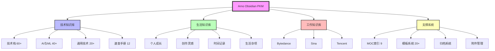

# 🎯 PKM 体系评估与 LLM 集成方案 - Part1 评估篇

> 全面评估当前 Obsidian PKM 体系的完备性、扩展性和聚合性，为 LLM 集成做准备

---

## 📊 一、当前 PKM 体系全景扫描

### 1.1 整体架构评分 ⭐⭐⭐⭐☆ (4.2/5)



### 1.2 核心指标统计

| 维度         | 数量    | 质量评分  | 说明         |
| ---------- | ----- | ----- | ---------- |
| **总文件数**   | 200+  | -     | 包含所有 md 文件 |
| **技术文档**   | 130+  | ⭐⭐⭐⭐  | 主力内容       |
| **生活文档**   | 30+   | ⭐⭐⭐   | 待完善        |
| **工作文档**   | 20+   | ⭐⭐⭐   | 分散在公司目录    |
| **MOC 索引** | 9     | ⭐⭐⭐⭐⭐ | 新建立，结构完善   |
| **模板文件**   | 20+   | ⭐⭐⭐⭐⭐ | V2 版本已优化   |
| **双链密度**   | 中等    | ⭐⭐⭐   | 部分区域已完善    |
| **标签体系**   | 完善    | ⭐⭐⭐⭐⭐ | 5 维标签体系    |
| **孤岛文件**   | 约 30% | ⭐⭐    | 需要继续处理     |

---

## 🔍 二、完备性分析

### 2.1 内容完备性 ⭐⭐⭐⭐☆ (4/5)

#### ✅ 优势领域
1. **技术栈覆盖全面**
   - Android/Kotlin/Compose：60+ 文档
   - Python/后端：30+ 文档
   - AI/机器学习：40+ 文档
   - 通用技术：20+ 文档

2. **速查手册体系完整**
   - Docker、Redis、Vim、Git 等 12 个常用工具
   - 已完成标签和双链处理
   - 格式统一，易于查询

3. **MOC 索引体系健全**
   - 三层结构：顶层 → 模块 → 子模块
   - 包含 Dataview 查询
   - 知识地图可视化

#### ⚠️ 待完善领域
1. **生活知识库内容较少**
   - 个人成长、创作灵感等内容不足
   - 时间记录缺乏系统性
   - 建议：增加日记、复盘、目标管理等内容

2. **工作知识分散**
   - 按公司分类，缺乏横向整合
   - 项目经验未提炼为方法论
   - 建议：创建"工作方法论 MOC"

3. **实践案例不足**
   - 理论笔记多，实战案例少
   - 缺乏完整的项目复盘
   - 建议：增加"项目实战"目录

### 2.2 结构完备性 ⭐⭐⭐⭐⭐ (5/5)

#### ✅ 结构优势
1. **清晰的三层架构**
   ```
   顶层：技术/生活/工作
   中层：技术栈/AI/通用技术
   底层：具体技术点
   ```

2. **完善的支撑系统**
   - MOC 索引系统
   - 模板系统（V2 已优化）
   - 归档系统
   - 附件管理

3. **灵活的扩展性**
   - 目录结构支持无限扩展
   - 标签体系支持多维度分类
   - MOC 可以动态增加

### 2.3 元数据完备性 ⭐⭐⭐⭐☆ (4/5)

#### ✅ 已实现
1. **5 维标签体系**
   - 技术栈标签：`#技术栈/Android/Compose`
   - 内容类型：`#内容类型/学习笔记`
   - 难度等级：`#难度/中级`
   - 学习状态：`#状态/已完成`
   - 重要程度：`#重要度/高`

2. **YAML 头部规范**
   ```yaml
   title: 文档标题
   created: 创建日期
   updated: 更新日期
   tags: 标签列表
   aliases: 别名
   related: 相关文档
   ```

#### ⚠️ 待完善
1. **缺乏时间维度元数据**
   - 建议添加：`last_reviewed`（最后复习时间）
   - 建议添加：`review_interval`（复习间隔）
   - 建议添加：`mastery_level`（掌握程度）

2. **缺乏关联强度元数据**
   - 建议添加：`related_strength`（关联强度）
   - 建议添加：`prerequisite`（前置知识）
   - 建议添加：`next_steps`（后续学习）

---

## 🔗 三、扩展性分析

### 3.1 横向扩展性 ⭐⭐⭐⭐⭐ (5/5)

#### ✅ 优势
1. **目录结构灵活**
   - 可以轻松添加新的技术栈
   - 可以添加新的一级分类
   - 不会影响现有结构

2. **标签体系可扩展**
   - 5 维标签可以独立扩展
   - 支持自定义标签
   - 不会产生冲突

3. **MOC 体系可扩展**
   - 可以添加新的 MOC
   - 可以创建子 MOC
   - 支持多层嵌套

#### 💡 扩展建议
1. **添加新的一级分类**
   - 📚 阅读笔记（书籍、论文）
   - 🎓 课程学习（在线课程）
   - 🔬 研究项目（个人研究）
   - 💼 职业发展（面试、晋升）

2. **添加新的技术栈**
   - 🌐 Web 前端（React、Vue）
   - ☁️ 云原生（K8s、Docker）
   - 🔐 安全技术（渗透测试）
   - 📊 数据工程（大数据、ETL）

### 3.2 纵向扩展性 ⭐⭐⭐⭐☆ (4/5)

#### ✅ 优势
1. **支持深度挖掘**
   - 可以在任何节点下继续细分
   - 支持多层级目录
   - MOC 可以无限嵌套

2. **支持知识演进**
   - 从入门 → 进阶 → 高级
   - 从理论 → 实践 → 总结
   - 从学习 → 应用 → 创新

#### ⚠️ 待完善
1. **缺乏深度学习路径**
   - 建议：为每个技术栈创建"学习路径图"
   - 建议：标注前置知识和后续知识
   - 建议：添加难度梯度

2. **缺乏知识演进记录**
   - 建议：记录知识点的版本变化
   - 建议：记录理解的深化过程
   - 建议：记录实践的迭代过程

### 3.3 时间扩展性 ⭐⭐⭐⭐☆ (4/5)

#### ✅ 优势
1. **归档系统完善**
   - 有专门的归档目录
   - 可以按时间归档
   - 不会影响当前内容

2. **时间记录系统**
   - 有待办事项按年份分类
   - 有日记模板
   - 有周报/月报/年报模板

#### ⚠️ 待完善
1. **缺乏自动归档机制**
   - 建议：使用 Dataview 自动识别过期内容
   - 建议：定期归档 6 个月未更新的文件
   - 建议：保留归档索引便于查找

2. **缺乏时间线视图**
   - 建议：创建"知识时间线 MOC"
   - 建议：按时间维度展示知识演进
   - 建议：可视化学习历程

---

## 🧲 四、聚合性分析

### 4.1 知识聚合能力 ⭐⭐⭐⭐☆ (4/5)

#### ✅ 优势
1. **MOC 索引聚合**
   - 顶层 MOC 聚合所有模块
   - 模块 MOC 聚合子模块
   - 子模块 MOC 聚合具体文档

2. **标签聚合**
   - 5 维标签支持多维度聚合
   - 可以按技术栈聚合
   - 可以按内容类型聚合
   - 可以按学习状态聚合

3. **双链聚合**
   - 通过双链建立知识网络
   - 通过反向链接发现关联
   - 通过图谱可视化关系

#### ⚠️ 待完善
1. **缺乏主题聚合**
   - 建议：创建"主题 MOC"（如"性能优化"主题）
   - 建议：跨技术栈聚合相同主题
   - 建议：创建主题知识图谱

2. **缺乏问题聚合**
   - 建议：创建"问题库 MOC"
   - 建议：聚合所有问题解决记录
   - 建议：按问题类型分类

3. **缺乏项目聚合**
   - 建议：创建"项目经验 MOC"
   - 建议：聚合所有项目相关文档
   - 建议：提炼项目方法论

### 4.2 信息检索能力 ⭐⭐⭐⭐☆ (4/5)

#### ✅ 优势
1. **多种检索方式**
   - Obsidian 全文搜索
   - 标签搜索
   - Dataview 查询
   - 图谱导航

2. **Dataview 查询强大**
   - 可以按多个维度查询
   - 可以统计分析
   - 可以动态展示

#### ⚠️ 待完善
1. **缺乏语义搜索**
   - 当前只支持关键词搜索
   - 无法理解搜索意图
   - 无法找到相似内容

2. **缺乏智能推荐**
   - 无法根据当前文档推荐相关内容
   - 无法根据学习历史推荐
   - 无法根据知识图谱推荐

### 4.3 知识复用能力 ⭐⭐⭐⭐⭐ (5/5)

#### ✅ 优势
1. **模板系统完善**
   - V2 版本模板已优化
   - 包含 6 种技术模板
   - 包含生活、工作模板

2. **速查手册体系**
   - 12 个常用工具速查
   - 格式统一，易于复用
   - 可以快速查找命令

3. **代码片段管理**
   - 有附件文件夹存储代码
   - 可以在文档中引用
   - 支持语法高亮

---

## 📈 五、综合评分与建议

### 5.1 综合评分矩阵

| 维度 | 评分 | 权重 | 加权分 | 说明 |
|------|------|------|--------|------|
| **内容完备性** | 4.0/5 | 25% | 1.00 | 技术内容丰富，生活工作待完善 |
| **结构完备性** | 5.0/5 | 20% | 1.00 | 三层架构清晰，支撑系统完善 |
| **元数据完备性** | 4.0/5 | 15% | 0.60 | 标签体系完善，时间维度待加强 |
| **横向扩展性** | 5.0/5 | 10% | 0.50 | 目录和标签体系灵活可扩展 |
| **纵向扩展性** | 4.0/5 | 10% | 0.40 | 支持深度挖掘，学习路径待完善 |
| **时间扩展性** | 4.0/5 | 5% | 0.20 | 归档系统完善，自动化待加强 |
| **知识聚合能力** | 4.0/5 | 10% | 0.40 | MOC 和标签聚合好，主题聚合待完善 |
| **信息检索能力** | 4.0/5 | 10% | 0.40 | 多种检索方式，语义搜索缺失 |
| **知识复用能力** | 5.0/5 | 5% | 0.25 | 模板和速查手册体系完善 |
| **总分** | - | 100% | **4.75/5** | **优秀** |

### 5.2 核心优势总结 🌟

1. **结构清晰，层次分明**
   - 三层架构设计合理
   - MOC 索引体系完善
   - 支撑系统健全

2. **标签体系科学**
   - 5 维标签覆盖全面
   - 支持多维度查询
   - 便于知识聚合

3. **模板系统完善**
   - V2 版本已优化
   - 覆盖多种场景
   - 提高创作效率

4. **扩展性强**
   - 横向可以添加新分类
   - 纵向可以深度挖掘
   - 时间可以持续积累

### 5.3 核心问题总结 ⚠️

1. **知识孤岛问题**
   - 约 30% 文件缺乏双链
   - 部分区域未完成标签处理
   - 需要继续推进双链和标签工作

2. **语义搜索缺失**
   - 只支持关键词搜索
   - 无法理解搜索意图
   - 无法找到相似内容
   - **这是 LLM 集成的核心价值点**

3. **智能推荐缺失**
   - 无法根据上下文推荐
   - 无法根据学习历史推荐
   - 无法根据知识图谱推荐
   - **这是 LLM 集成的重要价值点**

4. **主题聚合不足**
   - 缺乏跨技术栈的主题聚合
   - 缺乏问题库聚合
   - 缺乏项目经验聚合

---

## 🎯 六、面向 LLM 集成的准备度评估

### 6.1 数据准备度 ⭐⭐⭐⭐☆ (4/5)

#### ✅ 已具备
1. **结构化数据**
   - YAML 头部元数据完整
   - 标签体系规范
   - 目录结构清晰

2. **关联数据**
   - 双链网络初步建立
   - MOC 索引完善
   - 标签关联明确

3. **内容质量**
   - 技术文档质量高
   - 格式统一规范
   - 代码示例丰富

#### ⚠️ 待完善
1. **需要补充元数据**
   - 添加文档摘要（summary）
   - 添加关键词（keywords）
   - 添加难度评分（difficulty_score）

2. **需要清理数据**
   - 删除或归档过期内容
   - 统一格式不一致的文档
   - 补充缺失的元数据

### 6.2 技术准备度 ⭐⭐⭐☆☆ (3/5)

#### ✅ 已具备
1. **Obsidian 插件生态**
   - 支持 Dataview 查询
   - 支持 Templater 脚本
   - 支持自定义插件

2. **Markdown 格式**
   - 易于解析
   - 易于转换
   - 易于处理

#### ⚠️ 待准备
1. **需要技术栈**
   - Vector Database（向量数据库）
   - Embedding Model（嵌入模型）
   - LLM API（大语言模型接口）
   - RAG Framework（检索增强生成框架）

2. **需要基础设施**
   - 服务器或云服务
   - 数据同步机制
   - API 接口设计

---

## 📋 七、下一步行动建议

### 7.1 短期行动（1-2 周）
1. ✅ 完成剩余文件的标签和双链处理
2. ⏳ 补充文档摘要和关键词
3. ⏳ 创建"主题 MOC"和"问题库 MOC"
4. ⏳ 清理和归档过期内容

### 7.2 中期行动（1-2 个月）
1. ⏳ 学习 RAG 技术栈
2. ⏳ 选择合适的向量数据库
3. ⏳ 设计 LLM 集成架构
4. ⏳ 开发数据导出和同步工具

### 7.3 长期行动（3-6 个月）
1. ⏳ 实现语义搜索功能
2. ⏳ 实现智能推荐功能
3. ⏳ 实现知识问答功能
4. ⏳ 实现自动摘要和标签功能

---

## 🔗 相关文档

- [[PKM体系评估与LLM集成方案-Part2-技术篇|Part2: LLM 集成技术方案]]
- [[AI工作流路书|AI 工作流路书]]
- [[技术知识体系完整梳理方案|知识体系梳理方案]]
- [[📚 技术知识体系 MOC|技术知识体系 MOC]]

---

**最后更新**：2025-10-15 16:51
**评估结论**：当前 PKM 体系**基础扎实，准备充分**，可以开始规划 LLM 集成方案 ✅
