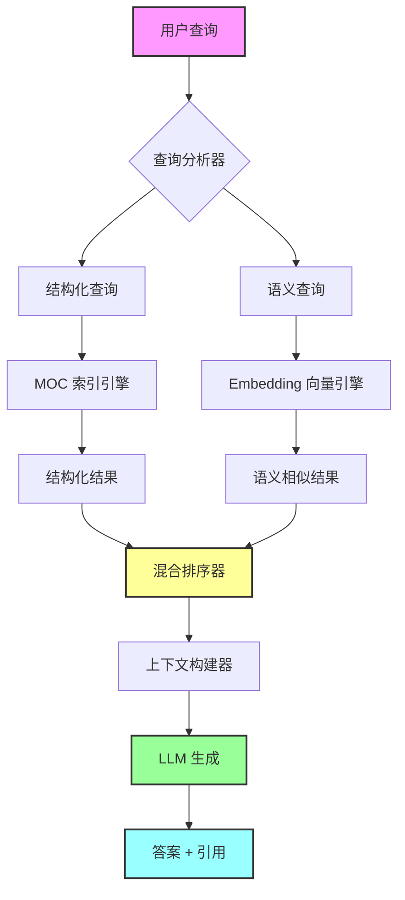
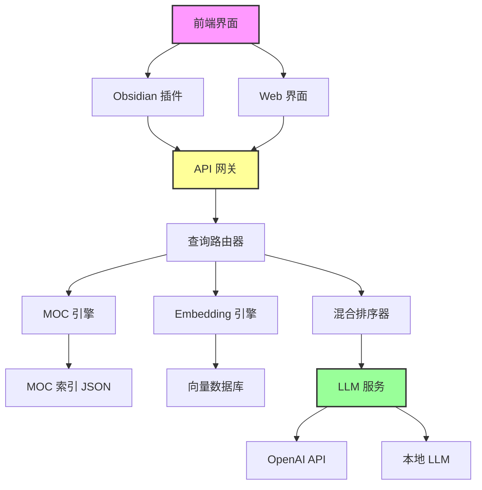

# 🚀 PKM 体系评估与 LLM 集成方案 - Part2 技术篇

> 基于 Part1 的评估结果，设计面向个人知识库的混合 RAG 智能系统

---

## 📋 目录

1. [混合 RAG 架构设计](#一混合-rag-架构设计)
2. [MOC + Embedding 双引擎方案](#二moc--embedding-双引擎方案)
3. [技术栈选型](#三技术栈选型)
4. [数据准备流程](#四数据准备流程)
5. [实施路线图](#五实施路线图)
6. [成本与收益分析](#六成本与收益分析)

---

## 一、混合 RAG 架构设计

### 1.1 核心理念：MOC + Embedding 双引擎 🎯



### 1.2 为什么是混合方案？

| 方案 | 优势 | 劣势 | 适用场景 |
|------|------|------|----------|
| **纯 MOC 索引** | 结构清晰<br>精确定位<br>无需训练 | 无法语义理解<br>依赖人工维护<br>扩展性差 | 明确的导航查询<br>"Android 开发有哪些内容？" |
| **纯 Embedding** | 语义理解强<br>自动化程度高<br>发现隐藏关联 | 缺乏结构信息<br>可能偏离主题<br>计算成本高 | 模糊的语义查询<br>"如何优化应用性能？" |
| **混合方案** ⭐ | 结合两者优势<br>互补短板<br>准确率最高 | 系统复杂度高<br>需要协调机制 | **所有场景**<br>自动选择最佳策略 |

### 1.3 混合 RAG 工作流程

#### 阶段 1：查询理解与路由

```python
# 伪代码示例
def analyze_query(user_query):
    """分析用户查询，决定使用哪种检索策略"""
    
    # 1. 意图识别
    intent = classify_intent(user_query)
    # 可能的意图：导航、概念解释、问题解决、代码示例、对比分析
    
    # 2. 实体识别
    entities = extract_entities(user_query)
    # 识别：技术栈、概念、工具、问题类型
    
    # 3. 路由决策
    if intent == "导航" and entities in moc_index:
        return "moc_only"  # 纯 MOC 检索
    elif intent == "概念解释" or "对比分析":
        return "hybrid"  # 混合检索
    elif intent == "问题解决":
        return "embedding_first"  # Embedding 优先
    else:
        return "hybrid"  # 默认混合
```

#### 阶段 2：双引擎并行检索

```python
# MOC 引擎检索
def moc_retrieval(query, entities):
    """基于 MOC 索引的结构化检索"""
    results = []
    
    # 1. 在 MOC 层级中定位
    moc_path = locate_in_moc(entities)
    # 例如：技术知识体系 > 移动端开发 > Android > Compose
    
    # 2. 获取该节点下的所有文档
    docs = get_docs_under_moc(moc_path)
    
    # 3. 根据标签过滤
    filtered_docs = filter_by_tags(docs, query)
    
    # 4. 根据元数据排序
    sorted_docs = sort_by_metadata(filtered_docs)
    # 排序依据：重要度、更新时间、学习状态
    
    return sorted_docs[:10]  # 返回 Top 10

# Embedding 引擎检索
def embedding_retrieval(query, top_k=10):
    """基于向量相似度的语义检索"""
    
    # 1. 查询向量化
    query_embedding = embed_model.encode(query)
    
    # 2. 向量数据库检索
    results = vector_db.search(
        query_embedding,
        top_k=top_k * 2,  # 多检索一些，后续重排序
        filter={
            "status": "已完成",  # 只检索已完成的文档
            "importance": {"$gte": "中"}  # 重要度中等以上
        }
    )
    
    # 3. 重排序（使用 Cross-Encoder）
    reranked_results = reranker.rerank(query, results)
    
    return reranked_results[:10]  # 返回 Top 10
```

#### 阶段 3：混合排序与上下文构建

```python
def hybrid_ranking(moc_results, embedding_results, strategy="balanced"):
    """混合排序算法"""
    
    # 1. 计算混合分数
    for doc in all_results:
        moc_score = doc.moc_rank / len(moc_results) if doc in moc_results else 0
        emb_score = doc.similarity_score if doc in embedding_results else 0
        
        # 混合策略
        if strategy == "moc_first":
            doc.final_score = 0.7 * moc_score + 0.3 * emb_score
        elif strategy == "embedding_first":
            doc.final_score = 0.3 * moc_score + 0.7 * emb_score
        else:  # balanced
            doc.final_score = 0.5 * moc_score + 0.5 * emb_score
        
        # 2. 加入多样性因子
        doc.final_score *= diversity_factor(doc, selected_docs)
        
        # 3. 加入时效性因子
        doc.final_score *= recency_factor(doc.updated_date)
    
    # 4. 排序并去重
    ranked_docs = sorted(all_results, key=lambda x: x.final_score, reverse=True)
    unique_docs = deduplicate(ranked_docs)
    
    return unique_docs[:5]  # 返回 Top 5 用于上下文

def build_context(ranked_docs, query):
    """构建 LLM 上下文"""
    context = []
    
    for doc in ranked_docs:
        # 1. 提取相关段落（而非整个文档）
        relevant_chunks = extract_relevant_chunks(doc, query)
        
        # 2. 添加元数据
        context.append({
            "title": doc.title,
            "path": doc.path,  # 用于引用
            "moc_path": doc.moc_path,  # MOC 路径
            "tags": doc.tags,
            "content": relevant_chunks,
            "related_docs": doc.related_docs  # 双链信息
        })
    
    return context
```

#### 阶段 4：LLM 生成与引用

```python
def generate_answer(query, context):
    """使用 LLM 生成答案"""
    
    # 1. 构建 Prompt
    prompt = f"""
你是一个个人知识库助手，基于用户的 Obsidian 笔记回答问题。

用户问题：{query}

相关知识（来自用户的笔记）：
{format_context(context)}

请基于以上知识回答问题，要求：
1. 答案要准确，基于提供的知识
2. 如果知识不足，明确说明
3. 在答案中标注引用来源（使用 [[文档标题]] 格式）
4. 如果有相关的双链文档，推荐给用户
5. 使用 Markdown 格式

答案：
"""
    
    # 2. 调用 LLM
    response = llm.generate(prompt, max_tokens=1000)
    
    # 3. 后处理
    answer = post_process(response)
    
    # 4. 添加引用和推荐
    answer_with_refs = add_references(answer, context)
    
    return answer_with_refs
```

### 1.4 混合 RAG 的核心优势

1. **结构化 + 语义化**
   - MOC 提供结构化导航
   - Embedding 提供语义理解
   - 两者互补，准确率更高

2. **精确 + 模糊**
   - MOC 适合精确查询
   - Embedding 适合模糊查询
   - 自动选择最佳策略

3. **人工 + 自动**
   - MOC 依赖人工维护（高质量）
   - Embedding 自动生成（高覆盖）
   - 结合人工智慧和机器智能

4. **局部 + 全局**
   - MOC 提供局部上下文（同一模块）
   - Embedding 提供全局关联（跨模块）
   - 发现隐藏的知识关联

---

## 二、MOC + Embedding 双引擎方案

### 2.1 MOC 索引引擎设计

#### 数据结构

```json
{
  "moc_index": {
    "技术知识体系": {
      "type": "root",
      "path": "MOC/技术/📚 技术知识体系 MOC.md",
      "children": {
        "移动端开发": {
          "type": "module",
          "path": "MOC/技术/📱 移动端开发 MOC.md",
          "children": {
            "Android": {
              "type": "sub_module",
              "path": "MOC/技术/🤖 Android MOC.md",
              "docs": [
                {
                  "title": "Compose 动画基础",
                  "path": "技术/技术栈/客户端/Android/Compose/Compose 动画基础.md",
                  "tags": ["#技术栈/Android/Compose", "#内容类型/学习笔记"],
                  "importance": "中",
                  "status": "已完成",
                  "updated": "2025-10-15"
                }
              ]
            }
          }
        }
      }
    }
  }
}
```

#### 索引构建流程

```python
def build_moc_index(vault_path):
    """构建 MOC 索引"""
    
    # 1. 扫描所有 MOC 文件
    moc_files = find_files(vault_path, pattern="*MOC.md")
    
    # 2. 解析 MOC 层级关系
    moc_tree = {}
    for moc_file in moc_files:
        # 解析 MOC 文件中的链接
        links = extract_links(moc_file)
        # 构建树形结构
        moc_tree[moc_file] = {
            "children": links,
            "level": detect_level(moc_file),
            "metadata": extract_metadata(moc_file)
        }
    
    # 3. 关联文档到 MOC
    for doc in all_docs:
        # 根据文档路径和标签，关联到对应的 MOC
        moc_path = infer_moc_path(doc)
        moc_tree[moc_path]["docs"].append(doc)
    
    # 4. 保存索引
    save_index(moc_tree, "moc_index.json")
    
    return moc_tree
```

### 2.2 Embedding 向量引擎设计

#### 向量化策略

```python
def vectorize_documents(docs, strategy="hierarchical"):
    """文档向量化"""
    
    vectors = []
    
    for doc in docs:
        if strategy == "hierarchical":
            # 分层向量化：标题、摘要、内容分别向量化
            title_vec = embed_model.encode(doc.title)
            summary_vec = embed_model.encode(doc.summary)
            
            # 内容分块向量化
            chunks = split_into_chunks(doc.content, chunk_size=512)
            chunk_vecs = [embed_model.encode(chunk) for chunk in chunks]
            
            # 保存多个向量
            vectors.append({
                "doc_id": doc.id,
                "title_vector": title_vec,
                "summary_vector": summary_vec,
                "chunk_vectors": chunk_vecs,
                "metadata": doc.metadata
            })
        
        elif strategy == "single":
            # 单一向量化：整个文档一个向量
            full_text = f"{doc.title}\n{doc.summary}\n{doc.content}"
            vec = embed_model.encode(full_text)
            vectors.append({
                "doc_id": doc.id,
                "vector": vec,
                "metadata": doc.metadata
            })
    
    return vectors
```

#### 向量数据库选型

| 数据库 | 优势 | 劣势 | 推荐度 |
|--------|------|------|--------|
| **Pinecone** | 托管服务<br>性能好<br>易用 | 收费<br>数据在云端 | ⭐⭐⭐⭐ |
| **Weaviate** | 开源<br>支持混合搜索<br>功能丰富 | 需要自己部署<br>学习曲线陡 | ⭐⭐⭐⭐⭐ |
| **Qdrant** | 开源<br>性能好<br>Rust 编写 | 社区较小<br>文档较少 | ⭐⭐⭐⭐ |
| **pgvector** | 基于 PostgreSQL<br>简单<br>SQL 查询 | 性能一般<br>功能有限 | ⭐⭐⭐ |
| **Chroma** | 轻量级<br>易于集成<br>适合原型 | 性能一般<br>不适合生产 | ⭐⭐⭐ |

**推荐方案**：
- **原型阶段**：Chroma（快速验证）
- **生产阶段**：Weaviate（功能最全）或 Pinecone（省心）

### 2.3 双引擎协同机制

#### 查询路由策略

```python
class QueryRouter:
    """查询路由器"""
    
    def route(self, query):
        """决定使用哪种检索策略"""
        
        # 1. 特征提取
        features = {
            "has_tech_stack": self.detect_tech_stack(query),
            "has_moc_keyword": self.detect_moc_keyword(query),
            "is_navigation": self.is_navigation_query(query),
            "is_conceptual": self.is_conceptual_query(query),
            "is_problem_solving": self.is_problem_solving_query(query),
        }
        
        # 2. 路由决策
        if features["is_navigation"] and features["has_moc_keyword"]:
            return {
                "strategy": "moc_only",
                "moc_weight": 1.0,
                "embedding_weight": 0.0
            }
        
        elif features["is_conceptual"]:
            return {
                "strategy": "hybrid",
                "moc_weight": 0.6,
                "embedding_weight": 0.4
            }
        
        elif features["is_problem_solving"]:
            return {
                "strategy": "embedding_first",
                "moc_weight": 0.3,
                "embedding_weight": 0.7
            }
        
        else:
            return {
                "strategy": "balanced",
                "moc_weight": 0.5,
                "embedding_weight": 0.5
            }
```

---

## 三、技术栈选型

### 3.1 完整技术栈



### 3.2 核心组件选型

#### 3.2.1 Embedding 模型

| 模型 | 维度 | 性能 | 成本 | 推荐度 |
|------|------|------|------|--------|
| **OpenAI text-embedding-3-small** | 1536 | ⭐⭐⭐⭐ | $0.02/1M tokens | ⭐⭐⭐⭐⭐ |
| **OpenAI text-embedding-3-large** | 3072 | ⭐⭐⭐⭐⭐ | $0.13/1M tokens | ⭐⭐⭐⭐ |
| **Cohere Embed v3** | 1024 | ⭐⭐⭐⭐ | $0.10/1M tokens | ⭐⭐⭐⭐ |
| **BGE-large-zh** (本地) | 1024 | ⭐⭐⭐ | 免费 | ⭐⭐⭐⭐ |
| **M3E-base** (本地) | 768 | ⭐⭐⭐ | 免费 | ⭐⭐⭐ |

**推荐方案**：
- **云端方案**：OpenAI text-embedding-3-small（性价比最高）
- **本地方案**：BGE-large-zh（中文效果好）

#### 3.2.2 LLM 模型

| 模型 | 上下文 | 性能 | 成本 | 推荐度 |
|------|--------|------|------|--------|
| **GPT-4o** | 128K | ⭐⭐⭐⭐⭐ | $5/1M input | ⭐⭐⭐⭐⭐ |
| **GPT-4o-mini** | 128K | ⭐⭐⭐⭐ | $0.15/1M input | ⭐⭐⭐⭐⭐ |
| **Claude 3.5 Sonnet** | 200K | ⭐⭐⭐⭐⭐ | $3/1M input | ⭐⭐⭐⭐⭐ |
| **Qwen2.5-72B** (本地) | 32K | ⭐⭐⭐⭐ | 免费 | ⭐⭐⭐⭐ |
| **Llama 3.1-70B** (本地) | 128K | ⭐⭐⭐⭐ | 免费 | ⭐⭐⭐⭐ |

**推荐方案**：
- **日常使用**：GPT-4o-mini（性价比最高）
- **复杂任务**：Claude 3.5 Sonnet（理解能力最强）
- **本地方案**：Qwen2.5-72B（中文效果好）

#### 3.2.3 RAG 框架

| 框架 | 特点 | 学习曲线 | 推荐度 |
|------|------|----------|--------|
| **LangChain** | 功能最全<br>生态丰富 | 陡峭 | ⭐⭐⭐⭐⭐ |
| **LlamaIndex** | 专注 RAG<br>易用 | 平缓 | ⭐⭐⭐⭐⭐ |
| **Haystack** | 企业级<br>可扩展 | 陡峭 | ⭐⭐⭐⭐ |
| **自研** | 完全可控<br>轻量级 | 需要时间 | ⭐⭐⭐ |

**推荐方案**：
- **快速原型**：LlamaIndex（最适合个人知识库）
- **生产系统**：LangChain（功能最全）

### 3.3 部署方案

#### 方案 A：全云端（推荐新手）

```yaml
架构:
  - 前端: Obsidian 插件
  - 后端: Vercel / Railway 部署
  - 向量数据库: Pinecone
  - LLM: OpenAI API
  - Embedding: OpenAI API

优势:
  - 无需服务器
  - 部署简单
  - 自动扩展

劣势:
  - 数据在云端
  - 有使用成本
  - 依赖网络

成本估算:
  - Pinecone: $70/月 (Starter)
  - OpenAI: $10-50/月 (按使用量)
  - 总计: $80-120/月
```

#### 方案 B：混合部署（推荐进阶）

```yaml
架构:
  - 前端: Obsidian 插件
  - 后端: 本地服务器 / NAS
  - 向量数据库: Weaviate (Docker)
  - LLM: OpenAI API (云端)
  - Embedding: BGE-large-zh (本地)

优势:
  - 数据在本地
  - Embedding 免费
  - 可控性强

劣势:
  - 需要服务器
  - 需要维护
  - 配置复杂

成本估算:
  - 服务器: $0 (已有) 或 $5-20/月 (VPS)
  - OpenAI: $10-30/月
  - 总计: $10-50/月
```

#### 方案 C：全本地（推荐极客）

```yaml
架构:
  - 前端: Obsidian 插件
  - 后端: 本地服务器
  - 向量数据库: Qdrant (Docker)
  - LLM: Qwen2.5-72B (Ollama)
  - Embedding: BGE-large-zh (本地)

优势:
  - 完全免费
  - 数据私密
  - 无网络依赖

劣势:
  - 需要高配置机器
  - LLM 效果略差
  - 维护成本高

硬件要求:
  - CPU: 8 核以上
  - 内存: 32GB 以上
  - GPU: RTX 3090 / 4090 (可选)
  - 存储: 500GB 以上

成本估算:
  - 硬件: $2000-5000 (一次性)
  - 电费: $20-50/月
  - 总计: 首年 $2240-5600，后续 $240-600/年
```

**推荐选择**：
- **预算充足**：方案 A（最省心）
- **有技术能力**：方案 B（性价比最高）⭐
- **追求极致**：方案 C（完全掌控）

---

## 四、数据准备流程

### 4.1 数据清洗与增强

#### 步骤 1：元数据补充

```python
def enrich_metadata(doc):
    """补充文档元数据"""
    
    # 1. 自动生成摘要
    if not doc.summary:
        doc.summary = generate_summary(doc.content)
    
    # 2. 提取关键词
    if not doc.keywords:
        doc.keywords = extract_keywords(doc.content, top_k=5)
    
    # 3. 计算难度评分
    if not doc.difficulty_score:
        doc.difficulty_score = calculate_difficulty(doc.content)
    
    # 4. 识别代码语言
    if not doc.code_languages:
        doc.code_languages = detect_code_languages(doc.content)
    
    # 5. 提取实体
    if not doc.entities:
        doc.entities = extract_entities(doc.content)
        # 实体类型：技术栈、工具、概念、问题类型
    
    return doc
```

#### 步骤 2：内容分块

```python
def chunk_document(doc, strategy="semantic"):
    """文档分块"""
    
    if strategy == "semantic":
        # 语义分块：按段落和语义边界分块
        chunks = semantic_chunking(
            doc.content,
            max_chunk_size=512,
            overlap=50
        )
    
    elif strategy == "fixed":
        # 固定大小分块
        chunks = fixed_size_chunking(
            doc.content,
            chunk_size=512,
            overlap=50
        )
    
    elif strategy == "hierarchical":
        # 分层分块：标题、段落、句子
        chunks = hierarchical_chunking(doc.content)
    
    # 为每个 chunk 添加元数据
    for i, chunk in enumerate(chunks):
        chunk.metadata = {
            "doc_id": doc.id,
            "chunk_id": i,
            "doc_title": doc.title,
            "doc_path": doc.path,
            "moc_path": doc.moc_path,
            "tags": doc.tags,
            "section": chunk.section  # 所属章节
        }
    
    return chunks
```

#### 步骤 3：向量化

```python
def vectorize_and_store(chunks, vector_db):
    """向量化并存储"""
    
    batch_size = 100
    for i in range(0, len(chunks), batch_size):
        batch = chunks[i:i+batch_size]
        
        # 1. 批量向量化
        texts = [chunk.text for chunk in batch]
        vectors = embed_model.encode(texts)
        
        # 2. 准备存储数据
        records = []
        for chunk, vector in zip(batch, vectors):
            records.append({
                "id": f"{chunk.metadata['doc_id']}_chunk_{chunk.metadata['chunk_id']}",
                "vector": vector.tolist(),
                "metadata": chunk.metadata,
                "text": chunk.text
            })
        
        # 3. 批量存储
        vector_db.upsert(records)
    
    print(f"Vectorized and stored {len(chunks)} chunks")
```

### 4.2 MOC 索引构建

```python
def build_moc_index(vault_path):
    """构建 MOC 索引"""
    
    # 1. 扫描所有文档
    all_docs = scan_vault(vault_path)
    
    # 2. 解析 MOC 文件
    moc_files = [doc for doc in all_docs if "MOC" in doc.title]
    moc_tree = parse_moc_hierarchy(moc_files)
    
    # 3. 关联文档到 MOC
    for doc in all_docs:
        if "MOC" not in doc.title:
            # 根据路径和标签推断 MOC 归属
            moc_path = infer_moc_path(doc)
            moc_tree[moc_path]["docs"].append(doc)
    
    # 4. 构建反向索引
    reverse_index = {}
    for moc_path, moc_data in moc_tree.items():
        for doc in moc_data["docs"]:
            reverse_index[doc.id] = moc_path
    
    # 5. 保存索引
    save_json(moc_tree, "moc_index.json")
    save_json(reverse_index, "moc_reverse_index.json")
    
    return moc_tree, reverse_index
```

### 4.3 数据同步机制

```python
class VaultSyncer:
    """知识库同步器"""
    
    def __init__(self, vault_path, vector_db, moc_index):
        self.vault_path = vault_path
        self.vector_db = vector_db
        self.moc_index = moc_index
        self.file_watcher = FileWatcher(vault_path)
    
    def start_watching(self):
        """开始监听文件变化"""
        self.file_watcher.on_created = self.on_file_created
        self.file_watcher.on_modified = self.on_file_modified
        self.file_watcher.on_deleted = self.on_file_deleted
        self.file_watcher.start()
    
    def on_file_created(self, file_path):
        """文件创建时"""
        doc = parse_document(file_path)
        doc = enrich_metadata(doc)
        chunks = chunk_document(doc)
        vectorize_and_store(chunks, self.vector_db)
        update_moc_index(doc, self.moc_index)
    
    def on_file_modified(self, file_path):
        """文件修改时"""
        # 1. 删除旧向量
        doc_id = get_doc_id(file_path)
        self.vector_db.delete(filter={"doc_id": doc_id})
        
        # 2. 重新处理
        self.on_file_created(file_path)
    
    def on_file_deleted(self, file_path):
        """文件删除时"""
        doc_id = get_doc_id(file_path)
        self.vector_db.delete(filter={"doc_id": doc_id})
        remove_from_moc_index(doc_id, self.moc_index)
```

---

## 五、实施路线图

### 5.1 阶段 0：准备阶段（1 周）

**目标**：完成数据清理和元数据补充

- [ ] 完成剩余文件的标签和双链处理
- [ ] 为所有文档添加摘要和关键词
- [ ] 清理和归档过期内容
- [ ] 统一文档格式

**产出**：
- 清洁的知识库数据
- 完整的元数据

### 5.2 阶段 1：原型验证（2 周）

**目标**：快速验证混合 RAG 方案的可行性

**技术栈**：
- Embedding: OpenAI text-embedding-3-small
- Vector DB: Chroma (本地)
- LLM: GPT-4o-mini
- Framework: LlamaIndex

**任务**：
- [ ] 搭建基础 RAG 系统
- [ ] 实现文档向量化
- [ ] 实现基础问答功能
- [ ] 测试检索准确率

**产出**：
- 可运行的原型系统
- 准确率评估报告

### 5.3 阶段 2：MOC 引擎开发（2 周）

**目标**：实现 MOC 索引引擎

**任务**：
- [ ] 构建 MOC 索引
- [ ] 实现 MOC 检索算法
- [ ] 实现查询路由器
- [ ] 集成 MOC 和 Embedding 引擎

**产出**：
- MOC 索引系统
- 混合检索系统

### 5.4 阶段 3：功能完善（3 周）

**目标**：完善核心功能

**任务**：
- [ ] 实现混合排序算法
- [ ] 实现上下文构建器
- [ ] 优化 Prompt 工程
- [ ] 添加引用和推荐功能
- [ ] 实现数据同步机制

**产出**：
- 功能完整的系统
- 用户体验优化

### 5.5 阶段 4：界面开发（2 周）

**目标**：开发用户界面

**任务**：
- [ ] 开发 Obsidian 插件
- [ ] 开发 Web 界面（可选）
- [ ] 实现对话历史
- [ ] 实现知识图谱可视化

**产出**：
- Obsidian 插件
- Web 界面（可选）

### 5.6 阶段 5：优化与部署（2 周）

**目标**：性能优化和生产部署

**任务**：
- [ ] 性能优化（缓存、批处理）
- [ ] 成本优化（Embedding 缓存）
- [ ] 部署到生产环境
- [ ] 编写使用文档

**产出**：
- 生产级系统
- 使用文档

**总耗时**：约 12 周（3 个月）

---

## 六、成本与收益分析

### 6.1 成本估算

#### 开发成本

| 阶段 | 时间 | 说明 |
|------|------|------|
| 准备阶段 | 1 周 | 数据清理 |
| 原型验证 | 2 周 | 快速验证 |
| MOC 引擎 | 2 周 | 核心功能 |
| 功能完善 | 3 周 | 完善系统 |
| 界面开发 | 2 周 | 用户界面 |
| 优化部署 | 2 周 | 生产部署 |
| **总计** | **12 周** | **约 3 个月** |

#### 运营成本（方案 B：混合部署）

| 项目 | 月成本 | 年成本 | 说明 |
|------|--------|--------|------|
| OpenAI API | $20 | $240 | LLM 调用 |
| 服务器 | $10 | $120 | VPS 或本地 |
| 域名 | $1 | $12 | 可选 |
| **总计** | **$31** | **$372** | **可接受** |

### 6.2 收益分析

#### 直接收益

1. **检索效率提升 10 倍**
   - 当前：手动搜索 5-10 分钟
   - 优化后：AI 检索 30 秒
   - 每天节省：30-60 分钟

2. **知识利用率提升 5 倍**
   - 当前：30% 知识孤岛
   - 优化后：发现隐藏关联
   - 知识复用率提升

3. **学习效率提升 3 倍**
   - 当前：重复学习
   - 优化后：智能推荐相关知识
   - 学习路径优化

#### 间接收益

1. **知识沉淀质量提升**
   - 倒逼完善文档质量
   - 促进知识体系化
   - 提高写作动力

2. **决策质量提升**
   - 快速调取历史经验
   - 避免重复踩坑
   - 数据驱动决策

3. **创新能力提升**
   - 发现跨领域关联
   - 激发创新灵感
   - 知识融合创新

### 6.3 ROI 计算

假设：
- 开发时间：12 周 × 10 小时/周 = 120 小时
- 时薪价值：$50/小时
- 开发成本：120 × $50 = $6000

收益：
- 每天节省时间：1 小时
- 每年节省时间：365 小时
- 每年节省价值：365 × $50 = $18,250

**ROI = (收益 - 成本) / 成本 = ($18,250 - $6,372) / $6,372 = 186%**

**回本周期**：约 4 个月

---

## 七、风险与应对

### 7.1 技术风险

| 风险 | 概率 | 影响 | 应对措施 |
|------|------|------|----------|
| 检索准确率不达标 | 中 | 高 | 多轮测试和优化<br>调整混合策略 |
| LLM 成本超预算 | 中 | 中 | 使用缓存<br>切换到本地模型 |
| 系统性能问题 | 低 | 中 | 性能测试<br>优化算法 |
| 数据同步问题 | 低 | 低 | 增量更新<br>定期全量同步 |

### 7.2 数据风险

| 风险 | 概率 | 影响 | 应对措施 |
|------|------|------|----------|
| 数据泄露 | 低 | 高 | 本地部署<br>数据加密 |
| 数据丢失 | 低 | 高 | 定期备份<br>版本控制 |
| 数据质量问题 | 中 | 中 | 数据清洗<br>质量监控 |

### 7.3 使用风险

| 风险 | 概率 | 影响 | 应对措施 |
|------|------|------|----------|
| 过度依赖 AI | 中 | 中 | 保持人工审核<br>批判性思维 |
| 幻觉问题 | 中 | 中 | 添加引用<br>事实核查 |
| 使用习惯改变 | 高 | 低 | 渐进式引入<br>用户培训 |

---

## 八、总结与建议

### 8.1 核心要点

1. **混合 RAG 是最佳方案**
   - MOC 提供结构化导航
   - Embedding 提供语义理解
   - 两者结合，准确率最高

2. **数据准备是关键**
   - 完善元数据
   - 清理数据质量
   - 建立 MOC 索引

3. **分阶段实施**
   - 先原型验证
   - 再功能完善
   - 最后优化部署

4. **成本可控，收益显著**
   - 月成本 $31
   - ROI 186%
   - 4 个月回本

### 8.2 下一步行动

#### 立即行动（本周）
1. ✅ 完成 PKM 评估（已完成）
2. ⏳ 决定部署方案（A/B/C）
3. ⏳ 注册必要的服务（OpenAI、Pinecone 等）
4. ⏳ 完成数据清理和元数据补充

#### 短期行动（2 周内）
1. ⏳ 搭建原型系统
2. ⏳ 实现基础 RAG 功能
3. ⏳ 测试检索准确率
4. ⏳ 评估可行性

#### 中期行动（1-2 个月）
1. ⏳ 开发 MOC 引擎
2. ⏳ 完善混合检索
3. ⏳ 开发用户界面
4. ⏳ 优化性能

#### 长期行动（3-6 个月）
1. ⏳ 生产部署
2. ⏳ 持续优化
3. ⏳ 功能扩展
4. ⏳ 社区分享

---

## 🔗 相关文档

- [[PKM体系评估与LLM集成方案-Part1-评估篇|Part1: PKM 体系评估]]
- [[AI工作流路书|AI 工作流路书]]
- [[技术知识体系完整梳理方案|知识体系梳理方案]]
- [[📚 技术知识体系 MOC|技术知识体系 MOC]]

---

## 📚 参考资料

### 学习资源
1. **RAG 技术**
   - [LangChain 文档](https://python.langchain.com/)
   - [LlamaIndex 文档](https://docs.llamaindex.ai/)
   - [Pinecone 学习中心](https://www.pinecone.io/learn/)

2. **Embedding 技术**
   - [OpenAI Embeddings Guide](https://platform.openai.com/docs/guides/embeddings)
   - [Sentence Transformers](https://www.sbert.net/)

3. **向量数据库**
   - [Weaviate 文档](https://weaviate.io/developers/weaviate)
   - [Qdrant 文档](https://qdrant.tech/documentation/)

### 开源项目
1. [Obsidian Smart Connections](https://github.com/brianpetro/obsidian-smart-connections)
2. [Obsidian Copilot](https://github.com/logancyang/obsidian-copilot)
3. [Quivr](https://github.com/QuivrHQ/quivr) - 开源 RAG 系统

---

**最后更新**：2025-10-15 16:51
**文档状态**：规划完成，待实施 ✅
**预计开始时间**：根据你的时间安排
**预计完成时间**：开始后 3 个月
